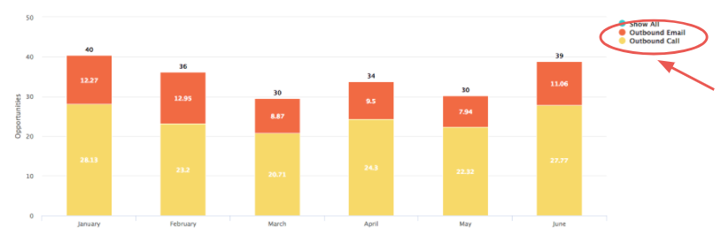

# Salesforce Activities Attribution {#salesforce-activities-attribution}

The [!DNL Marketo Measure] Salesforce Activities integration brings in specific Task and Event records into your attribution model. Begin to track things like sales emails or sales phone calls that were not receiving due credit. To configure your activities rule, go to [experience.adobe.com/marketo-measure](https://experience.adobe.com/marketo-measure){target="_blank"}. From there, go to the **[!UICONTROL Settings]** tab and click the **[!UICONTROL Activities]** tab.

>[!AVAILABILITY]
>
>This feature is enabled for Tier 2 customers only. To request a higher account tier, contact the Adobe Account Team (your account manager).

To start off, we're introducing a new concept called a [!DNL Marketo Measure] Campaign. For each rule that you define, you are going to bucket the records into a [!DNL Marketo Measure] Campaign that you can name. Add multiple campaigns as needed. Imagine measuring the effectiveness of an Outbound Sales campaign next to a Paid Media campaign!

You're going to use this [!DNL Marketo Measure] Campaign Name to tell us which Channel it should get mapped to. If you are still thinking about Outbound Sales, perhaps all Outbound Sales campaigns should sit in a BDR channel.

Get familiar with this hierarchy:

* Channel
   * Subchannel
      * Campaign
      * Campaign
   * Subchannel
      * Campaign

>[!TIP]
>
>If you want to set a unique Campaign for each Sales rep for example, use dynamic replacement parameters to fill in the [!DNL Marketo Measure] Campaign Name. In the same example, you can enter `"Outbound Sales - {AssignedTo}"` and it changes it to something like `"Outbound Sales - Jill"` or `"Outbound Sales - Jack."`

Once your [!DNL Marketo Measure] Campaign Name is set, it's time to set up your Activity rules.

The rules act as a filter to tell us which records are eligible for attribution. Imagine you are creating a report in your CRM using similar logic to generate that report. You have the flexibility of using a combination of and/or statements and various operators like `matches any`, `contains`, `starts with`, `ends with`, `is equal to`. Define `and` statements within a boxed rule or layer `or` statements outside the box.

>[!NOTE]
>
>Formula fields cannot be used within your rules and will not appear in the picklist. Because formulas calculate in the background and do not modify a record, [!DNL Marketo Measure] cannot detect whether a record fits a rule or not.
>
>Make sure to use correct values for ID fields such as CrmEvent.CreatedById. [!DNL Salesforce IDs] are 18 characters long ( 0054H000007WmrfQAC).

Lastly, choose one of your date or date/time fields to utilize as the Buyer Touchpoint Date. Either standard and custom fields are selectable.

>[!TIP]
>
>With your package installation, [!DNL Marketo Measure] includes a custom Buyer Touchpoint Date field on the Activity record. If you want to use a dynamic date, like the date when a status changes, it's possible to use a CRM workflow to set the "Buyer Touchpoint Date" then select the Buyer Touchpoint Date here on this step.

Do not forget to set different rules for Tasks or Events. You must know which object your Sales team uses to record their activities.

You will probably want to place these new touchpoints into their appropriate [Marketing Channel](https://experience.adobe.com/#/marketo-measure/MyAccount/Business?busView=false&id=10#/!/MyAccount/Business/Account.Settings.SettingsHome?tab=Channels.Online%20Channels){target="_blank"}. Do that by defining the Channel with its new Campaign mapping that was just created.

>[!TIP]
>
>When adding a Channel definition, make use of wild-card values, an easier way to state operators like:
>
>starts with ( Outbound&#42; )
>
>contains ( &#42;Outbound&#42; )
>
>ends with ( &#42;Outbound )
>
>No wild card basically means "is equal to" so be sure to use them as needed.

| **Operator** | **Use Case** |
|---|---|
| Is Equal To | Single value - exact match |
| Contains | Single value - contains value |
| Matches Any | Multiple values - Exact Match |
| Matches Any (Contains) | Multiple values - &#42;value&#42;, &#42;value, &#42;value&#42; |

And last but not least, you have the option of entering costs for your new channels. The [Marketing Spend upload](https://experience.adobe.com/#/marketo-measure/MyAccount/Business?busView=false&id=10#/!/MyAccount/Business/Account.Settings.SettingsHome?tab=Reporting.Marketing%20Spend){target="_blank"} allows you to enter your spend at the Channel level, Subchannel level, or Campaign level. With your new [!DNL Marketo Measure] Campaigns, you can add those related costs by month, then see the ROI for each Campaign!

>[!MORELIKETHIS]
>
>[Activity Attribution FAQ](/help/advanced-marketo-measure-features/activities-attribution/activities-attribution-faq.md)
