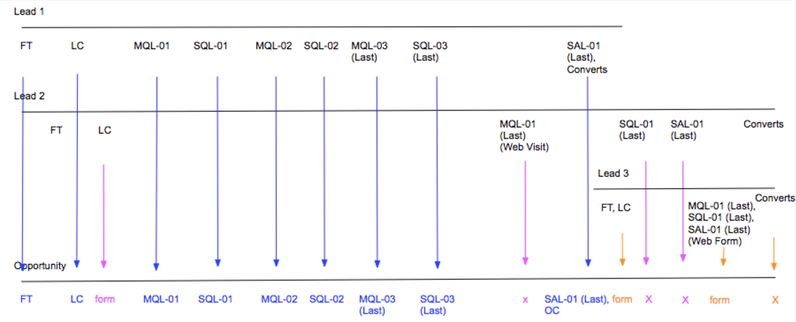

# Boomerang Stage Scenarios {#boomerang-stage-scenarios}

>[!AVAILABILITY]
>
>The Boomerang feature is only enabled for Tier 3 customers. To request a higher account tier, contact the Adobe Account Team (your account manager).

Below are a few examples of Boomerang Stage scenarios to provide an understanding of how [!DNL Marketo Measure] creates touchpoints in each situation.

## Single Lead Scenarios {#single-lead-scenarios}

**Scenario 1: Standard Boomerang Touchpoints for a Lead**

This is the simplest Boomerang scenario. The top line (labeled Lead 1) represents the individual Leads' journey, and how their touchpoints appear on the Lead record. The bottom line (labeled Opportunity) displays how the Leads' touchpoints translates onto the Opportunity. The progression of touchpoints is explained in chronological occurrence, from left to right.

In this scenario, a customer has chosen to have their **MQL** and **SQL** stages tracked with Boomerangs. Each Boomerang touchpoint position is labeled with the stage and the number in which it occurs (MQL-01, SQL-01, MQL-02). The last boomerang touchpoint for that stage has "(Last)" in the touchpoint position.

Lead 1 is then converted in to a Contact with an Opportunity, which is considered the OC touch.

**Scenario 2: Boomerang Touchpoints AND Custom Stages for a Lead**

In this scenario, a customer has chosen only to track the **SQL stage** with boomerang touchpoints. MQL and SAL stages are still being tracked, but with the [!DNL Marketo Measure] Custom Stage feature.

Notice that the MQL touchpoint position is not labeled with a number. This is because it was not selected to be tracked with Boomerang touchpoints. When creating touchpoints for stages included in the custom model, but are not tracked with Boomerang, [!DNL Marketo Measure] takes the last occurrence from that stage.

For the SAL stage, [!DNL Marketo Measure] ignores the first two occurrences of this stage. [!DNL Marketo Measure] only creates a SAL touchpoint for the _last_ occurrence. In the example above, this happens right before the OC touchpoint.

The SQL stage is being tracked with Boomerang touchpoints, and three touchpoints have been created and labeled accordingly.

Lead 1 is then converted in to a Contact with an Opportunity, which is considered the OC touch.

**Scenario 3: When Leads don't reach/skip a stage**

This scenario uses the same criteria as scenario 2. A customer has chosen only to track the SQL stage with boomerang touchpoints. MQL and SAL still being tracked, but with the [!DNL Marketo Measure] Custom Stage feature.

In this scenario, the Lead never actually transitions to the SAL stage. It converts into a Contact before it reaches the SAL stage, essentially "skipping" the SAL stage. In this situation, [!DNL Marketo Measure] assumes that the SAL occurs with the OC touchpoint, and both the SAL and OC position will appear on the same touchpoint.

Lead 1 is then converted in to a Contact with an Opportunity, which is considered the OC touch.

## Scenarios with Multiple Leads {#scenarios-with-multiple-leads}

The following scenarios are where Boomerang Stages can get more complicated, as we are looking at how multiple Leads can influence the Opportunity journey.

The top line (labeled Lead 1, in blue) represents the individual Leads' journey, and how their touchpoints appear on the Lead record. The same applies to the Lead 2 (in pink) and Lead 3 (in orange). The bottom line (labeled Opportunity) displays how both of these Leads' touchpoints translates onto the Opportunity. The progression of touchpoints is explained in chronological occurrence, from left to right.

**Scenario 1: [!UICONTROL Three Leads with Opportunity]**

In this scenario, a customer has chosen to track the **MQL** and **SAL stages** with boomerang touchpoints. The SQL stage is being tracked by the standard custom stages.

The FT and LC touchpoints on the Opportunity come from Lead 1 (blue), because they occurred before the FT and LC of Lead 2 (pink). The LC touchpoint for Lead 2 will appear as a 'Form' touchpoint on the Opportunity.

The MQL-01 (Last) from Lead 2 will become the first MQL on the Opportunity. The MQL-01 from Lead 1 will not appear as a touchpoint on the Opportunity because Lead 2's MQL occurred first. However, Lead 1's MQL-02 and MQL-03 will appear on the Opportunity.

THe SQL stage is being tracked with custom stages, and not boomerang stages. Even though there are three occurrences of the SQL stage between Lead 1 and Lead 2, only the last SQL occurrence will be included as a touchpoint on the Opportunity.

The SAL-01 (Last) touchpoint from Lead 1 is carried over as a touchpoint on the Opportunity. Lead 1 is then converted in to a Contact with an Opportunity, which is considered the OC touch. Lead 2's SAL-01 (Last) touchpoint will be created as a touchpoint because this stage transition occurred _after_ the OC touch.

Lead 3's FT, LC and MQL, SQL, SAL touchpoints (orange) all occurred after the OC touchpoint on the Opportunity. These touchpoints are included in the Opportunity, but are considered "middle touches."

When Lead 2 and 3 converted into Contacts, [!DNL Marketo Measure] will not create another OC touchpoint because there can only be one opportunity creation stage.

**Scenario 2 - [!UICONTROL Three Leads with Opportunity]**

In this scenario, a customer has chosen to track the **MQL**, **SQL**, and **SAL** stages with boomerang touchpoints.

All the touchpoints from Lead 1 are included on the opportunity, from FT to SAL-01 (Last). The LC touchpoint from Lead 2 will be included as a Form touchpoint in between the LC and MQL-01 touchpoints on the Opportunity.

The MQL-01 (Last) from Lead 2 ends up being the MQL-04 (Last) touchpoint on the Opportunity. Because this scenario is looking at multiple Leads' journeys within one Opportunity, the positioning and numbering of the Leads' touchpoints can change when they are translated as touchpoints on the Opportunity. Similarly, the SQL-01 (Last) from Lead 2 becomes the SQL-04 (Last) on the Opp. Lead 2's SAL-01 (Last) also becomes the Opportunity's SAL-02 (Last).

There are only 2 SAL touchpoints included on the Opportunity. [!DNL Marketo Measure] will not try to force/create touchpoints for stage transitions if they have not occurred.

Lead 3's touchpoint journey begins just before the OC touch occurs, but long after Lead 1 and Lead 2 had their FT and LC touch. In this case, Lead 3's FT and LC appear as a Form touchpoint on the Opportunity. Lead 1 is then converted in to a Contact with an Opportunity, which is considered the OC touch.

Lead 3's MQL, SQL, and SAL touches all occur at the same time, after the OC touch. Since they occurred after the OC touchpoint, this touchpoint will appear as a Form/Middle Touch on the Opportunity rather than a Boomerang stage transition.

**Scenario 2a - Web Visit Boomerang Touchpoints**

In this scenario, a customer has chosen to track the **MQL**, **SQL**, and **SAL** stages with boomerang touchpoints. This scenario is almost identical to the one above, with a few exceptions.

All the touchpoints from Lead 1 will be included on the opportunity, from FT to SAL-01 (Last). The LC touchpoint from Lead 2 will be included as a Form touchpoint in between the LC and MQL-01 touchpoints on the Opportunity.

Lead 2's MQL-01 (Last) (Web Visit) will not be created as a touchpoint on the Opp. This is because this touchpoint was a web visit that happens after the last occurrence of the SQL stage, and does not help drive the Opportunity forward.

Lead 1's stage changes to SAL, and then is converted in to a Contact with an Opportunity; in this case, the SAL-01 (Last) and OC positions are combined in the same touchpoint.

Lead 3's FT,LC touch is created as a Form touchpoint on the Opp. Only form fill actions will be created as touchpoints after the OC touch. For this reason, the SQL-01 (Last) and SAL-01 (Last) stage transitions for Lead two will not be created as touchpoints because these touchpoints were web visits.

Lead 3's MQL, SQL, SAL touches are included as a touchpoint because this was a form fill action.

**Scenario 3 - Boomerang Attribution Weighting**

In this scenario, a customer has chosen to track the **MQL**, **SQL**, and **SAL** stages with boomerang touchpoints.

The FT and LC touchpoints on the Opportunity come from Lead 1 (blue), because they occurred before the FT and LC of Lead 2 (pink). The LC touchpoint for Lead 2 appear as a 'Form' touchpoint on the Opportunity.

The MQL-01 (Last) from Lead 2 become the first MQL on the Opportunity. The MQL-01 from Lead 1 will not appear as a touchpoint on the Opportunity because Lead 2's MQL occurred first.

The SQL-01 (Last) from Lead 2 become SQL-01 on the Opportunity. The SQL-01 on Lead 1 will not appear as a touchpoint on the opportunity because SQL-01 on Lead 2 happened first.

Notice that Lead 1 boomerangs between MQL and SQL a couple times before finally reaching the SAL stage. SQL-01, MQL-02, SQL-02, MQL-03, SQL-03 _will not_ be included as touchpoints on the opportunity because these stage transitions do not aid in driving the opportunity forward in the journey.

The SAL-01 (Last) touchpoint from Lead 1 is the next touchpoint to be included on the Opp. Lead 1 then converts into a contact with an opportunity, creating the OC touchpoint.

Lead 3's FT and LC, and the MQL, SQL and SAL touchpoints appear as a form touches on the Opportunity.

Lead 2's SQL-01 (Last) touchpoint will not be included as a touchpoint on the Opp because it occurred after the OC touchpoint. Also, Lead 2's SQL stage transition occurred _after the final SAL stage transition_, and doesn't help drive the opportunity journey forward.

## Opportunity Scenarios {#opportunity-scenarios}

**Scenario 1 - Contacts with Opportunity and Boomerang Tracking**

In this scenario, a customer has chosen to track the **Demo and Negotiation stage transitions** on the **Contact**. Each boomerang stage can receive up to two touchpoints. The difference between stage transitions on a Contact versus stage transitions on a Lead is that Contact stage transitions can appear as Boomerang touchpoints on the Opportunity _after_ the OC touchpoint. This is not true for stage transitions that occur on the Lead as these appear as a Form touchpoint.

In this example, Contact 1's Demo and Negotiation Stage transitions are included as Demo-01 and Negotiation-01 touchpoints on the Opportunity. Contact 2's Demo stage transition occurs _after_ Contact 1's, and appears as the Demo-02 (Last) touchpoint on the Opportunity.

Notice that there is not a second transition to the Negotiation stage; the Opportunity immediately jumps from Demo-02 (Last) moves to Close Won. In this case, [!DNL Marketo Measure] will include the Negotiation transition with the Closed Won touchpoint.
