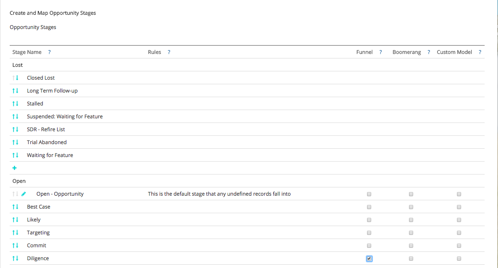

# Custom Attribution Model and Setup {#custom-attribution-model-and-setup}

See below for an overview of the [!DNL Marketo Measure] custom attribution model and how to set it up.

## Custom Attribution Model {#custom-attribution-model}

The [!DNL Marketo Measure] Custom Attribution model allows users to choose which touchpoints or custom stages to include in the model. Users are able to control the percentage of revenue credit attributed to these touchpoints and stages, or, can use the attribution percentage values suggested by the [!DNL Marketo Measure] Machine Learning Model.

## How to Set up Your Custom Attribution Model {#how-to-set-up-your-custom-attribution-model}

1. Determine which stages you want to include in your custom model.

   To start building your custom attribution model, you will need to select which stages are important to your Marketing team. In addition to the [!DNL Marketo Measure] milestone stages (FT, LC, OC, Closed) you can add up to six additional Lead/Contact Statuses or Opportunity stages in your custom model. For example, it's common for the MQL stage to be included in the custom model. Marketing teams often want to know what efforts or channels are driving transitions to the MQL stage.

   Sign in to [experience.adobe.com/marketo-measure](https://experience.adobe.com/marketo-measure){target="_blank"}. Go to [!UICONTROL My Account] > [!UICONTROL Settings] > and under the CRM section, select **[!UICONTROL Stage Mapping]**.

   Next, choose which Leads/Contacts and Opportunity stages to include by selecting the **[!UICONTROL Include in Model]** box.

   >[!NOTE]
   >
   >You are allowed up to six custom stages (not including the defaults: FT, LC, OC, Closed).

   

   >[!NOTE]
   >
   >_All_ Leads/Contacts and Opportunity stages will appear here, even if the stage is inactive or no longer used in [!DNL Salesforce]. If you want these stages removed, you will need to hard delete them in [!DNL Salesforce].

   When you've selected your stages, be sure to click the **[!UICONTROL Save & Process]** button at the bottom of the page. The stages will now appear in the **[!UICONTROL Attribution Settings]** tab and you will be able to assign attribution percentages to each stage. Custom stages will also be displayed in the Marketing Performance Suite as a Lead or Opportunity stage within the Demand Waterfall.

   If there are other stages that you want to include in the model, but they are not in the [!UICONTROL Lead/Contact Status] or [!UICONTROL Opportunity Stage] list, you can define your own custom stage based off of fields in your CRM.

   In the example below, a custom "MQL" stage is defined using a date field. The rule simply states that if the MQL Date field is not empty, it should be considered an MQL and should be included in the custom model. It is also important to sort the custom stages once they have been created so that it follows the progression of your sales cycle.

   

   >[!CAUTION]
   >
   >Don't forget to enable history tracking for custom fields.

If a custom field is used in your custom model, Field History tracking MUST be enabled in the CRM. For instructions  to enable field history tracking, refer to [Custom Model Setup: Enable Field History Tracking](/help/advanced-marketo-measure-features/custom-attribution-models/custom-model-setup-enable-field-history-tracking.md).

1. Determine the attribution percentages for the custom model.

   Go to the **[!UICONTROL Attribution Settings]** in [!DNL Marketo Measure] Apps; the custom stages will appear here in the attribution table. The attribution table displays all of the [!DNL Marketo Measure] attribution models, and the attribution weighting of each model. The attribution percentages of the first five models are fixed and cannot be changed.

   In the far right column labeled "**[!UICONTROL Custom]**," you can set the percentage weighting for each stage in your custom attribution model. Enter the values for each stage under the Custom column and click **[!UICONTROL Save and Reprocess]** when complete.

   To the left of the _Custom_ column is the **[!DNL Marketo Measure] Machine Learning model**. The Machine Learning model calculates attribution weighting based on the relative importance to winning a deal depending on what happened at each custom stage. For more information about the Machine Learning model, refer to [Machine Learning Model FAQ](/help/advanced-marketo-measure-features/custom-attribution-models/machine-learning-model-faq.md).

   

## Touchpoint Positions {#touchpoint-positions}

After the attribution percentages have been saved and processed, touchpoints will be updated and receive their new stages and positions. The touchpoint that occurred most recently, prior to a stage transition, will receive credit for that stage (as shown below). The custom weighting and revenue gets redistributed as well.

## The Difference Between Funnel Stages and Custom Model Stages {#the-difference-between-funnel-stages-and-custom-model-stages}

You can now see custom stages in your Marketing Funnel, even if you don't have Custom Model enabled. This would be through the use of our Funnel Stage functionality. Funnel Stages now give you the ability to add stages to the funnel, but not see attribution for them.

Funnel Stages will still get tracked as Touchpoints and will still appear as Touchpoint Positions in your CRM. Without Custom Model, these Touchpoints may still receive middle touch attribution if there's a form fill (10% for Middle Touches), but zero attribution credit if it's just a web visit.

As you can see below, we've included the Diligence stage as apart of our Funnel Stages. This means we will have Touchpoints where the position contains Diligence, but those Touchpoints will only receive Middle Touch attribution credit if Custom Model is not enabled (at most 10%).

>[!NOTE]
>
>The behavior for BAT custom models is to divide custom model middle touch percent evenly across other stages, provided there are no middle touches.
