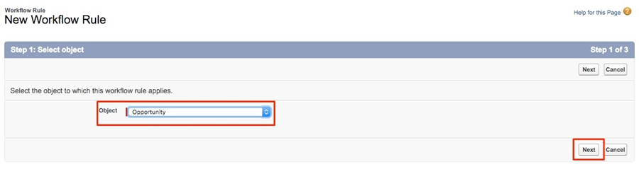

# Using a Custom Revenue Amount Field {#using-a-custom-revenue-amount-field}

By default, Buyer Attribution Touchpoints will pull the Opportunity Amount from one of two fields:

* Amount (SFDC Default)
* [!DNL Marketo Measure] Opportunity Amount (Custom)

If you are using a custom Amount field on your Opportunities, we will need to configure a workflow in order to calculate the Buyer Touchpoint Revenue. This takes some more advanced knowledge of [!DNL Salesforce], so it may require assistance from your SFDC Admin.

Starting off, we will need the following information:

* API Name of your Amount field

From here, we'll start creating the workflow. 

## Create the Workflow in Salesforce Lightning {#create-the-workflow-in-salesforce-lightning}

The following steps are for Salesforce Lightning users. If you still use Salesforce Classic, those steps [are listed below](#create-the-workflow-in-salesforce-classic).

1. From Setup, type "Flows" into the Quick Find Box, and select **[!UICONTROL Flows]** to start Flow Builder. From the right panel click the **[!UICONTROL New Flow]** button.

    
 
1. Select **[!UICONTROL Record-Triggered Flow]** and click **[!UICONTROL Create]** on the bottom right. 
 
    

1. In the Configure Start window, select the Opportunity object. From the [!UICONTROL Configure Trigger] section, select **[!UICONTROL A record is created or updated]**.
 
    

1. In the Set Entry Conditions section, under [!UICONTROL Condition Requirements], select **[!UICONTROL Custom Condition Logic Is Met]**. 
   * From the search field, select your custom Amount field. 
   * Set the operator as **Is Null**, and the value as **[!UICONTROL False]**. 
   * Set the evaluation criteria to **[!UICONTROL Every time a record is updated and meets the condition requirements]**.

    
 
1. Under the "Optimize the Flow for" section, select **[!UICONTROL Fast Field Updates]**. Click **[!UICONTROL Done]** on the bottom right. 

    
 
1. To add the element, click the plus (+) icon and select **[!UICONTROL Update Triggering Record]**.

    
 
1. In the New Update Records window, enter the following: 

   * Enter a label&mdash;the API name will be generated automatically 
   * Under "How to Find Records to Update and Set Their Values," select **[!UICONTROL Use the opportunity record that triggered the flow]**. 
   * In the "[!UICONTROL Set Filter Conditions]" section, select **[!UICONTROL Always Update Record]** as a Condition Requirement to Update Record.
   * In the "[!UICONTROL Set Field Values for the Campaign Record]," from field, select the Marketo Measure Opportunity Amount (**bizible2__Bizible_Opportunity_Amount__c**) and from value. Then select your custom Amount field.
   * Click **[!UICONTROL Done]**.

    

1. Click **[!UICONTROL Save]**. A pop-up will appear. Type "Flow Label" in the Save the Flow window (the Flow API Name will be generated automatically). Click **[!UICONTROL Save]** again.
 
    

1. Click the **[!UICONTROL Activate]** button to activate the flow.

    

## Create the Workflow in Salesforce Classic {#create-the-workflow-in-salesforce-classic}

The following steps are for Salesforce Classic users. If you have made the switch to Salesforce Lightning, those steps [can be found above](#create-the-workflow-in-salesforce-lightning).

1. Navigate to **[!UICONTROL Setup]** > **[!UICONTROL Create]** > **[!UICONTROL Workflow & Approvals]** > **[!UICONTROL Workflow Rules]**.

   

1. Select **[!UICONTROL New Rule]**, set the object as "Opportunity" and click **[!UICONTROL Next]**.

   

   

1. Configure the workflow. Set the Rule Name as "Update [!DNL Marketo Measure] Opportunity Amount." Set the Evaluation Criteria to "Created, and every time it's edited." For the Rule Criteria, select your custom Amount field and select the Operator [!UICONTROL as "Not Equal To"] and leave the "Value" field blank.

   

1. Add a workflow action. Set this picklist to "[!UICONTROL New Field Update]."
   

1. Here you will fill out field information. In the "Name" field, we recommend using this naming: "[!DNL Marketo Measure] Opp Amount." The "Unique Name" will automatically populate based off the "Name" field. In the "Field to Update" picklist select "[!DNL Marketo Measure] Opportunity Amount." After selecting the field, select the "Re-Evaulate Workflow Rules after Field Change" box. In the "Specify New Field Value," select "Use a formula to set the new value." In the empty box, drop the API name of your custom Amount field. Click **[!UICONTROL Save]**.

   

1. you will be brought back to a roll-up page for your workflow, be sure to "Activate" and you will be good to go. To activate, click **[!UICONTROL Edit]** next to your new workflow and then click **[!UICONTROL Activate]**.

   Once you've completed these steps, the opportunities will need to be updated in order to trigger the workflow to have the new value from the [!UICONTROL custom opportunity] field.

   This can be accomplished by running your opportunities through Data Loader within SFDC. Find details on using Data Loader in [this article](/help/advanced-marketo-measure-features/custom-revenue-amount/using-data-loader-to-update-marketo-measure-custom-amount-field.md).

If there are any questions along the way, do not hesitate to reach out to the Adobe Account Team (your Account Manager) or [[!DNL Marketo] Support](https://nation.marketo.com/t5/support/ct-p/Support){target="_blank"}.
