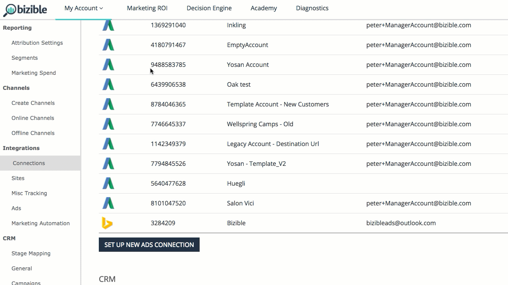

# [!DNL Facebook] API {#facebook-api}

## Introduction {#introduction}

Similar to our AdWords & [!DNL Bing Ads] integrations, our [!DNL Facebook] integration does two fundamental actions:

* Auto-tag all [!DNL Facebook] Ads with a [!DNL Marketo Measure] parameter (_bf)
* Download ad cost information across all active Facebook ads

## How to Configure the [!DNL Facebook] Integration {#how-to-configure-the-facebook-integration}

As for setup, there are seven steps to be completed within the [!DNL Marketo Measure] app.

1. Navigate to [experience.adobe.com/marketo-measure](https://experience.adobe.com/marketo-measure){target="_blank"} and log in.
1. Under My Account select **[!UICONTROL Settings]**.
1. Under Integrations select **[!UICONTROL Connections]**.
1. Select **[!UICONTROL Set Up New Ads Connection]** and a pop-up will appear. Select **[!UICONTROL Facebook]** and log-in using your Facebook credentials.

   >[!NOTE]
   >
   >The person connecting the [!DNL Facebook Ads] account needs to be an admin within the [!DNL Facebook Ads] account.

1. Once [!DNL Marketo Measure] is connected to your Facebook account, click the pencil icon next to the account.
1. Within this view, move the 'Auto-tagging?' toggle to 'Yes.' Then select the check box found in the [!UICONTROL Learn More] section to agree to the terms and conditions. Make sure the [!UICONTROL Auto-tagging] toggle is still set to '[!UICONTROL Yes]'.

## Connecting the Account {#connecting-the-account}

## Enabling Autotagging {#enabling-autotagging}

>[!NOTE]
>
>If you enable auto-tagging, we'll reset the conversion history and social proof of all of the ads that we tag. We highly recommend [exporting this data as a CSV](https://www.facebook.com/business/help/205067636197240) before you enable auto-tagging.

Once you've enabled the integration, [!DNL Marketo Measure] will start downloading ad level cost into the [!DNL Marketo Measure Marketing ROI] Dashboard.

For the integration to properly work, you will need to enable auto-tagging on your [!DNL Facebook] account. This will allow our system to add a _bf parameter across all ad links. This process will add the new parameter on top of any other tracking parameters you've already added to your [!DNL Facebook] ads.

## Field Mapping {#field-mapping}

<table> 
 <colgroup> 
  <col> 
  <col> 
 </colgroup> 
 <tbody> 
  <tr> 
   <th>
<strong>Touchpoint Field</strong>
</th> 
   <th>
<strong>Value</strong>
</th> 
  </tr> 
  <tr> 
   <td>
Ad Campaign Id
</td> 
   <td>
[[!DNL Facebook] Campaign Id]
</td> 
  </tr> 
  <tr> 
   <td>
Ad Campaign Name 
</td> 
   <td>
[[!DNL Facebook] Campaign Name], or [utm_campaign] if provided
</td> 
  </tr> 
  <tr> 
   <td>
Ad Group Id
</td> 
   <td>
[[!DNL Facebook] Ad Set Id]
</td> 
  </tr> 
  <tr> 
   <td>
Ad Group Name
</td> 
   <td>
[[!DNL Facebook] Ad Set Name]
</td> 
  </tr> 
  <tr> 
   <td>
Touchpoint Source
</td> 
   <td>
"[!DNL Facebook]", or [utm_source] if provided
</td> 
  </tr> 
  <tr> 
   <td>
Medium
</td> 
   <td>
"Social", or [utm_medium] if provided
</td> 
  </tr> 
  <tr> 
   <td>
Ad Id, or Creative_Unique_Id (Data Warehouse)
</td> 
   <td>
[custom Id generated from utm_content]
</td> 
  </tr> 
  <tr> 
   <td>
Ad Content, or Creative_Name (Data Warehouse)
</td> 
   <td>
[utm_content] if provided
</td> 
  </tr> 
  <tr> 
   <td>
Keyword Text, or Keyword_Name (Data Warehouse)
</td> 
   <td>
[utm_term] if provided
</td> 
  </tr> 
  <tr> 
   <td>
Ad_Unique_Id (Data Warehouse)
</td> 
   <td>
[[!DNL Facebook] Ad Id]
</td> 
  </tr> 
  <tr> 
   <td>
Ad_Name (Data Warehouse)
</td> 
   <td>
[[!DNL Facebook] Ad Name]
</td> 
  </tr> 
  <tr> 
   <td>
Keyword_Unique_Id (Data Warehouse)
</td> 
   <td>
[custom Id generated from utm_term]
</td> 
  </tr> 
  <tr> 
   <td>
Ad_Provider (Data Warehouse)
</td> 
   <td>
"[!DNL Facebook]"
</td> 
  </tr> 
  <tr> 
   <td>
Account_Unique_ID (Data Warehouse)
</td> 
   <td>
[[!DNL Facebook] Account #]
</td> 
  </tr> 
  <tr> 
   <td>
Account_Name (Data Warehouse)
</td> 
   <td>
[[!DNL Facebook] Account Name]
</td> 
  </tr> 
 </tbody> 
</table>

## FAQ {#faq}

**Q: What [!DNL Facebook] Ads are supported by [!DNL Marketo Measure]?**

A: Carousel, Single Image. Not Video, Slideshow or Collection at this time.

**Q: What is social proof?**

A: Social proof is visible engagement such as likes, clicks, comments, and shares.

**Q: What happens when [!DNL Marketo Measure] tags the Ad?**

A: [!DNL Facebook] does not allow ads to be edited so [!DNL Marketo Measure] needs to delete the creative, which contains the Destination URL, and then re-create the ad with the new parameters.

**Q: Why does [!DNL Marketo Measure] update all [!DNL Facebook] Ads?**

A: The [!DNL Marketo Measure] process is to tag all ads in case they are re-activated.

**Q: What permission does the connected user need?**

A: ads_management, email

**Q: How long can it take to import spend data?**

A: 1 hour

**Q: How long can it take to import ad data?**

A: 4 hours
