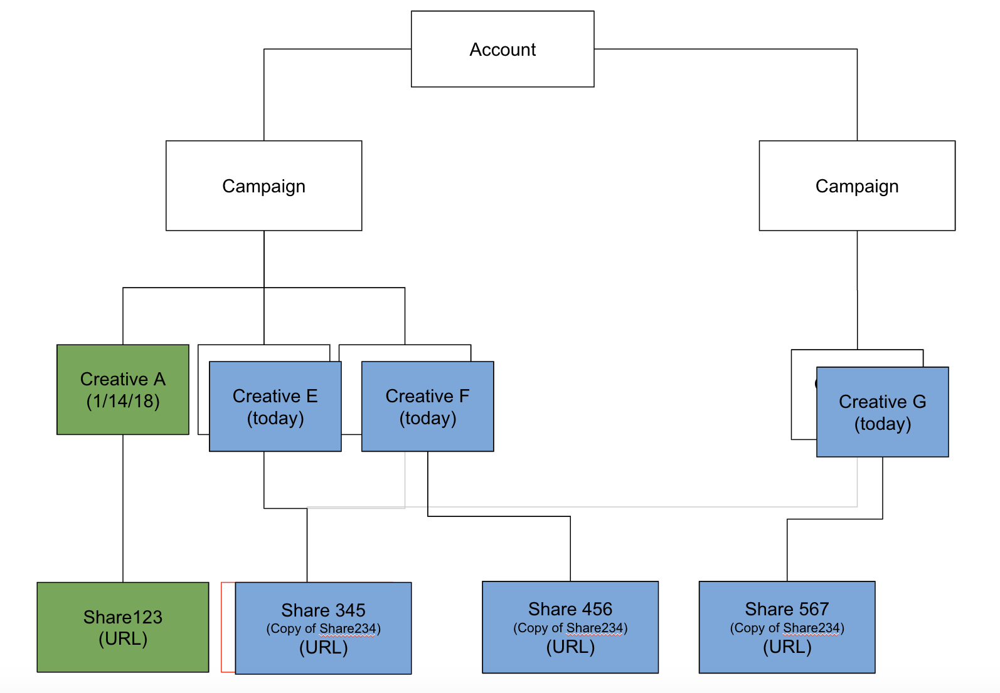

# LinkedIn Integration {#linkedin-integration}

## Overview {#overview}

The [!DNL Marketo Measure] integration with LinkedIn comes in two parts:

Sponsored Content: The Sponsored Content integration allows [!DNL Marketo Measure] to tag destination URLs on [!DNL LinkedIn] ads, which ultimately allows [!DNL Marketo Measure] to follow a user through their entire touchpoint journey and map the activity back to the specific [!DNL LinkedIn] Campaign and Creative. This provides insights to customers about the ROI of their [!DNL LinkedIn] activity.

Lead Gen Forms: Through the integration with LinkedIn's Lead Gen Forms, Marketo Measure gains insight into forms that have been submitted through the LinkedIn platform. These form fills are matched against leads from your CRM or [!DNL Marketo Engage] instance so that they're eligible for attribution. With insight into the Campaign, Creative, and Form that helped generate the forms, teams can now further optimize their LinkedIn marketing and ad spend.

## Availability {#availability}

Available to all users.

## Requirements {#requirements}

**Campaign Manager Roles**

For [!DNL Marketo Measure] to be able to download Ads Data & Ads cost data, you must have one of the following roles in the Campaign Manager:

* Billing Admin
* Account Manager
* Campaign Manager

Learn more: [User Roles and Functions in Campaign Manager](https://www.linkedin.com/help/lms/answer/a425731/user-roles-and-functions-in-campaign-manager).

**Paid Media Admin Roles**

For [!DNL Marketo Measure] to be able to Create/Update Sponsored Creatives, you must have one of the following Paid Media Admin roles:

* Sponsored Content Poster
* Lead Gen Forms Manager

Learn more: [LinkedIn Page Admin Roles](https://www.linkedin.com/help/linkedin/answer/4783/linkedin-page-admin-roles-overview).

There are other [!DNL LinkedIn] roles which we do **not** require for our integration. These roles are often mistaken for the required roles, so note there is a difference!

**Page Admin Roles**

For [!DNL Marketo Measure] to be able to download/integrate leads from lead gen forms, you must have the following Page Admin role:

* Super Admin

Learn more: [LinkedIn Page Admin Roles](https://www.linkedin.com/help/linkedin/answer/4783/linkedin-page-admin-roles-overview).

## LinkedIn Ad Types {#linkedin-ad-types}

[!DNL Marketo Measure] will support:

**Sponsored Content:** Sponsored Content allows you to deliver content to the [!DNL LinkedIn] feed of members beyond those who are following your company. Sponsored Content can be targeted to a specific audience and can help advertisers reach [!DNL LinkedIn] members wherever and whenever they are engaging on the [!DNL LinkedIn] platform across desktop, mobile, and tablet. Sponsored Content with Lead Gen Forms are supported.

The types of Sponsored Content ad formats supported by [!DNL Marketo Measure] are Single Image Ads and Video Ads (through Lead Gen Forms). Due to the complexity of the schema, we do not support Carousel ads.

[!DNL Marketo Measure] does not support Sponsored Messaging, Text Ads, or Dynamic Ads.

>[!TIP]
>
>For any of your Campaigns/Spend that originate from a non-Sponsored Content source (such as Campaign Type of "Text Ad" or "Sponsored InMail"), [!DNL Marketo Measure] does _not_ inherently support the tracking of these Campaign Types. If you want to track Spend for Campaigns such as these alongside your "Sponsored Content" Spend, be sure to make use of our Marketing Spend CSV to manually log said Spend.

## How It Works: Sponsored Content {#how-it-works-sponsored-content}

>[!NOTE]
>
>Prior to first use, this feature setting must be enabled by navigating to [!DNL Marketo Measure] [!UICONTROL Settings] > [!UICONTROL Integrations] > [!UICONTROL Ads] > [!UICONTROL Enable LinkedIn Lead Gen Forms].

**[!DNL LinkedIn's] Unique Auto-Tagging Requirements**

[!DNL Marketo Measure] can help track your [!DNL LinkedIn] campaign performance by auto-tagging your landing pages.

[!DNL Marketo Measure] will search for creatives with a unique LinkedIn Share and add a `?_bl={creativeId}` parameter to the end of it.

**Copying Shares**

With this [!DNL Marketo Measure/LinkedIn] Integration, we ask that customers do not copy/clone/duplicate existing Creatives. If Shares are found and are detected to only be used on one Creative, [!DNL Marketo Measure] can tag the Share as is without having to recreate any Creatives or Shares and all ads history (impressions, clicks, shares) will remain.

As soon as a Share is found to be shared across multiple Creatives, [!DNL Marketo Measure] will have to run through a process of pausing, copying, and re-tagging in order to make a unique set. [!DNL Marketo Measure] will pause and archive live creatives and therefore erase Ad History including impressions, clicks, and social shares in order to auto-tag everything properly.

Moving forward, [!DNL Marketo Measure] recommends that you do not duplicate any [!DNL LinkedIn] Shares and keep all creatives and shares as unique as possible so that we can simply add our tracking without having to erase Ad History.

**Shortened URLs**

The reason for the extra step is because LinkedIn allows destination URLs to be a shortened URL (bit.ly, goog.le, etc.,), which means [!DNL Marketo Measure] doesn't see the long, resolved URL and [!DNL Marketo Measure] needs to add tracking parameters to a resolved URL. In order to get around that issue, [!DNL Marketo Measure] looks for shortened URLs prior to re-creating an ad, expands the URL, then creates the new ad with the resolved URL and all of its parameters, allowing [!DNL Marketo Measure] to add tags. Creating a new ad will erase ads history (impressions, clicks, shares), hence the need for permission to tag shortened URLs.

If you heavily use shortened URLs, this could severely impact your creatives. We recommend that you no longer use shortened URLs so that [!DNL Marketo Measure] can tag the landing pages without having to create new ads and erase Ad History.

**The Process**

Let's start with some examples. Let's say we have....

Creative A : Share 123\
Creative B : Share 234\
Creative C : Share 234\
Creative D : Share 234

`1)` [!DNL Marketo Measure] will first look through all Campaigns, Creatives and Shares with an "Active" status. [!DNL Marketo Measure] will not tag paused, archived, or cancelled ads. If an ad was paused, then set to [!UICONTROL active], we will tag it once it's active again. If we can find a unique Share, meaning it's not used across multiple Creatives or Campaigns (e.g., Creative A : Share 123), [!DNL Marketo Measure] will add our custom parameter `>> ?_bl={creativeId}` to the share URL.

`2)` Now if the Share has been shared and lost its uniqueness (for instance, Creative B : Share 234 and Creative C : Share 234 and Creative D : Share 234), [!DNL Marketo Measure] will pause and archive all similar creatives (which would be Creative B, Creative C, and Creative D).

`3)` [!DNL Marketo Measure] will create 3 new creatives, Creative E, Creative F, and Creative G, that copies the content of Creative B, which is archived.

`4)` [!DNL Marketo Measure] will also create 3 new shares, Share 345, Share 456, and Share 567, that copies the content of Share 234, except it will have its own unique `?_bl` tagging.

`5)` [!DNL Marketo Measure] will have to regularly check that Shares do not get shared and if they do, we will restart the process at step 2 above.

>[!NOTE]
>
>Implementing this will mean that our customers will lose the ads history of the Creative B : Share 234, Creative C : Share 234 and Creative D : Share 234 because it now gets recreated with Creative E : Share 345, Share F : Share 456, and Creative G : Share 567 respectively.

## How It Works: Lead Gen Forms {#how-it-works-lead-gen-forms}

**[!DNL LinkedIn's] Unique Auto-Tagging Requirements**

[!DNL Marketo Measure] can help track your [!DNL LinkedIn] campaign performance by auto-tagging your landing pages.

[!DNL Marketo Measure] will search for creatives with a unique LinkedIn Share and add a `?_bl={creativeId}` parameter to the end of it.

**The Process**

Through [!DNL LinkedIn's] Ad Form API and Ad Form Response API, we are able to gather form submission data for an ad account and associate the email address to a lead from the CRM or Marketo.

LinkedIn forms may contain multiple email address. When we download form responses, we will look for email addresses with the following priority: Work email, Email address (primary form field), or custom fields with a valid email value.

Regardless of Campaign or Creative status, all Form Responses will result in a touchpoint. [!DNL Marketo Measure] has a 90-day lookback restriction, so [!DNL Marketo Measure] is unable to access form responses older than 90 days, but the longer that the [!DNL Marketo Measure] and [!DNL LinkedIn] integration is enabled, the more Lead Gen Form touchpoints will be visible through [!DNL Marketo Measure].

>[!NOTE]
>
>LinkedIn Costs are still downloaded as part of Sponsored Content Campaigns.

**Tracking Lead Gen Forms in CRM or Marketo**

Before the [!DNL Marketo Measure] and LinkedIn Lead Gen Forms Integration existed, it was common practice for customers to push their form submissions to a Marketo Program and/or CRM Campaign to track the forms and receive attribution on those activities. Once the Lead Gen Forms setting is enabled, we want to make sure those form submissions aren't double counted. Check the following:

* "Enable Buyer Touchpoints" field on the CRM object is set to "None" or "Exclude All Campaign Members"
* Update any related Marketo Program or Marketo Activity rules
* Update any related CRM Campaign rules

>[!NOTE]
>
>The LinkedIn API has a 90-day lookback limitation, so if you are using Marketo or CRM rules, it is recommended that you set the end date on the rule to 90 days prior to the date you enabled the integration in [!DNL Marketo Measure].

## Touchpoint Details {#touchpoint-details}

Once [!DNL Marketo Measure] has successfully tagged your landing page on the LinkedIn creative, you will be able to view the resolved ads data on the touchpoint. Here's the mapping of data values that you should expect to see:

<table> 
 <colgroup> 
  <col> 
  <col> 
 </colgroup> 
 <tbody> 
  <tr> 
   <th style="width:30%">Touchpoint Field</th> 
   <th>Sample Value</th> 
  </tr> 
  <tr> 
   <td>Ad Id</td>
   <td>84186224</td>
  </tr> 
  <tr> 
   <td>Ad Content</td>
   <td>copy-1-image-2-man 95% of #B2B marketers consider demand creation strategy to be successful. Learn more: [!DNL https]://lnkd.in/jgdi50vKrgv</td>
  </tr> 
  <tr> 
   <td>Ad Group Id</td>
   <td>(blank)</td>
  </tr> 
  <tr> 
   <td>Ad Group Name</td>
   <td>(blank)</td>
  </tr> 
  <tr> 
   <td>Ad Campaign Id</td>
   <td>138949954</td>
  </tr> 
  <tr> 
   <td>Ad Campaign Name</td>
   <td>SU - COM Accounts - Demand Skills</td>
  </tr> 
  <tr> 
   <td>Ad Destination URL <b>&#42;</b></td>
   <td>https://www.adobe.com/marketing-attribution-for-demand-generation-leaders?_bl=84186217</td> 
  </tr> 
  <tr> 
   <td>Form URL</td> 
   <td>info.bizible.com/demo</td> 
  </tr> 
  <tr> 
   <td>Form URL - Raw</td> 
   <td>info.bizible.com/demo</td> 
  </tr> 
  <tr> 
   <td>Keyword Id</td> 
   <td>(blank)</td> 
  </tr> 
  <tr> 
   <td>Keyword Match Type</td> 
   <td>(blank)</td> 
  </tr> 
  <tr> 
   <td>Landing Page</td> 
   <td>https://www.adobe.com/marketing-attribution-for-demand-generation-leaders</td> 
  </tr> 
  <tr> 
   <td>Landing Page - Raw</td> 
   <td>https://www.adobe.com/marketing-attribution-for-demand-generation-leaders?_bl=84186217</td> 
  </tr> 
  <tr> 
   <td>Marketing Channel</td> 
   <td>Paid Social</td> 
  </tr> 
  <tr> 
   <td>Marketing Channel - Path</td> 
   <td>Paid Social.LinkedIn</td> 
  </tr> 
  <tr> 
   <td>Medium</td> 
   <td>"cpc" or "Lead Gen Form"</td> 
  </tr> 
  <tr> 
   <td>Referrer Page</td> 
   <td>www.linkedin.com/</td> 
  </tr> 
  <tr> 
   <td>Referrer Page - Raw</td> 
   <td>www.linkedin.com/</td> 
  </tr> 
  <tr> 
   <td>Serach Phrase</td> 
   <td>(blank)</td> 
  </tr> 
  <tr> 
   <td>Touchpoint Type</td> 
   <td>Web Form</td>
  </tr> 
  <tr> 
   <td>Touchpoint Source</td>
   <td>LinkedIn</td>
  </tr> 
 </tbody> 
</table>

**&#42;** _"Ad Destination URL" field is only populated for Sponsored Content. It is not populated for Lead Gen Forms._

 

## Costs {#costs}

Because [!DNL Marketo Measure] has a direct integration with [!DNL LinkedIn], we download the recorded spend for each Campaign and Creative each day. There is no need for a customer to report on [!DNL LinkedIn] spend within the [!DNL Marketo Measure] application anymore.

As with other ad integrations, [!DNL Marketo Measure] has defined a marketing channel rule to place all [!DNL LinkedIn] campaigns, creatives, and cost. To use the rule, the customer will want to insert a new row for their Paid [!DNL LinkedIn] efforts. It can be a new or existing channel. In the Referrer column, use the definition "[[!DNL LinkedIn] Paid]" which [!DNL Marketo Measure] has defined as any touchpoint with a [!DNL Marketo Measure] tag.

## [!DNL Marketo Measure] Discover {#marketo-measure-discover}

There have been some enhancements made to [!DNL Marketo Measure] Discover to support Lead Gen Forms reporting.

**Paid Media Board**

Lead Gen Forms tile: New tile that includes count of LinkedIn form fills. Drill through of this count will display Activity Id, Form Date, Form Name, and Email Address.

**Engagement Path Board**

Journey of Events: Includes the "Activity" event type and medium "Lead Gen Form" for forms that come through the integration. Drill through view includes Campaign, Creative, and Form details.

## Sponsored Content FAQ {#sponsored-content-faq}

**What is a Dark Share?**

A dark share is a post where it is never posted on the company page and immediately gets created and directly added as a Creative. So that [!DNL Marketo Measure]-created Creatives don't appear at the top of a company's page and get promoted again, dark shares are used so that it can launch behind the scenes.

**What Statuses does [!DNL Marketo Measure] actually tag?**

There are four different statuses on a [!DNL LinkedIn] Campaign and Creative: Active, Paused, Archived, and Cancelled. We only tag Campaigns and Creatives that are Active. Tagging other statuses set them to Active again. [!DNL Marketo Measure] will not tag Paused, Archived or Cancelled Campaigns or Creatives, but will resume tagging if the status changes to Active.

**What is the value that [!DNL Marketo Measure] is using to tag?**

At the end of the destination URL, [!DNL Marketo Measure] is adding the parameter `&_bl={creativeId}`, where the `{creativeId}` is the Creative Id from LinkedIn. With the Creative Id, [!DNL Marketo Measure] can also determine the Campaign Id since [!DNL LinkedIn] has a pretty basic ads structure since each Creative can only belong to one Campaign.

**What happens with my old creative once [!DNL Marketo Measure] creates a new version of it?**

When [!DNL Marketo Measure] recreates a Share and places it in a new Creative, the old Creative get archived. This is also why [!DNL Marketo Measure] will not tag archived Campaigns or Creatives - it would otherwise loop with [!DNL Marketo Measure] trying to tag it indefinitely.

**Why doesn't the destination URL of the ad created match my original ad?**

[!DNL Marketo Measure] needs to add the tracking parameters to a resolved URL, but the URL that is presented in the API can potentially be a shortened URL without all parameters present. In order to get around that issue, [!DNL Marketo Measure] looks for shortened URLs prior to re-creating an add, resolves it, then creates the new ad with the resolved URL and all of its parameters, allowing [!DNL Marketo Measure] to add tags.

**Are you tagging all of my ads? I don't see the bl parameter on all of my landing pages?**

We have observed that some marketers will put an image link into the destination URL, which [!DNL Marketo Measure] cannot tag, so we search for the URL within the ad content. If [!DNL Marketo Measure] has permissions to tag shortened URLs, we will expand the URL and tag that, but due to LinkedIn's copy structure, it automatically gets shortened within the text. The tag will live within the LinkedIn shortened URL, which will appear in the touchpoint's Ad Content field rather than in the Landing Page - Raw field.

**Oh no, someone on my team accidentally cloned a share. Can I pause it?**

No worries. [!DNL Marketo Measure] will programmatically check for shares that are no longer unique, meaning that it had since been copied into a different Creative. Once that copy has been detected, [!DNL Marketo Measure] will follow the usual flow to tag and create new ads.

**My ad was pending review earlier. Why is it pending review again after [!DNL Marketo Measure] tagged it?**

LinkedIn requires that all ads that are created or modified go through the normal security process before it is posted. [!DNL Marketo Measure] tries to intercept the ad as quickly as possible, as it scans for new ads every 6 hours but with [!DNL LinkedIn's] additional step, it can delay the launch by a few hours.

**There are 2 URLs on my ad. Which one gets tagged?**

Both. The [!DNL Marketo Measure] integration allows us to tag the destination URL from the click through image in the ad, but also automatically updates the shortened URL in the ad description.

**I've connected my [!DNL LinkedIn ads] account. Why is not [!DNL Marketo Measure] tagging my links?**

The connected [!DNL LinkedIn] user needs to have proper editing access, which means the user needs to be an Account Manager, Campaign Manager, or Creative Manager.

**How do I know if my creative will be copied? Can I see if my creatives are using the same share?**

The share Id is not provided in a [!DNL LinkedIn] report, so there is not a clear and obvious way to check for creative-to-share mappings. If you suspect a creative might be a copy, you can manually check by opening the ad from within your [!DNL LinkedIn] Campaign manager--this will open the ad in a new tab and you will find the share Id in the URL.

## Lead Gen Forms FAQ {#lead-gen-forms-faq}

**What is the cost of this enhancement?**

This offering is included with any paid [!DNL Marketo Measure] subscription.

**Is the integration retroactive?**

Yes, we will download historical ad form responses from LinkedIn, although we are limited to the 90-day lookback window. The longer that the [!DNL Marketo Measure] and LinkedIn integration is enabled, the more Lead Gen Form touchpoints will be visible through [!DNL Marketo Measure].

There is no option to set a specific date for download, but you can optionally set Touchpoint Deletion rules if there are touchpoints that you need to suppress.

**Will this automatically be enabled if I'm already using the [!DNL Marketo Measure] LinkedIn ad integration?**

No, we will not automatically begin downloading it for all customers but it's a very simple switch to enable this feature in settings.

**Is Form data available?**

Form data is available through [!DNL Marketo Measure] Discover including Form Id and Form Name. Form details are not yet available on the touchpoint objects in the CRM.

**What happens to any [!DNL LinkedIn] leads that have previously been synced to Marketo Programs or CRM Campaigns?**

It is recommended that you adjust any [!DNL Marketo Measure] rules to generate touchpoints from those specific Programs or Campaigns to avoid duplication. The LinkedIn API has a 90-day lookback limitation, so if you are using Marketo or CRM rules, it is recommended that you set the end date on the rule to 90 days prior to the date you enabled the integration in [!DNL Marketo Measure]. From this point on, [!DNL Marketo Measure] can download those leads for you with greater insight and details.

**Is there any auto-tagging or tracking involved?**

No, this is different from other [!DNL Marketo Measure] integrations. Rather than modifying the landing page (since there is no click through landing page), we are only downloading the relevant information from LinkedIn and treating them as activities within [!DNL Marketo Measure].
