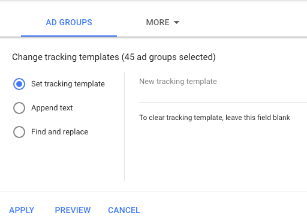

# Understanding [!DNL Marketo] Measure AdWords Tagging {#understanding-marketo-measure-adwords-tagging}

In order to track your ads at a very granular level, the Ad Destination URLs must be unique. To accomplish this, [!DNL Marketo Measure] autotagging automatically adds tracking parameters to the Ad Destination URLs of your [!DNL AdWords] ads. Let's take a look at an example below.

The following URL will not provide any granular data:

* `http://example.com/landing-page?myParam=foo`

However, the same URL will provide granular data because of the [!DNL Marketo] Measure parameters:

* `http://example.com/landing-page?myParam=foo&_bt={creative}&_bk={keyword}&_bm={matchtype}&_bn={network}&_bg={adgroupid}`

## How [!DNL Marketo Measure] Auto-tagging Works {#how-marketo-measure-auto-tagging-works}

**If [!DNL Marketo Measure] finds a Tracking Template:**

* [!DNL Marketo Measure] will add its parameters to the Tracking Template.
* If a third-party redirect is found in a Tracking Template such as Kenshoo or Marin, [!DNL Marketo Measure] will take no action. Instead, you must [add [!DNL Marketo Measure] parameters to the third-party tool in your account](/help/api-connections/utilizing-marketo-measures-api-connections/how-bid-management-tools-affect-marketo-measure.md){target="_blank"}.

However, if no Tracking Template is found, [!DNL Marketo Measure] will:

* Scan all Ad Destination URLs for our [!DNL Marketo Measure] Parameters.
* If found, you're good to go.
* If not found, [!DNL Marketo Measure] will append its parameters to the end of the Ad Destination URLs. For new ads, [!DNL Marketo Measure] will append its parameters to the Ad Destination URL within two hours of creation.
* It is important to have a tracking template in place before enabling auto-tagging so that [!DNL Marketo Measure] can attach to it and prevent an ad history reset.

[!DNL Marketo Measure] recommends using an Account-Level, Campaign-Level, or Ad Group-Level Tracking template, as it allows for the addition and subtraction of parameters for all ads without the risk of Ad History interruptions or deletion.

## Tracking Templates {#tracking-templates}

As explained by [!DNL Google AdWords], a tracking template is the URL that is used to reach a landing page. The tracking information collected is used to understand your ad traffic. [Click here](https://support.google.com/adwords/answer/7197008?hl=en){target="_blank"} for more information from Google.

[!DNL Marketo Measure] recommends using an Account Level, Campaign Level, or Ad Group Level Tracking template, as it allows for the addition and subtraction of parameters for all ads without the risk of Ad History interruptions or deletion.

There are two tracking templates [!DNL Marketo Measure] recommends using. Please use the following to determine which version is appropriate for you:

* If all of your ad URLs have a "?" in them, use this URL:

`{lpurl}&_bt={creative}&_bk={keyword}&_bm={matchtype}&_bn={network}&_bg={adgroupid}`

* If none of your ad URLs have a "?" in them, use this URL:

`{lpurl}?_bt={creative}&_bk={keyword}&_bm={matchtype}&_bn={network}&_bg={adgroupid}`

## Setting up a Tracking Template at the Account Level {#setting-up-a-tracking-template-at-the-account-level}

1. Log in to your [!DNL Google AdWords] Account.

1. Click **[!UICONTROL All campaigns]** and then **[!UICONTROL Settings]** in the expanding window.

   

1. Click **[!UICONTROL Account Settings]** at the top and then **[!UICONTROL Tracking Template]**. Enter the [!DNL Marketo Measure] Tracking Template.

   

1. Click **[!UICONTROL Save]**.

## Setting up a Tracking Template at the Campaign Level {#setting-up-a-tracking-template-at-the-campaign-level}

1. Click **[!UICONTROL All campaigns]** and then **[!UICONTROL Campaigns]** in the expanding window.

   

1. Select all applicable campaigns or **[!UICONTROL Select All]**, click **[!UICONTROL Edit]**, and then click **[!UICONTROL Change Tracking Templates]**.

   

1. Enter the [!DNL Marketo Measure] Tracking Template and click **[!UICONTROL Apply]**.

## Setting up a Tracking Template at the Ad Group Level: {#setting-up-a-tracking-template-at-the-ad-group-level}

1. Click **[!UICONTROL All campaigns]** and then **[!UICONTROL Ad Groups]** in the expanding window.

   

1. Select all applicable Ad Groups or Select All, click **[!UICONTROL Edit]** and then click **[!UICONTROL Change Tracking Templates]**.

1. Enter the [!DNL Marketo Measure] Tracking Template and click **[!UICONTROL Apply]**.

   

## FAQ {#faq}

**Q: What permissions does the connected user need?**

A: userinfo.email

**Q: How long can it take to import spend data?**

A: 6 hours

**Q: How long can it take to import ad data?**

A: 4 hours

>[!NOTE]
>
>Once the changes are made, you are done. Feel free to reach out to [Marketo Support](https://nation.marketo.com/t5/support/ct-p/Support){target="_blank"} if there are any questions during setup.

[Click here](https://support.google.com/adwords/answer/6076199?hl=en#tracking){target="_blank"} for instructions from Google on creating Account-Level Tracking Templates.
