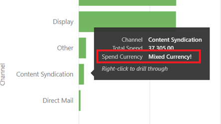

# Marketo Measure Report Template - Power BI {#marketo-measure-report-template-power-bi}

## Getting Started {#getting-started}

You can access the Power BI report template [here](https://github.com/adobe/Marketo-Measure-BI-Templates){target="_blank"}.

Open the Adobe Marketo Measure Reporting Template Power BI file.

You can find your specific Server, Warehouse, and Schema information in the Marketo Measure UI on the Data Warehouse information page. Instructions for how to locate this page are detailed [here](/help/marketo-measure-data-warehouse/data-warehouse-access-reader-account.md){target="_blank"}.

The QueryFilterStartDate and QueryFilterEndDate parameters are used to limit the amount of data imported. These parameters must be in SQL format as they are used to in the queries sent to Snowflake. For example, if you want to limit data to the past two years, the QueryFilterStartDate would be dateadd (year,-2,current_date()). These parameters are compared against datetime data types, so it's recommended to use dateadd (day,1,current_date()) for the QueryFilterEndDate to return all data to the current time.

## Data Connection {#data-connection}

The parameters entered when opening the file are used to structure native queries which import tables from the data warehouse. You will still need to set up a data connection to your Snowflake instance. For this you'll need the same Server and Warehouse names along with your Username and Password. Details on where to find your Username and reset your Password, if needed, are documented [here](/help/marketo-measure-data-warehouse/data-warehouse-access-reader-account.md){target="_blank"}.

## Data Import {#data-import}

In order to improve report performance, and take advantage of transformation capabilities in Power Query, we've elected to set up this template using the import storage method.

### Query Parameters {#query-parameters}

To limit the data imported into the model, each table is set up using a native query as the source. Native queries require approval to execute, you'll need to click run for each query. This step is only needed the first time the queries are run, or if the parameters change.

All queries filter out deleted rows and the facts tables are set to filter to rows with a modified date between the start and end dates entered as parameters.

>[!NOTE]
>
>Because the date filters are applied to the modified date of a row, use caution when reporting on dates that fall outside the restricted date range. For example, the modified date range is limited to the past two years. This can include an event with an event date of three years ago, but which has been modified recently. However, reporting on events from three years ago will return incomplete results since not all rows will have been modified within the two-year time frame.

The following tables are treated as facts tables; the date limits on modified date have been added to these queries.

* Activity
* Touchpoint
* Lead Touchpoint
* Attribution Touchpoint
* Cost
* Site Form
* Session
* Campaign Member
* Task
* Event
* Lead/Contact Stage Transition
* Opportunity Stage Transition

The following tables are treated as dimension tables; no date limits are set for these queries.

* Account
* Campaign
* Contact
* Conversion Rate
* Opportunity
* Lead
* Stage
* Channel

## Data Transformations {#data-transformations}

A few transformations have been applied to the data in Power Query. To view the specific transformations for any table, open Power Query, navigate to a table, and note the Applied Steps on the left side of the window. Some of the specific transformations are outlined below.

### Removed Columns {#removed-columns}

To simplify the data model and remove redundant and unnecessary data, we've reduced the number of columns imported into Power BI from the original Snowflake table. Columns removed include unnecessary foreign keys, denormalized dimensional data better leveraged via relationships to other tables in the model, audit columns, and fields used for internal Marketo Measure processing. You may add or remove columns as required for your business needs. Navigate to the "Removed Other Columns" step after the "Source" step in any table, click the gear icon, and update the selected columns in the list provided.

>[!NOTE]
>
>* Be cautious when adding additional foreign key values. Power BI is often set to auto detect relationships in the model and adding foreign key values may result in undesirable links between tables and/or disabling existing relationships.
>
>* Most tables in the Marketo Measure data warehouse contain denormalized dimensional data. We've worked to normalize and clean up the model in Power BI as much as possible to improve performance and data accuracy. Exercise caution when including any additional denormalized fields in facts tables, this may break dimensional filtering across tables and could also result in inaccurate reporting.

### Renamed Columns {#renamed-columns}

Tables and columns have been renamed to make them more user friendly and to standardize naming conventions. To view the column name changes, navigate to the "Renamed Columns" step after the "Removed Other Columns" step in any table.

### Renamed Segments {#renamed-segments}

Since segment names are customizable, they have generic column names in the Snowflake data warehouse. BIZ_SEGMENT_NAMES is a mapping table which lists the generic segment name and its mapped customized segment name, defined in the segment section in the Marketo Measure UI. The Segment Name table is used to rename the segment columns in the Lead Touchpoint and Attribution Touchpoint tables. If no customized segment exists, the generic segment name remains.

### Case Sensitive ID Conversion {#case-sensitive-id-conversion}

Marketo Measure data has a couple tables where the primary key (ID) values are case sensitive, namely Touchpoint and Campaign. The data engine that drives the Power BI modeling layer is case insensitive, thus resulting in "duplicate" id values. To preserve the case sensitivity of these key values, we've implemented transformation steps which attach invisible characters to lower case characters, preserving the uniqueness of the ID when evaluated in the data engine layer. More details about the issue and the detailed steps on the method we've employed can be found [here](https://blog.crossjoin.co.uk/2019
/10/06/power-bi-and-case-sensitivity/){target="_blank"}. These case sensitive ID values are labeled as "Join IDs" and are used as join keys in the relationship layer. We've hidden the Join IDs from the reporting layer, keeping the original ID values visible for use in reporting, since the invisible characters can interfere with cut
/paste functions and filtering.

### Rows Added {#rows-added}

To add currency conversion capabilities to the calculations in the model, we've added a corporate conversion rate column to both the Opportunity and Cost tables. The value in this column is added at the row level and is evaluated by joining to the Conversion Rate table on both date and currency id. For more details on how currency conversion works in this model, see the [Currency Conversion](#currency-conversion) section in this documentation.

The Conversion Rate table stored in Snowflake contains a date range for each conversion. Power BI does not allow join criteria on a calculation (i.e. between a range of dates). In order to join on date, we added steps to the Conversion Rate table to expand the rows so there is one row for each date in the conversion date range.

## Data Model {#data-model}

<table> 
 <tbody> 
  <tr> 
   <td><strong></strong></td> 
  </tr> 
  <tr> 
   <td>_Click image for larger version_</td> 
  </tr> 
 </tbody> 
</table>

### Relationships and Data Flow {#relationships-and-data-flow}

Event data, used for creating touchpoints, is stored in the Session, Task, Event, Activity, and Campaign Member tables. These event tables join to the Touchpoint table via their respective IDs, and if the event resulted in a touchpoint, details are stored in the Touchpoint table.

Lead Touchpoints and Attribution Touchpoints are stored in their own tables, with a link to the Touchpoint table. Most dimensional data for Lead and Attribution Touchpoints is sourced from their link to the corresponding Touchpoint.

In this model, Campaign and Channel dimensions are linked to the Touchpoint, so all reporting on these dimensions is through this link and means that dimensional reporting on event data may be incomplete. This is because many events do not have links to these dimensions until after they are processed into Touchpoints. Note: some events, such as Sessions, do have direct links to the Campaign and Channel dimensions. If reporting at the Session level on these dimensions is desired, it's recommended that a separate data model is created for this purpose.

Cost data is stored at differing aggregation levels within the Snowflake data warehouse Cost table. For all ad providers, Campaign level data can be rolled up to the Channel level. For this reason, this model pulls cost data based on the "campaign_is_aggregatable_cost" flag. Self-reported costs can be submitted at the Channel level only, and aren't required to have Campaign data. To provide the most accurate cost reporting possible, self-reported costs are pulled based on the "channel_is_aggregatable_cost" flag. The query which imports cost data is written with the following logic: If ad_provider = "SelfReported" then channel_is_aggregatable_cost = true, else campaign_is_aggregatable_cost = true.

Cost data and Touchpoint data have some common dimensions, so both facts tables have relationships with the Campaign and Channel dimension tables.

Within the context of this model, Lead, Contact, Account, and Opportunity data is considered as dimensional data, and joined directly to the Lead Touchpoint and Attribution Touchpoint tables.

### Added Tables {#added-tables}

**Date**

Because Power BI only allows for relationships between tables on one column, a Date dimension table was added to facilitate the join necessary between the tables containing amounts (Opportunity and Cost) and the Conversion Rate table. See the Currency Conversion section for more details on how currency conversions are calculated in this model.

**Measures**

All measures have been added to a dedicated Measures table. It is not connected to the model but serves as a single location to store all measures, for ease of use.

**Attribution Model**

A separate table was added to store the names of the attribution models. This table is used to create filters which allow the user to switch between attribution models for attributed revenue calculations.

### Currency Conversion {#currency-conversion}

The rates in the Conversion Rate table represent the value needed to convert an amount from the corporate currency. Conversions to any currency require a double conversion, first from the original currency to the corporate currency, and then from the corporate currency to the selected currency. The first step in this chain in the model is adding a column with the conversion rate to corporate to the tables with amounts, Opportunity and Cost. These steps are detailed in the Rows Added header of the Data Transformations section in this document. Converting from the original currency to the corporate currency consists of dividing the value by this added column. The next step is to multiply the corporate currency value by the rate in the Conversion Rate table which corresponds to the selected currency.

* Convert the original value to the corporate currency value / corporate conversion rate = value in corporate currency
* Convert the value from corporate to selected currency value in corporate currency `*` conversion rate of selected currency = value in selected currency

Because conversion rates are not required to be static, and can change by specified date ranges, all currency conversion calculations must be performed at the row level. Again, because conversion rates pertain to a specific date range, the lookup calculation must be performed within the DAX of the measure, so the relationship can be defined on both the currency code and the date.

The currency conversion measures in this model substitute a value of 1.0 for the rate if no conversion rate can be identified. Separate measures have been created to display the currency value for the measure, and alert if a calculation includes more than one currency value (i.e., a value could not be converted to the selected currency).

## Data Definitions {#data-definitions}

Definitions have been added to the Power BI model for tables, custom columns, and measures.

To view definitions for columns coming directly from Snowflake, please see the [data warehouse documentation](/help/marketo-measure-data-warehouse/data-warehouse-schema.md){target="_blank"}

## Discrepancies Between Templates and Discover {#discrepancies-between-templates-and-discover}

### Attributed Revenue {#attributed-revenue}

Lead Touchpoints and Attribution Touchpoints inherit dimensional data from the original Touchpoint. The reporting template model sources all inherited dimensional data from the relationship to Touchpoint, while in the Discover model, dimensional data is denormalized to the Lead and Attribution Touchpoint records. The overall attributed revenue or attributed pipeline revenue values should line up between the two reports. However, discrepancies may be observed when revenue is broken down or filtered by dimensional data (channel, subchannel, or campaign). If dimensional revenue amounts don't match between the template and Discover, it is likely there are missing touchpoint records in the template report data set. This happens when there is a Lead or Attribution Touchpoint record, but no corresponding record in the Touchpoint table within the data set imported into the report. Because these tables are filtered by modified date, it's possible the Lead/Attribution Touchpoint record was modified more recently than the Touchpoint record, and thus the Lead/Attribution Touchpoint has been imported into the data set while the original Touchpoint record was not. To fix this issue, widen the filtered date range for the Touchpoint table, or consider removing the date constraint it all together. Note: Touchpoint is a large table, so consider the trade-offs of a more complete data set vs. the amount of data which must be imported.

### Cost {#cost}

Cost reporting in the templates is only available at the campaign and channel level, however, Discover offers reporting at lower levels of granularity for some ad providers, (i.e., creative, keyword, ad groups, etc.). For more detail on how the cost data is modeled in the templates, reference the Data Model section of this documentation. If the dimension filter in Discover is set to channel or campaign, costs at the channel, subchannel, and campaign levels should line up between Discover and the report templates.

### ROI {#roi}

Since ROI is calculated from Attributed Revenue and Cost, the same discrepancies that might arise in either of those calculations can arise in ROI and for the same reasons, as noted in those sections.

### Touchpoints {#touchpoints}

These metrics, as shown in the reporting templates, are not mirrored in Discover. There is currently no direct comparison possible between the two.

### Web Traffic {#web-traffic}

The reporting template data model normalizes channel, subchannel, and campaign dimensional data via the relationship between Session and Touchpoint. This is different from the Discover data model, which denormalizes these dimensions to Session. Because of this distinction, overall counts for visits and visitors should match between Discover and the reporting template, however, once displayed or filtered by dimension, these numbers are not expected to line up. This is because the dimensional data in the template is only available for web events which resulted in a touchpoint (i.e. non- anonymous events). For more details, please reference the [Data Model](#data-model) section of this documentation.

There may be small discrepancies in total site form counts between Discover and the template. This is because the data model in the reporting template obtains dimensional data for Site Form via a relationship to Session and then Touchpoint; there are a few instances where site form data does not have a correlated session.

### Leads and Accounts {#leads-and-accounts}

Dimensional reporting for accounts touched may differ slightly between Discover and the template, this is again due to the dimensional modeling coming from the relationship between Touchpoint and Lead Touchpoint or Attribution Touchpoint. Please reference the details outlined in the Attributed Revenue section for more details.

All lead counts in Discover are attributed lead counts, and in the reporting template the metric is leads touched. Therefore, there is no direct comparison possible between the two reports for this measure.

### Engagement Path {#engagement-path}

There is no direct comparison between the Engagement Path report in Discover and the template. The report in Discover is modeled off the Touchpoint while the report in the template is modeled off the Attribution Touchpoint. The template focuses solely on opportunities and their related touchpoints instead of showing all touchpoint data.

### Deal Velocity {#deal-velocity}

There should be no discrepancy between this report in the template and the Deal Velocity tile on the Velocity dashboard in Discover.
