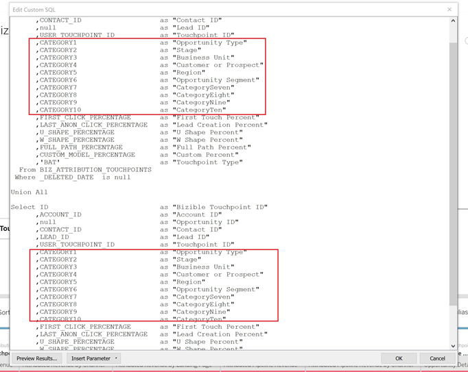

# [!DNL Marketo Measure] Report Template - Tableau {#marketo-measure-report-template-tableau}

## Getting Started {#getting-started}

You can access the [!DNL Tableau] report template [here](https://github.com/adobe/Marketo-Measure-BI-Templates){target="_blank"}.

Open the [!DNL Adobe Marketo Measure] Reporting Template Tableau Workbook file.

You will need to update the existing connection data to your specific Snowflake connection information. Click the [!UICONTROL Edit Connection] button and follow the steps outlined in the [[!UICONTROL Data Connection]](#data-connection) section of this documentation.


## Data Connection {#data-connection}

You'll need to set up a data connection to your Snowflake instance. For this you'll need the Server name along with your Username and Password. Details on where to find this information and reset your password, if needed, are documented [here](/help/marketo-measure-data-warehouse/data-warehouse-access-reader-account.md){target="_blank"}.


You will also need to enter an initial SQL command. This supports the use of custom queries in this data model. The command to enter is "Use Schema `<your schema name>`". You can locate your schema name in the [!UICONTROL data warehouse connections] page, see documentation referenced above.


### Custom SQL Queries {#custom-sql-queries}

Because [!DNL Tableau] applies data source filters to the overall query and not on the individual table the filter is set to, we've elected to use custom SQL for each table in the model. This allows the model to filter out deleted and duplicate rows at the table level. For example, when applied as a data source filter, session._deleted_date is null will be added to the where clause of the query, resulting in the following query.

**Filters Added to Data Source**

```
--A deleted session removes this row completely and the touchpoint data is lost. Select *
   From Touchpoint    tp
      join Session sn
      on tp.session_id = sn.session_id 
 Where tp._deleted_date is null
    and sn._deleted_date is null
```

However, this is incorrect in that if a session was deleted, but the corresponding touchpoint is not deleted, the touchpoint data is removed from the data set. We want the touchpoint data present in the data set, as the touchpoint has not been deleted. Adding custom SQL ensures the filter criteria is applied at the table level, resulting in the following query.

**Filters Applied via Custom SQL**

```
--A deleted session only removes the session related data, and the touchpoint data is preserved. Select *
   From Touchpoint       tp
      join Session sn
      on tp.session_id          = sn.session_id 
      and sn._deleted_date      is null
  Where tp._deleted_date is null
```

## Data Transformations {#data-transformations}

A few transformations have been applied to the data in [!DNL Tableau] from its original state in Snowflake. Most of these transformations are applied in the custom SQL queries which generate the tables in the [!DNL Tableau] model. To view the custom SQL used to generate a table, right click on the table name and select "Edit Custom SQL Query". Some of the specific transformations are outlined below.


### Removed Columns {#removed-columns}

To simplify the data model and remove redundant and unnecessary data, we've reduced the number of columns imported into Tableau from the original Snowflake table. Columns removed include unnecessary foreign keys, denormalized dimensional data better leveraged via relationships to other tables in the model, audit columns, and fields used for internal [!DNL Marketo Measure] processing. You may add or remove columns as required for your business needs by editing the list of imported columns in the Select section of the custom SQL.

>[!NOTE]
>
>Most tables in the data warehouse contain denormalized dimensional data. We've worked to normalize and clean up the model in [!DNL Tableau] as much as possible to improve performance and data accuracy. Exercise caution when including any additional denormalized fields in facts tables, this may break dimensional filtering across tables and could also result in inaccurate reporting.

### Renamed Columns {#renamed-columns}

Tables and columns have been renamed to make them more user friendly and to standardize naming conventions. To view the column name changes, reference the custom SQL statements which create the tables.

### Rows Added {#rows-added}

To add currency conversion capabilities to the calculations in the model, we've added a corporate conversion rate and a target conversion rate column to both the Opportunity and Cost tables. The value in these columns is added at the row level and is evaluated by joining to the Conversion Rate table on both date and currency id. Since Tableau does not allow for facts tables to share more than one dimension table, the conversion rates were added directly to the tables which use it. For more details on how currency conversion works in this model, see the [Currency Conversion](#currency-conversion) section in this documentation.


There are a few places where two tables from [!DNL Snowflake] have been combined with a union to create one table in the [!DNL Tableau] data model. In these instances, a "Type" column has been added to indicate which [!DNL Snowflake] table it comes from and designate which entity the row represents. For more details on the tables which have been combined, see the Relationship and Data Flow section in this documentation.


### Segment Names {#segment-names}

Since segment names are customizable, they have generic column names in the Snowflake data warehouse. [!DNL BIZ_SEGMENT_NAMES] is a mapping table which lists the generic segment name with the customized segment name it's mapped to, as defined in the segment section in the [!DNL Marketo Measure] UI. If you use custom segment names and would like to update your [!DNL Tableau] model to incorporate these, use this table and manually rename the columns inside the Tableau model. The segment columns are in the Lead and Attribution Touchpoint table, and will only need to be renamed one time.

The [!UICONTROL CATEGORY] column lists the category number and the SEGMENT_NAME column has the customized segment name it maps to.


Names can be updated in two ways. The first option is to update the custom SQL. In this example Categories 1-6 have been renamed based on the mapping from the Segment Names table.



The other option is to rename the columns directly in the [!DNL Tableau] table.


## Data Model {#data-model}

Click the image below for its full-size version.

[](/help/bi-report-templates/assets/tableau-data-model.png){target="_blank"}

### Relationships and Data Flow {#relationships-and-data-flow}

Event data, used for creating touchpoints, is stored in the [!UICONTROL Session], [!UICONTROL Task], [!UICONTROL Event], [!UICONTROL Activity], and [!UICONTROL Campaign Member] tables. These event tables join to the Touchpoint table via their respective IDs, and if the event resulted in a touchpoint, details are stored in the Touchpoint table.

Lead Touchpoints and Attribution Touchpoints are combined into one table in this model, with a link to the Touchpoint table. The "Touchpoint Type" column has been added to designate if a row is a Lead or an Attribution touchpoint. Most dimensional data for Lead and Attribution Touchpoints is sourced from their link to the corresponding Touchpoint.

Opportunity Stage Transitions and Lead Stage Transitions are combined into one table in this model, with a link to the [!UICONTROL Lead and Attribution] Touchpoint table. The "Transition Type" column has been added to designate if a row is an Opportunity or Lead stage transition.

Both Cost and Touchpoint data share Channel and Campaign dimensions. However, Tableau is limited in it's ability to model shared dimensions between facts tables. Since we are limited to only one shared dimension table, Channel and Campaign data has been combined into one table. They are combined using a cross join of the two dimensions into one table in Tableau: Channel and Campaign. The unique id is created by concatenating the channel and campaign ids. This same id value is added to both the Touchpoint and Cost tables to create a relationship to this combined dimension table.


In this model, Campaign and Channel dimensions are linked to the Touchpoint, so all reporting on these dimensions is through this link and means that dimensional reporting on event data may be incomplete. This is because many events do not have links to these dimensions until after they are processed into Touchpoints.

>[!NOTE]
>
>Some events, such as Sessions, do have direct links to the Campaign and Channel dimensions. If reporting at the Session level on these dimensions is desired, it's recommended that a separate data model is created for this purpose.

Cost data is stored at differing aggregation levels within the Snowflake data warehouse Cost table. For all ad providers, Campaign level data can be rolled up to the Channel level. For this reason, this model pulls cost data based on the "campaign_is_aggregatable_cost" flag. Self-reported costs can be submitted at the Channel level only and aren't required to have Campaign data. To provide the most accurate cost reporting possible, self-reported costs are pulled based on the "channel_is_aggregatable_cost" flag. The query which imports cost data is written with the following logic: If ad_provider = "SelfReported" then channel_is_aggregatable_cost = true, else campaign_is_aggregatable_cost = true.

Within the context of this model, Lead, [!UICONTROL Contact], [!UICONTROL Account], and [!UICONTROL Opportunity] data is considered as dimensional data, and joined directly to the Lead and Attribution Touchpoint table.

### Currency Conversion {#currency-conversion}

The rates in the Conversion Rate table represent the value needed to convert an amount from the corporate currency. Conversions to any currency require a double conversion, first from the original currency to the corporate currency, and then from the corporate currency to the selected currency. The first step in this chain in the model is adding two columns with these conversion rates to the tables with amounts, Opportunity and Cost. These steps are detailed in the Rows Added section in this document. Because conversion rates are not required to be static, and can change by specified date ranges, all currency conversion calculations must be performed at the row level. Converting from the original currency to the corporate currency consists of dividing the value by the corporate conversion rate, and then multiplying by the target conversion rate. The target conversion rate is determined by the selected currency parameter value.

* Convert the original value to the corporate currency value / corporate conversion rate = value in corporate currency
* Convert the value from corporate to selected currency value in corporate currency `*` conversion rate of selected currency = value in selected currency


The currency conversion measures in this model substitute a value of 1.0 for the rate if no conversion rate can be identified. Separate measures have been created to display the currency value for the measure, and alert if a calculation includes more than one currency value (i.e. a value could not be converted to the selected currency). These measures, Cost Currency and Revenue Currency, are included as tooltips in any visual which displays Cost or Revenue data.


## Data Definitions {#data-definitions}

Definitions have been added to the [!DNL Tableau model] for parameters, custom columns, and measures.


To view definitions for columns coming directly from [!DNL Snowflake], please see the [data warehouse documentation](/help/marketo-measure-data-warehouse/data-warehouse-schema.md){target="_blank"}.

## Discrepancies Between Templates and Discover {#discrepancies-between-templates-and-discover}

### Attributed Revenue {#attributed-revenue}

Lead Touchpoints and Attribution Touchpoints inherit dimensional data from the original Touchpoint. The reporting template model sources all inherited dimensional data from the relationship to Touchpoint, while in the Discover model, dimensional data is denormalized to the Lead and Attribution Touchpoint records. The overall attributed revenue or attributed pipeline revenue values should line up between the two reports. However, discrepancies may be observed when revenue is broken down or filtered by dimensional data (channel, subchannel, or campaign). If dimensional revenue amounts don't match between the template and Discover, it is likely there are missing touchpoint records in the template report data set. This happens when there is a Lead or Attribution Touchpoint record, but no corresponding record in the Touchpoint table within the data set imported into the report. Because these tables are filtered by modified date, it's possible the Lead/Attribution Touchpoint record was modified more recently than the Touchpoint record, and thus the Lead/Attribution Touchpoint has been imported into the data set while the original Touchpoint record was not. To fix this issue, widen the filtered date range for the Touchpoint table, or consider removing the date constraint it all together.

>[!NOTE]
>
>Touchpoint is a large table, so consider the trade-offs of a more complete data set vs. the amount of data which must be imported.

### Cost {#cost}

Cost reporting in the templates is only available at the campaign and channel level, however, Discover offers reporting at lower levels of granularity for some ad providers, (i.e., creative, keyword, ad groups, etc.). For more detail on how the cost data is modeled in the templates, reference the [!UICONTROL Data Model] section of this documentation. If the dimension filter in [!UICONTROL Discover] is set to channel or campaign, costs at the channel, subchannel, and campaign levels should line up between Discover and the report templates.

### ROI {#roi}

Since ROI is calculated from Attributed Revenue and Cost, the same discrepancies that might arise in either of those calculations can arise in ROI and for the same reasons, as noted in those sections.

### Touchpoints {#touchpoints}

These metrics, as shown in the reporting templates, are not mirrored in Discover. There is currently no direct comparison possible between the two.

### Web Traffic {#web-traffic}

The reporting template data model normalizes channel, subchannel, and campaign dimensional data via the relationship between Session and Touchpoint. This is different from the Discover data model, which denormalizes these dimensions to Session. Because of this distinction, overall counts for visits and visitors should match between Discover and the reporting template, however, once displayed or filtered by dimension, these numbers are not expected to line up. This is because the dimensional data in the template is only available for web events which resulted in a touchpoint (i.e. non- anonymous events). For more details, please reference the [Data Model](#data-model) section of this documentation.

There may be small discrepancies in total site form counts between [!DNL Discover] and the template. This is because the data model in the reporting template obtains dimensional data for Site Form via a relationship to Session and then Touchpoint; there are a few instances where site form data does not have a correlated session.

### Leads and Accounts {#leads-and-accounts}

Dimensional reporting for accounts touched may differ slightly between [!DNL Discover] and the template, this is again due to the dimensional modeling coming from the relationship between Touchpoint and Lead Touchpoint or Attribution Touchpoint. Please reference the details outlined in the Attributed Revenue section for more details.

All lead counts in [!UICONTROL Discover] are attributed lead counts, and in the reporting template the metric is [!UICONTROL leads] touched. Therefore, there is no direct comparison possible between the two reports for this measure.

### Engagement Path {#engagement-path}

There is no direct comparison between the [!UICONTROL Engagement Path] report in [!DNL Discover] and the template. The report in [!DNL Discover] is modeled off the Touchpoint while the report in the template is modeled off the Attribution Touchpoint. The template focuses solely on opportunities and their related touchpoints instead of showing all touchpoint data.

### Deal Velocity {#deal-velocity}

There should be no discrepancy between this report in the template and the Deal Velocity tile on the Velocity dashboard in Discover.
