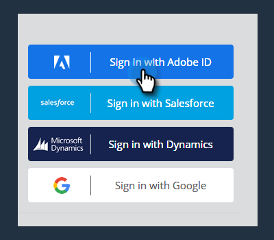
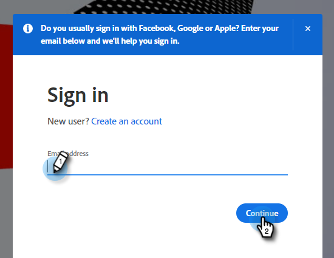
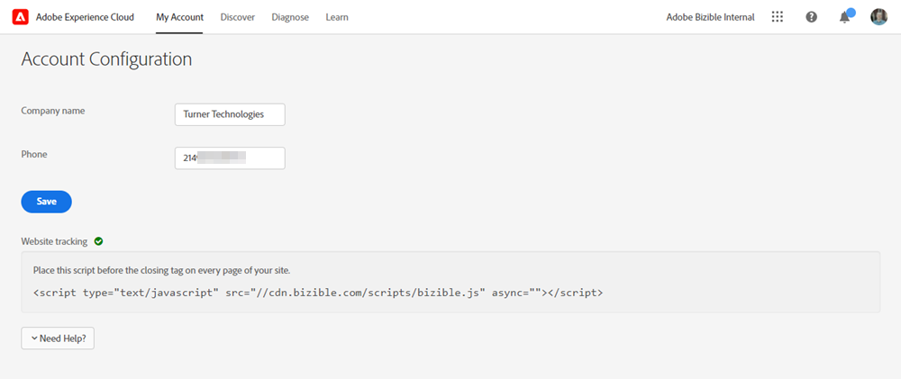
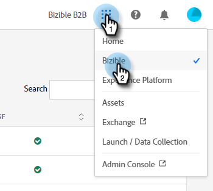
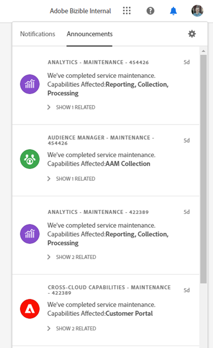

# Unified Shell Overview {#unified-shell-overview}

Unified Shell aligns the "shell" look and feel of Adobe Experience Cloud applications and services. But, it's more than just a new design. It's a single-page application that delivers user experience in a single instance.

## User Flows {#user-flows}

**Traditional**

This flow is for those who have not yet been [IMS-migrated](/help/marketo-measure-and-adobe/migration-to-adobe-admin-console.md).

When visiting [https://apps.bizible.com](https://apps.bizible.com) and clicking "Sign in with Adobe ID," you're automatically directed to [https://experience.adobe.com/bizible](https://experience.adobe.com/bizible).

   

   

You can use your Corporate Adobe Account to sign in to Experience Cloud. Once signed in, you'll be directed to https://experience.adobe.com/bizible and will see your normal Bizible home page, but with an updated look and feel. Menu items, actionable elements, and other features are in the same locations as the legacy Bizible system.

   

**Unified Shell Flow**

This flow is for those who _have_ been [IMS-migrated](/help/marketo-measure-and-adobe/migration-to-adobe-admin-console.md).

If you're already logged in to an Adobe Experience Cloud product, click the menu icon and select **Bizible**.

   

>[!NOTE]
>
>Your drop-down menu may look different depending on which Adobe Experience Cloud products you’re subscribed to.

If you're _not_ already logged in to an Adobe Experience Cloud product, log in directly to Bizible here: [https://experience.adobe.com/bizible](https://experience.adobe.com/bizible).

## New Features {#new-features}

In addition to the updated look and feel, you'll notice the following features:

**Domain Management**

[Manage your Bizible domains](/help/marketo-measure-and-adobe/domain-management.md) without assistance from Bizible.

   

**Integrated Help Center**

Search for support articles, submit tickets, provide feedback, all from within the Bizible application.

   

**Application Switcher**

Those with with access to multiple Adobe products will be able to easily toggle between them.

   

**Notifications and Announcements**

View and interact with product-specific notifications and general Adobe product announcements directly in the application.

   

   

**Adobe Settings**

Click your profile icon to change your language or other Adobe-wide preferences. You can also make Bizible-speific changes by clicking **My Settings**.

   

## FAQ {#faq}

**What happens to my bookmarks?**

Bookmarks will be redirected. For example, if you were to navigate to https://apps.bizible.com/Discover/391, you would be redirected to https://experience.adobe.com/bizible/Discover/391 after completing authentication.

**I can't log in to Bizible through the Unified Shell. What might the issue be?**

If you can log in to Adobe Experience Cloud, but see the a page like the following, the issue could be on the Bizible side:

   

If you receive the above error, please [contact Support](https://nation.marketo.com/t5/support/ct-p/Support) for assistance.
