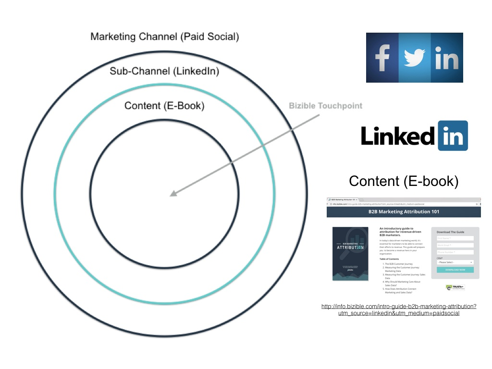

# Marketing Channels and Subchannels {#marketing-channels-and-subchannels}

## Purpose {#purpose}

To define what a Channel and Subchannel are in [!DNL Marketo Measure], how they relate to your content, the difference between the two classifications, and how they are utilized within the [!DNL Marketo Measure] app.

## Overview {#overview}

Marketing Channels are used to help categorize (or "bucket") your marketing activities for ease of reporting, both in the [!DNL Marketo Measure] ROI Dash as well as in your CRM. [!DNL Marketo Measure] comes with 12 out of the box channels (which you can customize/rename to fit your organization's conventions), as well as the ability to further create Custom Channels for even more granular filtering.  
  
Whenever you receive a visitor to one of your Content pages on your site (whether that Content be a Web Page, a White-paper Download, a Page URL, etc.), that Lead will be "bucketed" into a Channel/Subchannel based on several UTM parameters found in the URL:

* Medium
* Source
* Campaign
* Landing Page
* Referring Website

To customize which "bucket" your Leads will fall into based on their UTM parameters, you can use Channel Rules. For more on setting up and maintaining your Channel Rules, [click here](/help/channel-tracking-and-setup/online-channels/online-custom-channel-setup.md).

Learn how to set up your [Online Channels](/help/channel-tracking-and-setup/online-channels/online-custom-channel-setup.md) and [Offline Channels](/help/channel-tracking-and-setup/offline-channels/offline-custom-channel-setup.md), as well as the difference between them.

**Marketing Channel**

The Marketing Channel is the broadest level of classification, and can cover a wide variety of Subchannels. You can consider these the "type" of Subchannel that your leads are coming from. Examples of Marketing Channels include **Paid Search, Organic Search, Display,** and **Paid Social**. The Marketing Channel usually corresponds to the utm_medium parameter value found in your URL.

**Subchannel**

Subchannels are the second piece of the puzzle when bucketing your incoming Leads. Subchannels tell the story of exactly _which_ iteration of your Marketing Channel was used. For example, within the Paid Social Marketing Channel, you may have Subchannels for **AdWords**, **BingAds**, **Facebook**, etc. The Subchannel usually corresponds to the utm_source parameter value found in your URL.

## Use Case Example {#use-case-example}

The diagram below illustrates an example of a Marketing Channel, Subchannel, and Content based on a web page with the following URL:

* [http://info.bizible.com/intro-guide-b2b-marketing-attribution?utm_source=linkedin&utm_medium=paidsocial](http://info.bizible.com/intro-guide-b2b-marketing-attribution?utm_source=linkedin&utm_medium=paidsocial)*

In this case, the Content the user is trying to access is the Intro Guide to B2B Marketing Attribution. [!DNL Marketo Measure] will analyze the URL leading to this Content using the Channel Rules set up in this org, and use them to "bucket" this lead into the Marketing Channel "Paid Social" and the Subchannel "LinkedIn".

Further examples...

**Marketing Channel (Medium)**

* PPC
* Paid Social
* Organic Social
* Email
* Events and Conferences
* Organic Search/SEO
* PR
* Referral Programs

**Subchannel (Touchpoint Source)**

* Google AdWords
* BingAds
* Facebook Ads
* Adroll
* Double-Click
* Capterra
* Drip Campaigns
* LinkedIn Ads

**Content (White-papers, Page URLs, Blog posts)**

* www.adobe.com/blog1
* www.adobe.com/whitepaper
* www.adobe.com/sign-up-now
