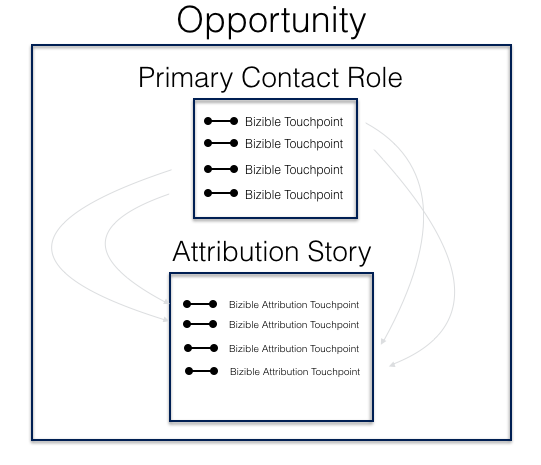

# Attribution Mapping Methodology {#attribution-mapping-methodology}

Attribution Object Mapping is the process of looking up certain objects in your CRM (Contacts, Opportunities, Accounts) to create attribution touchpoints into the associated opportunity. In other words, it's the [!DNL Marketo Measure] way of understanding which touchpoints to include in the attribution model based on your current CRM's processes.

## Account ID Mapping {#account-id-mapping}

Out of the box, [!DNL Marketo Measure] provides Account ID mapping. This means that [!DNL Marketo Measure] looks at the Account and its Contacts marketing information to create Attribution Touchpoints associated to the opportunity. Below is a simple representation of that process.

Please keep in mind that **not all** touchpoints from your contacts will get pushed into the Opportunity as Attribution Touchpoints. The Opportunity's timeline (it's first touch date - closed date) will determine whether or not a touchpoint will count as an influencer on the Opportunity. Therefore, if a touchpoint on Contact A occurred after the Opportunity is Closed Won/Lost, [!DNL Marketo Measure] will not push that touchpoint to the Opportunity. This timeline procedure is followed across all other attribution object mapping.

Pros: This method of attribution is highly effective for most companies. The marketing team doesn't need to rely on the sales team to associate all contacts to a particular opportunity (which is often an issue). Further, even if a sales team associates contact roles, a lot of other contact's interactions with marketing materials may be missed. Finally, this method aides ABM strategies that strive to influence the totality of an account, rather than specific influencers.

Cons: If there are strong Marketing & Sales SLAs that define who should be getting credit for what, then this method could be problematic. In addition, if folks don't use Account hierarchies to define specific business units within a larger account (ex: IBM), then marketing interactions specific to one business unit may get spread across other business unit opportunities.

## Opportunity Contact Role Mapping {#opportunity-contact-role-mapping}

While most clients leverage Account ID mapping, [!DNL Marketo Measure] has the ability to look up to the contact roles (contacts associated to the Opportunity) within an Opportunity to break down the attribution process. This means that [!DNL Marketo Measure] will only push marketing interactions associated to the contact roles on the Opportunity as Buyer Attribution Touchpoints. Below is a representation of this process.

Pros: If your team has a very well defined contact roles process, this type of attribution mapping may be ideal for you. It will help align sales and marketing a bit more as everyone would fully understand how attribution is broken down. This process is also very helpful when organizations are targeting multiple business units within a big company as well as when they are selling different products at the same time.

Cons: However, if there's no contact role process in place, marketing will lose a lot of marketing data and the team will end up receiving a lot less credit for their marketing efforts that are influencing opportunities.

## Opportunity Primary Contact Role Mapping {#opportunity-primary-contact-role-mapping}

Beyond simply looking at the contact roles on the opportunity, [!DNL Marketo Measure] can focus even more to look at only the Primary Contacts on an Opportunity. With this setup in mind, [!DNL Marketo Measure] will only grab the marketing touchpoint associated to the primary contacts on an opportunity and push that information into the attribution story of that specific opportunity. See the image below.

Pros: If your team is only interested in understand the marketing influence on contacts that are set as 'primary' on the opportunity, this type of mapping will suit the team best.

Cons: This is certainly the least used mapping process and can highly undermine marketing influence that's moving the needle across other contacts on an opportunity.
