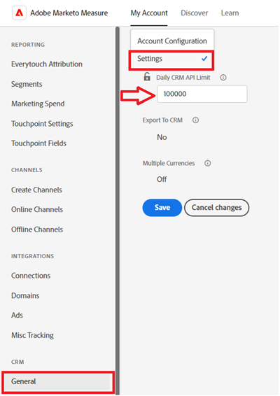

# Error Notifications {#error-notifications}

Below is a list of errors you may receive via in-app notification or email. If you receive any of these, please follow the respective troubleshooting steps. If these steps do not resolve the issue, contact [Marketo Support](https://nation.marketo.com/t5/support/ct-p/Support).

<table>
  <tbody>
    <tr>
      <th>Error Code</th>
      <th>Notification Example</th>
      <th>Description</th>
      <th>Troubleshooting Steps</th>
    </tr>
    <tr>
      <td>API_DISABLED</td>
      <td>Error occurred during Crm Import : API_DISABLED : API calls have been disabled for this user</td>
      <td>The API permission has been disabled for the Marketo Measure user.</td>
      <td>Refer to the following Salesforce documentation on <a href="https://help.salesforce.com/s/articleView?id=sf.branded_apps_commun_api_permset.htm&amp;type=5">how to enable API access</a>.</td>
    </tr>
    <tr>
      <td>API_LIMIT_EXCEEDED</td>
      <td>Error occurred during Crm Export : PI_LIMIT_EXCEEDED</td>
      <td>The CRM's API limit has been exceeded (24 hrs).</td>
      <td>Refer to the following documentation for your CRM for assistance adjusting API credit allocations:

          <ul>
            <li><a href="https://learn.microsoft.com/en-us/dynamics365/fin-ops-core/dev-itpro/data-entities/service-protection-monitoring">Dynamics</a>
            </li>
            <li><a href="https://developer.salesforce.com/docs/atlas.en-us.salesforce_app_limits_cheatsheet.meta/salesforce_app_limits_cheatsheet/salesforce_app_limits_platform_api.htm">Salesforce</a>
            </li>
          </ul>
          
You may also adjust the CRM credits Marketo Measure uses following the below steps:

          <ul>
            <li>Navigate to Settings → CRM → General</li>
            <li>Update the Daily CRM API Limit 
              <ul>
                <li><b>Note</b>: Default is 100,000</li>
              </ul>
            </li>
          </ul>
          

           
          

      </td>
    </tr>
    <tr>
      <td>INVALID_ADOBE_ANALYTICS_CONFIGURATION</td>
      <td>Error occurred during AdobeAnalytics Export: INVALID_ADOBE_ANALYTICS_CONFIGURATION : Error: Upload not allowed. Please confirm the datasource schema before upload. Datasource Id:1234</td>
      <td>The Adobe Analytics integration is not configured correctly.</td>
      <td>Refer to the following help articles to ensure correct configuration:
        <ul>
          <li>
            <a href="/help/marketo-measure-and-adobe/marketo-measure-integrations-with-adobe-analytics.md">Marketo Measure Integrations with Adobe Analytics</a>
          </li>
          <li>
            <a href="https://experienceleague.adobe.com/docs/core-services/interface/services/customer-attributes/t-crs-usecase.html">Create a Customer Attribute source and upload the data file</a>
          </li>
        </ul>
      </td>
    </tr>
    <tr>
      <td>INVALID_CURRENCY_ISO_CODE</td>
      <td>Error occurred during Ad Import: INVALID_CURRENCY_ISO_CODE: Currency XXX is not supported by Marketo Measure.
      

      Error occurred during Ad Import: INVALID_CURRENCY_ISO_CODE : Currency XXX on Account for 1234 is not supported by Marketo Measure.</td>
      <td>An unsupported currency was encountered.</td>
      <td>In the source system indicated in the notification (Ad, Crm, Marketo) ensure the currency associated to the record has a supported & valid currency. Supported currencies are derived from ISO currency standards.</td>
    </tr>
    <tr>
      <td>MISSING_CONVERTED_LEAD_PERMISSION</td>
      <td>Error occurred during Crm Export: MISSING_CONVERTED_LEAD_PERMISSION</td>
      <td>Marketo Measure is missing the View/Edit Converted Leads permission</td>
      <td>Refer to the following Experience League document for assistance with enabling this permission in your CRM 
          <a href="/help/marketo-measure-salesforce-reporting/additional-functionality/enabling-the-permission-to-edit-converted-leads.md">Enabling the Permission to Edit Converted Leads</a></td>
    </tr>
    <tr>
      <td>MISSING_FIELD_READ_PERMISSION</td>
      <td>Error occurred during Crm Import: MISSING_FIELD_READ_PERMISSION : Entity type 'Event': INVALID_FIELD: 
    SystemModstamp,IsDeleted,WhoId,bizible2__Bizible_Touchpoint_Date__c</td>
      <td>Marketo Measure is missing read permissions to a required field.</td>
      <td>Refer to the following help articles for guidance on the permissions Marketo Measure requires:
        <ul>
          <li><a href="/help/marketo-measure-and-dynamics/getting-started-with-marketo-measure-and-dynamics/marketo-measure-dynamics-schema.md">Dynamics</a>
          </li>
          <li><a href="/help/configuration-and-setup/marketo-measure-and-salesforce/how-marketo-measure-and-salesforce-interact.md">Salesforce</a>
          </li>
        </ul>
      </td>
    </tr>
    <tr>
      <td>MISSING_ISREPLICATEABLE_PERMISSION</td>
      <td>Error occurred during Crm Import: MISSING_ISREPLICATEABLE_PERMISSION : We are missing IsReplicateable permission on Campaign</td>
      <td>This permission is required on Salesforce objects for us to keep your Marketo Measure and Salesforce in sync.</td>
      <td>Contact Salesforce support for assistance setting the replicateable permission on objects.</td>
    </tr>
    <tr>
      <td>MISSING_OBJECT_READ_PERMISSION</td>
      <td>Error occurred during Crm Import: MISSING_OBJECT_READ_PERMISSION : Entity type Campaign': CRM ErrorCode: MISSING_PERMISSION</td>
      <td>Marketo Measure is missing read permissions to a required object.</td>
      <td rowspan="2">Refer to the following help articles for guidance on the permissions Marketo Measure requires:
          <ul>
            <li><a href="/help/marketo-measure-and-dynamics/getting-started-with-marketo-measure-and-dynamics/marketo-measure-dynamics-schema.md">Dynamics</a>
            </li>
            <li><a href="/help/configuration-and-setup/marketo-measure-and-salesforce/how-marketo-measure-and-salesforce-interact.md">Salesforce</a>
            </li>
          </ul>
      </td>
    </tr>
    <tr>
      <td>MISSING_OBJECT_WRITE_PERMISSION</td>
      <td>Error occurred during Crm Export: MISSING_OBJECT_WRITE_PERMISSION : Entity type 'bizible2_Bizible_Attribution_Touchpoint': CRM ErrorCode: MISSING_PERMISSION</td>
      <td>Marketo Measure is missing write permissions to a required object.</td>
    </tr>
    <tr>
      <td>NULL_EMPTY_CURRENCY_ISO_CODE</td>
      <td>
        

          Error occurred during Crm Import: NULL_EMPTY_CURRENCY_ISO_CODE: Currency ISO code is NULL or Empty when MultiCurrency is enabled for RecordId 1234
      </td>
      <td>Currency must be a supported ISO currency code.</td>
      <td>In the source system indicated in the notification (Ad, Crm, Marketo) ensure the currency associated to the record has a supported & valid currency. Supported currencies are derived from ISO currency standards.</td>
    </tr>
    <tr>
      <td>OPERATION_TOO_LARGE</td>
      <td>Error occurred during Crm Import: OPERATION_TOO_LARGE : We require the 'View All Data' permission to query activities successfully.</td>
      <td>CRM settings are not allowing Marketo Measure to query a large enough set of data</td>
      <td>Grant Marketo Measure 'View All Data' permissions on the designated object.
      

      More info on the 'View All Data' permission <a href="https://developer.salesforce.com/docs/atlas.en-us.securityImplGuide.meta/securityImplGuide/users_profiles_view_all_mod_all.htm">can be found here</a>.</td>
    </tr>
    <tr>
      <td>UNSUPPORTED_CRM_PACKAGE_VERSION</td>
      <td>Error occurred during Crm Import: UNSUPPORTED_CRM_PACKAGE_VERSION : Please update your crm package</td>
      <td>The current package detected is no longer supported.</td>
      <td>Upgrade your package to the most recent version:
        <ul>
          <li><a href="/help/configuration-and-setup/marketo-measure-and-salesforce/best-practices-for-marketo-measure-crm-package.md">Best Practices</a>
          </li>
          <li><a href="/help/marketo-measure-and-dynamics/getting-started-with-marketo-measure-and-dynamics/microsoft-dynamics-crm-installation-guide.md">Dynamics</a>
          </li>
          <li><a href="/help/configuration-and-setup/marketo-measure-and-salesforce/marketo-measure-salesforce-package-installation-and-set-up.md">Salesforce</a>
          </li>
        </ul>
      </td>
    </tr>
  </tbody>
</table>
