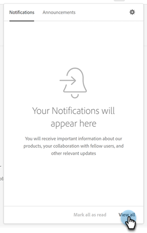

# Error Notifications {#error-notifications}

Below is a list of errors that you may receive via in-app notification or email. If you receive any of these, follow the respective troubleshooting steps. If these steps do not resolve the issue, contact [Marketo Support](https://nation.marketo.com/t5/support/ct-p/Support).

<table>
  <tbody>
    <tr>
      <th style="width:31%">Error Code</th>
      <th style="width:23%">Notification Example</th>
      <th style="width:23%">Description</th>
      <th style="width:23%">Troubleshooting Steps</th>
    </tr>
    <tr>
      <td>API_DISABLED</td>
      <td>Error occurred during Crm Import : API_DISABLED : API calls have been disabled for this user</td>
      <td>The API permission has been disabled for the Marketo Measure user.</td>
      <td>Refer to the following Salesforce documentation on <a href="https://help.salesforce.com/s/articleView?language=en_US&id=sf.branded_apps_commun_api_permset.htm&type=5">how to enable API access</a>.</td>
    </tr>
    <tr>
      <td>API_LIMIT_EXCEEDED</td>
      <td>Error occurred during Crm Export : PI_LIMIT_EXCEEDED</td>
      <td>The CRM's API limit has been exceeded (24 hrs).</td>
      <td>Refer to the following documentation for your CRM for assistance adjusting API credit allocations:

          <ul>
            <li><a href="https://learn.microsoft.com/en-us/dynamics365/fin-ops-core/dev-itpro/data-entities/service-protection-monitoring">Dynamics</a>
            </li>
            <li><a href="https://developer.salesforce.com/docs/atlas.en-us.salesforce_app_limits_cheatsheet.meta/salesforce_app_limits_cheatsheet/salesforce_app_limits_platform_api.htm">Salesforce</a>
            </li>
          </ul>
          
You may also adjust the CRM credits Marketo Measure uses following the below steps:

          <ul>
            <li>Navigate to <b>Settings</b> > <b>CRM</b> > <b>General</b></li>
            <li>Update the Daily CRM API Limit 
              <ul>
                <li><b>Note: Default is 100,000</b></li>
              </ul>
            </li>
          </ul>
          

           
          

      </td>
    </tr>
    <tr>
      <td>CANNOT_EXECUTE_FLOW_TRIGGER</td>
      <td>Error occurred during Crm Export: CANNOT_EXECUTE_FLOW_TRIGGER : Entity type 'Contact' Give your Salesforce admin these details.
Limit Exceeded
You or your organization has exceeded the maximum limit for this feature. Error ID: 123456</td>
      <td>The record cannot be saved because it does not meet a trigger flow rule that is set up in the Salesforce org.</td>
      <td>Review the full details of the notification message and review the flow triggers in the Salesforce org.
Salesforce documentation on flow triggers <a href="https://admin.salesforce.com/blog/2023/what-is-a-record-triggered-flow#:~:text=A%20record%2Dtriggered%20flow%20allows,is%20created%20and%2For%20updated">can be found here</a>.
      </td>
    </tr>
    <tr>
      <td>CANNOT_INSERT_UPDATE_ACTIVATE_ENTITY</td>
      <td>Error occurred during Crm Export: CANNOT_INSERT_UPDATE_ACTIVATE_ENTITY : Entity type 'Lead': CRM ErrorCode: CANNOT_INSERT_UPDATE_ACTIVATE_ENTITY, CRM ErrorMessage: System.LimitException: Apex CPU time limit exceeded, RecordId: 0123456
      

      Error occurred during Crm Export: CANNOT_INSERT_UPDATE_ACTIVATE_ENTITY : Entity type 'Account': CRM ErrorCode: CANNOT_INSERT_UPDATE_ACTIVATE_ENTITY, CRM ErrorMessage: entity type cannot be updated: Account, RecordId: 0123456</td>
      <td>Triggers are preventing update or inserting an object.
      

      OR
      

      Missing permissions on the object.</td>
      <td>Review trigger code causing the insert/update to fail. See the following Salesforce documentation fore more details on triggers:
        <ul>
          <li><a href="https://help.salesforce.com/s/articleView?id=sf.code_manage_triggers.htm&type=5">Apex triggers</a>
          </li>
          <li><a href="https://admin.salesforce.com/blog/2023/what-is-a-record-triggered-flow#:~:text=A%20record%2Dtriggered%20flow%20allows,is%20created%20and%2For%20updated">Flow triggers</a>
          </li>
        </ul>
        

        Provide all necessary permissions to the <a href="/help/configuration-and-setup/marketo-measure-and-salesforce/how-marketo-measure-and-salesforce-interact.md">Marketo Measure user</a>.
      </td>
    </tr>
    <tr>
      <td>DUPLICATES_DETECTED</td>
      <td>Error occurred during Crm Export: DUPLICATES_DETECTED : Entity type 'Contact': CRM ErrorCode: DUPLICATES_DETECTED, CRM ErrorMessage: You're creating a duplicate record. We recommend you use an existing record instead., RecordId: 0123456</td>
      <td>The record being imported to the Salesforce Org already exists.</td>
      <td>
        <ul>
          <li><a href="https://help.salesforce.com/s/articleView?id=000390009&type=1">Disable the "Duplicate Rule" setting</a> to allow for duplicates.
          </li>
          <li>Exclude the Marketo Measure dedicated user from <a href="https://trailhead.salesforce.com/content/learn/modules/validation-rules/bypass-your-validation-rules">custom validation rules</a>.
          </li>
        </ul>
      </td>
    </tr>
    <tr>
      <td>DUPLICATE_VALUE</td>
      <td>Error occurred during Crm Export: DUPLICATE_VALUE : Entity type 'Lead': CRM ErrorCode: DUPLICATE_VALUE, CRM ErrorMessage: duplicate value found: Email_Unique__c duplicates value on record with id: 123, RecordId: 456</td>
      <td>The field being imported to the Salesforce Org does not allow duplicate values.</td>
      <td>
        <ul>
          <li>Uncheck the <a href="https://help.salesforce.com/s/articleView?id=000390009&type=1">"Unique Checkbox"</a> in Salesforce.
          </li>
          <li>Exclude the Marketo Measure dedicated user from <a href="https://trailhead.salesforce.com/content/learn/modules/validation-rules/bypass-your-validation-rules">custom validation rules</a>.
          </li>
        </ul>
      </td>
    </tr>
    <tr>
      <td>ENTITY_IS_LOCKED</td>
      <td>Error occurred during Crm Export: ENTITY_IS_LOCKED : Entity type 'Account': CRM ErrorCode: ENTITY_IS_LOCKED, CRM ErrorMessage: This record is locked. If you need to edit it, contact your admin., RecordId: 0123456</td>
      <td>When a record is in an approval process and a user who is not the current approver or system administrator tries to edit the record.</td>
      <td>
        <ul>
          <li>Resolve the pending approval process for that record in the Salesforce org.</li>
          <li>Exclude the Marketo Measure dedicated user from <a href="https://trailhead.salesforce.com/content/learn/modules/validation-rules/bypass-your-validation-rules">custom validation rules</a>.
          </li>
        </ul>
      </td>
    </tr>
    <tr>
      <td>FIELD_FILTER_VALIDATION_EXCEPTION</td>
      <td>Error occurred during Crm Export: FIELD_FILTER_VALIDATION_EXCEPTION : Entity type 'Lead': CRM ErrorCode: FIELD_FILTER_VALIDATION_EXCEPTION, Field(s): User__C, CRM ErrorMessage: Value does not exist or does not match filter criteria. Please select a user with the role "Account Executive, Inside Sales"; RecordId: 0123456</td>
      <td>Modified record no longer satisfies lookup filters defined on the object.</td>
      <td>Check for filters on the object Marketo Measure is trying to modify. See <a href="https://help.salesforce.com/s/articleView?id=000384756&type=1">this Salesforce article</a> to learn how to check for filters on an object.</td>
    </tr>
    <tr>
      <td>FIELD_INTEGRITY_EXCEPTION</td>
      <td>Error occurred during Crm Export: FIELD_INTEGRITY_EXCEPTION : Entity type 'Lead': CRM ErrorCode: FIELD_INTEGRITY_EXCEPTION, Field(s): Country, CRM ErrorMessage: There's a problem with this country, even though it may appear correct. Please select a country/territory from the list of valid countries.: Country, RecordId: 0123456</td>
      <td>The expected type of the record does not match up.</td>
      <td>The most common case of this is not following State/Country naming standards set in the Salesforce Org because the State/Country fields have been standardized to only accept certain pick-list values. To address this issue, you can:
        <ul>
          <li>Update the record to follow the organization's accepted values for that field. Contact your SFDC administrator to get the list of accepted values.</li>
          <li><a href="https://help.salesforce.com/s/articleView?id=sf.admin_state_country_picklist_enable.htm&type=5">Disable the State/Country picklists</a>.
          </li>
        </ul>
      </td>
    </tr>
    <tr>
      <td>INACTIVE_OWNER_OR_USER</td>
      <td>Error occurred during Crm Export: INACTIVE_OWNER_OR_USER : Entity type 'Contact': CRM ErrorCode: INACTIVE_OWNER_OR_USER, CRM ErrorMessage: operation performed with inactive user [1234] as owner of contact, RecordId: 0123456</td>
      <td>Marketo Measure is missing the "Update Records with Inactive Owners" permission.</td>
      <td>Grant Marketo Measure the "<a href="/">Update Records with Inactive Owners</a>" permission.</td>
    </tr>
    <tr>
      <td>INSUFFICIENT_ACCESS_OR_READONLY</td>
      <td>Error occurred during Crm Export: INSUFFICIENT_ACCESS_OR_READONLY : Entity type 'Account': CRM ErrorCode: INSUFFICIENT_ACCESS_OR_READONLY, CRM ErrorMessage: insufficient access rights on object id: [123], RecordId: 456</td>
      <td>Marketo Measure is missing permissions on an object/ field or the object is read only.</td>
      <td>Refer to the following <a href="/help/configuration-and-setup/marketo-measure-and-salesforce/how-marketo-measure-and-salesforce-interact.md">Experience League article</a> for guidance on the permissions Marketo Measure requires.</td>
    </tr>
    <tr>
      <td>INVALID_ADOBE_ANALYTICS_CONFIGURATION</td>
      <td>Error occurred during Adobe Analytics Export: INVALID_ADOBE_ANALYTICS_CONFIGURATION : Error: Upload not allowed. Confirm the datasource schema before upload. Datasource Id:1234</td>
      <td>The Adobe Analytics integration is not configured correctly.</td>
      <td>Refer to the following help articles to ensure correct configuration:
        <ul>
          <li>
            <a href="/help/marketo-measure-and-adobe/marketo-measure-integrations-with-adobe-analytics.md">Marketo Measure Integrations with Adobe Analytics</a>
          </li>
          <li>
            <a href="https://experienceleague.adobe.com/docs/core-services/interface/services/customer-attributes/t-crs-usecase.html">Create a Customer Attribute source and upload the data file</a>
          </li>
        </ul>
      </td>
    </tr>
    <tr>
      <td>INVALID_CURRENCY_ISO_CODE</td>
      <td>Error occurred during Ad Import: INVALID_CURRENCY_ISO_CODE: Currency XXX is not supported by Marketo Measure.
      

      Error occurred during Ad Import: INVALID_CURRENCY_ISO_CODE : Currency XXX on Account for 1234 is not supported by Marketo Measure.</td>
      <td>An unsupported currency was encountered.</td>
      <td>In the source system indicated in the notification (Ad, Crm, Marketo) ensures the currency associated to the record has a supported & valid currency. Supported currencies are derived from ISO currency standards.</td>
    </tr>
    <tr>
      <td>MISSING_BIZIBLE_CUSTOM_FIELDS_PERMISSIONS</td>
      <td>Error occurred during Crm Export: MISSING_BIZIBLE_CUSTOM_FIELDS_PERMISSIONS : Entity type 'Campaign': CRM ErrorCode: INVALID_FIELD_FOR_INSERT_UPDATE, Field(s): bizible2__UniqueId__c, CRM ErrorMessage: Unable to create/update fields: bizible2__UniqueId__c. Please check the security settings of this field and verify that it is read/write for your profile or permission set.</td>
      <td>Marketo Measure is missing permissions on bizible fields.</td>
      <td>We require read and write permissions on all fields prefixed with "bizible2__". A full list of these fields can be found <a href="/help/configuration-and-setup/marketo-measure-and-salesforce/how-marketo-measure-and-salesforce-interact.md">in this article</a>.</td>
    </tr>
    <tr>
      <td>MISSING_CONVERTED_LEAD_PERMISSION</td>
      <td>Error occurred during Crm Export: MISSING_CONVERTED_LEAD_PERMISSION</td>
      <td>Marketo Measure is missing the View/Edit Converted Leads permission</td>
      <td>Refer to the following Experience League document for assistance with enabling this permission in your CRM 
          <a href="/help/marketo-measure-salesforce-reporting/additional-functionality/enabling-the-permission-to-edit-converted-leads.md">Enabling the Permission to Edit Converted Leads</a></td>
    </tr>
    <tr>
      <td>MISSING_FIELD_READ_PERMISSION</td>
      <td>Error occurred during Crm Import: MISSING_FIELD_READ_PERMISSION : Entity type 'Event': INVALID_FIELD: 
    SystemModstamp,IsDeleted,WhoId,bizible2__Bizible_Touchpoint_Date__c</td>
      <td>Marketo Measure is missing read permissions to a required field.</td>
      <td>Refer to the following help articles for guidance on the permissions Marketo Measure requires:
        <ul>
          <li><a href="/help/marketo-measure-and-dynamics/getting-started-with-marketo-measure-and-dynamics/marketo-measure-dynamics-schema.md">Dynamics</a>
          </li>
          <li><a href="/help/configuration-and-setup/marketo-measure-and-salesforce/how-marketo-measure-and-salesforce-interact.md">Salesforce</a>
          </li>
        </ul>
      </td>
    </tr>
    <tr>
      <td>MISSING_ISREPLICATEABLE_PERMISSION</td>
      <td>Error occurred during Crm Import: MISSING_ISREPLICATEABLE_PERMISSION : We are missing IsReplicateable permission on Campaign</td>
      <td>This permission is required on Salesforce objects for us to keep your Marketo Measure and Salesforce in sync.</td>
      <td>Contact Salesforce support for assistance setting the replicateable permission on objects.</td>
    </tr>
    <tr>
      <td>MISSING_OBJECT_READ_PERMISSION</td>
      <td>Error occurred during Crm Import: MISSING_OBJECT_READ_PERMISSION : Entity type Campaign': CRM ErrorCode: MISSING_PERMISSION</td>
      <td>Marketo Measure is missing read permissions to a required object.</td>
      <td rowspan="2">Refer to the following help articles for guidance on the permissions Marketo Measure requires:
          <ul>
            <li><a href="/help/marketo-measure-and-dynamics/getting-started-with-marketo-measure-and-dynamics/marketo-measure-dynamics-schema.md">Dynamics</a>
            </li>
            <li><a href="/help/configuration-and-setup/marketo-measure-and-salesforce/how-marketo-measure-and-salesforce-interact.md">Salesforce</a>
            </li>
          </ul>
      </td>
    </tr>
    <tr>
      <td>MISSING_OBJECT_WRITE_PERMISSION</td>
      <td>Error occurred during Crm Export: MISSING_OBJECT_WRITE_PERMISSION : Entity type 'bizible2_Bizible_Attribution_Touchpoint': CRM ErrorCode: MISSING_PERMISSION</td>
      <td>Marketo Measure is missing write permissions to a required object.</td>
    </tr>
    <tr>
      <td>MISSING_RECORD_OBJECT_PERMISSIONS</td>
      <td>Error occurred during Crm Export: MISSING_RECORD_OBJECT_PERMISSIONS : Entity type 'bizible2__Bizible_Touchpoint__c': CRM ErrorCode: INSUFFICIENT_ACCESS_ON_CROSS_REFERENCE_ENTITY, Field(s): Account, CRM ErrorMessage: insufficient access rights on cross-reference id: 0123456</td>
      <td>Marketo Measure is missing permissions.</td>
      <td>There are several reasons for this error that are specific to the Salesforce org. Below are a few common troubleshooting steps that can resolve the issue:
        <ul>
          <li>Review all permissions we require for each <a href="/help/configuration-and-setup/marketo-measure-and-salesforce/how-marketo-measure-and-salesforce-interact.md">object and field</a>.</li>
          <li>Exclude the Marketo Measure dedicated user from <a href="https://trailhead.salesforce.com/content/learn/modules/validation-rules/bypass-your-validation-rules">custom validation rules</a>.</li>
          <li>Grant Marketo Measure "<a href="https://developer.salesforce.com/docs/atlas.en-us.securityImplGuide.meta/securityImplGuide/users_profiles_view_all_mod_all.htm">Modify All</a>" permissions.</li>
        </ul>
      </td>
    </tr>
    <tr>
      <td>NULL_EMPTY_CURRENCY_ISO_CODE</td>
      <td>
        

          Error occurred during Crm Import: NULL_EMPTY_CURRENCY_ISO_CODE: Currency ISO code is NULL or Empty when MultiCurrency is enabled for RecordId 1234
      </td>
      <td>Currency must be a supported ISO currency code.</td>
      <td>In the source system indicated in the notification (Ad, Crm, Marketo) ensures the currency associated to the record has a supported & valid currency. Supported currencies are derived from ISO currency standards.</td>
    </tr>
    <tr>
      <td>OPERATION_TOO_LARGE</td>
      <td>Error occurred during Crm Import: OPERATION_TOO_LARGE : We require the 'View All Data' permission to query activities successfully.</td>
      <td>CRM settings are not allowing Marketo Measure to query a large enough set of data</td>
      <td>Grant Marketo Measure 'View All Data' permissions on the designated object.
      

      More info on the 'View All Data' permission <a href="https://developer.salesforce.com/docs/atlas.en-us.securityImplGuide.meta/securityImplGuide/users_profiles_view_all_mod_all.htm">can be found here</a>.</td>
    </tr>
    <tr>
      <td>RECORD_NONCOMPLIANT_WITH_VALIDATION_RULES</td>
      <td>Error occurred during Crm Export: RECORD_NONCOMPLIANT_WITH_VALIDATION_RULES : Entity type 'Lead': CRM ErrorCode: FIELD_CUSTOM_VALIDATION_EXCEPTION, Field(s): Lead_Status_Reason__c, CRM ErrorMessage: You must select the Lead Status Reason, RecordId: 0123456</td>
      <td>The record being updated does not meet a validation rule set in the Salesforce org.</td>
      <td>Exclude the Marketo Measure dedicated user from <a href="https://trailhead.salesforce.com/content/learn/modules/validation-rules/bypass-your-validation-rules">custom validation rules</a>.
      

      Update your <a href="https://help.salesforce.com/s/articleView?id=sf.fields_about_field_validation.htm&type=5">validation rules</a>.</td>
    </tr>
    <tr>
      <td>RESTRICT_PICKLIST_VALUES_ENABLED</td>
      <td>Error occurred during Crm Export: RESTRICT_PICKLIST_VALUES_ENABLED : Entity type 'Campaign': CRM ErrorCode: INVALID_OR_NULL_FOR_RESTRICTED_PICKLIST, Field(s): Areas_of_Interest__c, CRM ErrorMessage: bad value for restricted picklist field: Unknown</td>
      <td>When 'Restrict picklist to the values defined in the value set' is enabled in the picklist field's setup or the value being inserted into the field is not available in the object's record type.</td>
      <td>Disable the restrict picklist setting in the Salesforce Org.
          

          Exclude the Marketo Measure dedicated user from <a href="https://trailhead.salesforce.com/content/learn/modules/validation-rules/bypass-your-validation-rules">custom validation rules</a>.
      </td>
    </tr>
    <tr>
      <td>REQUIRED_FIELD_MISSING</td>
      <td>Error occurred during Crm Export: MISSING_REQUIRED_FIELD : Entity type 'Lead': CRM ErrorCode: REQUIRED_FIELD_MISSING, Field(s): Product_Type__c, CRM ErrorMessage: Required fields are missing: [Product_Type__c], RecordId: 0123456</td>
      <td>When a validation rule specifies require fields on objects.</td>
      <td>Exclude the Marketo Measure dedicated user from <a href="https://trailhead.salesforce.com/content/learn/modules/validation-rules/bypass-your-validation-rules">custom validation rules</a>.
      </td>
    </tr>
    <tr>
      <td>UNKNOWN_EXCEPTION</td>
      <td>Error occurred during Crm Export: UNKNOWN_EXCEPTION : Entity type 'Contact': CRM ErrorCode: UNKNOWN_EXCEPTION, CRM ErrorMessage: portal users cannot own partner accounts, RecordId: 0123456</td>
      <td>An unhandled exception occurred in Salesforce.</td>
      <td>If the issue persists, file a case with Salesforce and copy the numeric values in the error message.</td>
    </tr>
    <tr>
      <td>UNSUPPORTED_CRM_PACKAGE_VERSION</td>
      <td>Error occurred during Crm Import: UNSUPPORTED_CRM_PACKAGE_VERSION : Update your crm package</td>
      <td>The current package detected is no longer supported.</td>
      <td>Upgrade your package to the most recent version:
        <ul>
          <li><a href="/help/configuration-and-setup/marketo-measure-and-salesforce/best-practices-for-marketo-measure-crm-package.md">Best Practices</a>
          </li>
          <li><a href="/help/marketo-measure-and-dynamics/getting-started-with-marketo-measure-and-dynamics/microsoft-dynamics-crm-installation-guide.md">Dynamics</a>
          </li>
          <li><a href="/help/configuration-and-setup/marketo-measure-and-salesforce/marketo-measure-salesforce-package-installation-and-set-up.md">Salesforce</a>
          </li>
        </ul>
      </td>
    </tr>
  </tbody>
</table>
