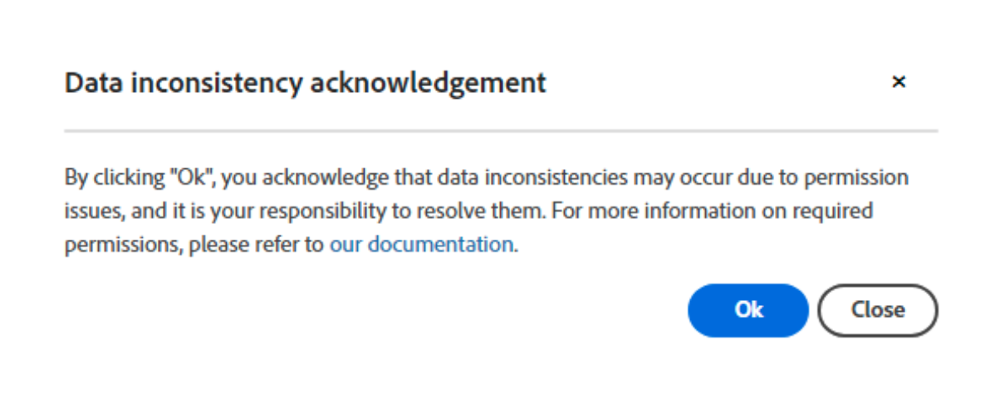

# Error Handling for CRM Exports

The Pause on Export Errors feature allows you to control whether CRM export jobs should pause when encountering a record-level error.

The setting can be found under **My Account** > **Settings** > **CRM** > **General**. 

>[!NOTE]
>
>This feature is only visible if you have the "Export to CRM" feature enabled.

When this feature is enabled, the export job stops progressing and remains on the record where the error occurred, until the issue is resolved. These errors are usually due to missing permissions, improperly applied custom validation rules, or issues in workflows/triggers. The job will continue to run as scheduled and will automatically reattempt exporting the failed record until it is successful.

If you choose to disable this feature, a warning popup will appear, informing you that this may lead to data inconsistencies. It will be your responsibility to address any issues that may arise from these inconsistencies.

In both cases, whether the feature is toggled on or off, all record-level errors encountered are logged in the `ExportErrors` table, and the `CRMExport_ExportError` job will automatically attempt to re-export these records daily. This eliminates the need for a support request to initiate a re-export, as it will happen automatically without any developer intervention.

Why is the job halting behavior needed given the `ExportErrors` functionality? By halting the regular CRM export jobs at a specific record, troubleshooting becomes much easier. It allows you to run jobs locally and prevent the creation of a potentially large number of ExportErrors, which would need to be retrieved and processed during the re-export.

This feature can be toggled on or off based on your preferred behavior. For example, if you encounter a particularly challenging error code and prefer to accept "incomplete" data temporarily, you can toggle the feature off. Once the issue is resolved, you can turn the feature back on to ensure future exports are complete and accurate.
