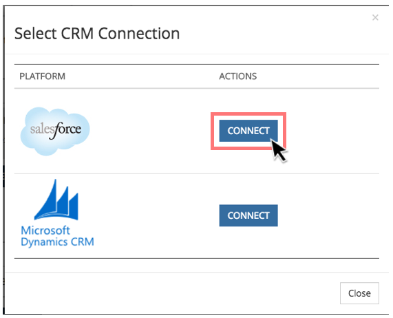

# Install and Connect {#install-and-connect}

This lesson provides an overview of the Marketo Measure components that are added to your Salesforce upon installation and how to connect your Salesforce account to your Marketo Measure account.

## Installation {#installation}

Two packages must be installed in order to use Marketo Measure in your Salesforce environment:

* Marketo Measure’s base package
* Dashboard Extension Package

To integrate with Salesforce, Marketo Measure mirrors the way Salesforce organizes and displays data. Salesforce organizes data into Objects, Records, Fields, and allows you to visualize this data through Reports and Dashboards. When Marketo Measure is installed into SF, we add our own Objects, Fields, Reports, and Dashboards.

Marketo Measure's **Base Package** contains:

* 7 Custom Marketo Measure Objects
* Custom Marketo Measure Fields
* 25 Stock Reports

Marketo Measure's **Dashboard Extension Package** contains three pre-built Dashboards.

Marketo Measure is able to read standard SF Objects, Fields and Records, however Marketo Measure will never update or push data to them. All the data collected by Marketo Measure's Javascript will be surfaced in the Marketo Measure Custom Objects and Fields.

For the complete installation guide, [click here](/help/configuration-and-setup/marketo-measure-and-salesforce/marketo-measure-installation-guide.md).

## Connecting Accounts {#connecting-accounts}

1. Go to the Marketo Measure App and log-in.

1. In the menu bar at the top of the screen, navigate to **My Account** and  click the Settings option.

1. In the column of setting options on the left, click Connections located under the Integrations section.

   

1. Under the CRM section in Connections, click **Set Up New CRM Connection**.

   

1. A pop-up window will appear asking you to Select CRM connection. Click the Connect button next to the Salesforce logo.

   

1. A final pop-up window will appear, asking you for your Salesforce credentials. Enter your information and click **Authorize** to connect the account to Marketo Measure.
