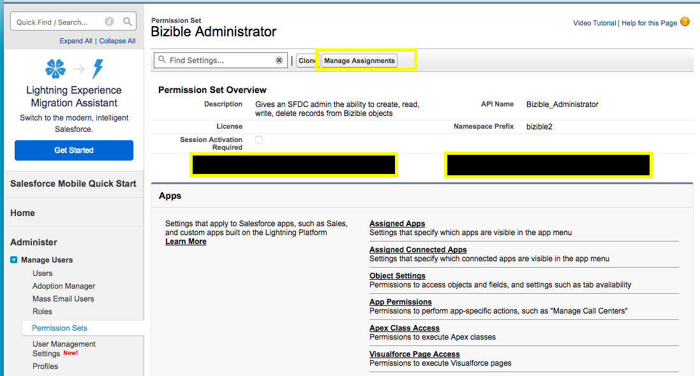

# [!DNL Marketo Measure] Permission Sets {#marketo-measure-permission-sets}

Learn how to access and assign [!DNL Marketo Measure] Permission Sets in Salesforce.

## [!DNL Marketo Measure] Permission Sets {#marketo-measure-permission-sets-1}

Three permission sets are included with the [!DNL Marketo Measure] Salesforce package. These permission sets provide access to [!DNL Marketo Measure] for Admins, Marketers and Standard Users.

To access and assign Permission Sets in Salesforce:

1. Click **[!UICONTROL Setup]**.
1. In the left margin, Click **[!UICONTROL Users]**, then **[!UICONTROL Permission Sets]**.
1. Select the [!DNL Marketo Measure] Permission Set you'd like to assign.
1. Click **[!UICONTROL Manage Assignments]**, then **[!UICONTROL Add Assignments]**.
1. Select the users for the permission set and click **[!UICONTROL Assign]**.

   

## [!DNL Marketo Measure] Permission Sets Explained {#marketo-measure-permission-sets-explained}

<table> 
 <tbody> 
  <tr> 
   <td><strong>[!DNL Marketo Measure] Administrator</strong></td> 
   <td>Gives an SFDC admin the ability to create, read, write, delete records from [!DNL Marketo Measure] objects. The license under which [!DNL Marketo Measure] pushes data to SFDC should have this permission set enabled. Additionally, it's recommended this license has the ability to edit converted Leads in the scenarios where the Lead is converted prior to [!DNL Marketo Measure] applying data to the record. This will ensure accuracy in reporting between Salesforce and [!DNL Marketo Measure]. <a href="http://releasenotes.docs.salesforce.com/en-us/spring17/release-notes/rn_sales_leads_view_converted.htm">Read more here</a>.</td> 
  </tr> 
  <tr> 
   <td><strong>[!DNL Marketo Measure] Marketing User</strong></td> 
   <td>Gives a marketing user the ability to read and write records from [!DNL Marketo] Measure objects. All members of the marketing team should have the [!DNL Marketo] Measure Marketing User permission set enabled.  </td> 
  </tr> 
  <tr> 
   <td><strong>[!DNL Marketo Measure] Standard User</strong></td> 
   <td>Gives a user the ability to read records from [!DNL Marketo Measure] objects.</td> 
  </tr> 
 </tbody> 
</table>

Inbound sales development teams and account executives may benefit from [!DNL Marketo Measure] data. If these roles would like to use [!DNL Marketo Measure] data in reporting, enable the [!DNL Marketo Measure] Standard User permission set.

>[!NOTE]
>
>In addition, the user we are connected through needs to have the "Marketing User" [!DNL Salesforce] Profile enabled at a user level in order for us to access the Campaign object. To check for this, click into **[!UICONTROL Setup]** > **[!UICONTROL Manage Users]** > **[!UICONTROL Profiles]** > **[!UICONTROL Marketing User]** > **Assigned Users**.
