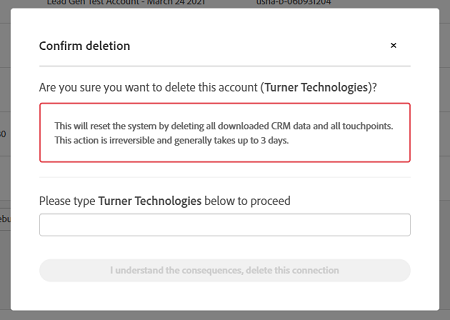

# Salesforce Sandbox to Production Migration {#salesforce-sandbox-to-production-migration}

If you chose to test Bizible in a Salesforce Sandbox environment, please follow these instructions to migrate to Production once you are ready. The following instructions assume that you have already downloaded Bizible's packages into your Sandbox org, performed the necessary testing and are ready to push Bizible to Production.  
  
Please don't hesitate to reach out to your Bizible point of contact with any questions or to walk through this over the phone.

## Step 1: Install Bizible Packages into your Production Salesforce Instance {#install-bizible-packages-into-your-production-salesforce-instance}

* Install Bizible's two packages into Production with the "All Users" setting

    * Main package: [bizible.com/sf](https://appexchange.salesforce.com/appxListingDetail?listingId=a0N3000000B3KLuEAN)
    * Dashboard package: [bizible.com/dashboard-mt](https://login.salesforce.com/packaging/installPackage.apexp?p0=04t610000001jI6)

* For more information about Bizible's relationship with Salesforce, take a look at [this article](/help/configuration-and-setup/marketo-measure-and-salesforce/how-marketo-measure-and-salesforce-interact.md)
* A bit of Salesforce configuration is necessary. The specific action items are outlined below in [Step 4 below](#salesforce-configuration)

## Step 2: Delete the Current Sandbox CRM Connection in Bizible App {#delete-the-current-sandbox-crm-connection-in-bizible-app}

* Log in to the Bizible application at apps.bizible.com
  
  * Ensure you log-in with your original Sandbox login credentials
* Navigate to My Account > Settings > Connections
* Click the trash icon next to your SFDC connection to delete
* You will be prompted to confirm your deletion. Please make sure to read over the prompt carefully and understand the consequences of the deletion

   

  * Type the name of the Business as prompted in the confirmation model and click “I understand the consequences, delete this connection”
* This will trigger the deletion process and will take some time to finish

## Step 3: Connect the Production CRM Instance in Bizible App {#connect-the-production-crm-instance-in-bizible-app}

* Log in to the Bizible application at apps.bizible.com

  * Ensure you log in with your original Sandbox login credentials
* Navigate to My Account > Settings > Connections
* Once the deletion of the Sandbox connection has been successfully deleted the connection will disappear from the page, otherwise the connection will still be present with a status of “Deletion in progress”
* Click “Set up New CRM connection”
* In the “Select CRM Connection” modal dialog, click “Connect” Action next to the Salesforce Platform, Select the “Production” option
* You will be prompted for your credentials, be sure to enter Production login details

## Step 4: Salesforce Configuration {#salesforce-configuration}

[Page Layouts](/help/configuration-and-setup/marketo-measure-and-salesforce/page-layout-instructions.md)
[Permission Sets](/help/configuration-and-setup/marketo-measure-and-salesforce/marketo-measure-permission-sets.md)  
[Sharing reports](https://help.salesforce.com/articleView?id=analytics_share_folder.htm&type=0)
[Hiding unnecessary report types](/help/configuration-and-setup/marketo-measure-and-salesforce/hiding-unnecessary-report-types.md)
[Custom workflow if applicable](/help/advanced-marketo-measure-features/custom-revenue-amount/using-a-custom-revenue-amount-field.md)
