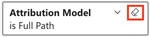

# Discover Dashboard Basics {#discover-dashboard-basics}

This article will guide you through the foundational capabilities of the redesigned interface, ensuring you can effortlessly access and interpret your data. Delve into the dynamics of the filter pane and uncover the intricacies of our enhanced reporting functionalities, such as drill features, cross-filtering, and tooltips.

## Filter Pane {#filter-pane}

Every dashboard has a range of filters, accompanied by the following controls for seamless navigation and customization.

| Name | Description |
| --- | --- |
| Filter Toggle Button | Toggle the filter pane open or closed.  |
| Search Bar | Use the search at the top of the filter pane to search for a specific filter. Each filter also has its own search bar.  |
| Clear Filter Button | To clear a filter, click the eraser icon located at the top-right corner of each filter.  |
| Apply Button | Click to confirm and implement your filter changes on the dashboard.  |

## Filters on Visual {#filters-on-visual}

Hover over a visual's top-right corner to see a read-only list of applied filters.

## Report Capabilities {#report-capabilities}

### Drill down and up {#drill-down-and-up}

* Hover over a visual to identify if it has a hierarchy; the presence of drill control options in the action bar indicates this.

* Activate drill-down by clicking the single downward arrow, highlighted by a gray background. To revert, use the drill-up icon.

To drill down one field at a time, turn on the drill-down icon and select a visual element, such as a bar.

Use the double arrow drill-down icon to advance to the next hierarchy level.

Use the fork-like icon to add an additional hierarchy level in your current view.

### Drill through {#drill-through}

To explore the data behind the visual, right-click the visual element and select the "drill-through" option.

### Export Data {#export-data}

To export the underlying data from a visual, hover over its top-right corner. Click the "more options" button, choose "export data," select your preferred format, then click "export."

### Focus Mode {#focus-mode}

To zoom in on a specific visual or tile, hover over the top-right corner and select the "focus" button.

### Cross Filtering {#cross-filtering}

Selecting a value or axis label in one visualization will cross-filter other visuals on the report page, ensuring they display only the relevant, filtered data.

### Tooltips {#tooltips}

Tooltips offer supplementary details about the displayed data. Hover over a visual element and a contextual tooltip will pop up, providing insights or explanations related to that specific data point.

