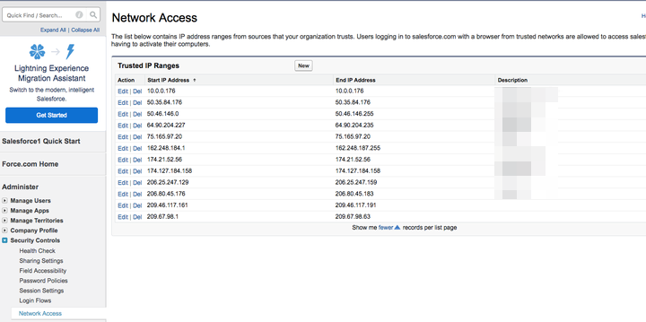

# [!UICONTROL Discover Data Download] Access Control {#discover-data-download-access-control}

[!UICONTROL Discover Data Download] control enables [!DNL Marketo Measure] Admins to set the data download policies for the Discover dashboards based on the users' roles. The control covers all data download actions on Discover dashboards.

1. Click **[!UICONTROL Data Access]** under [!UICONTROL Security].

   

1. Click the drop-down and select the appropriate option for your console.

   

| Option | Download access |
| --- | --- |
| All Users | All users can download data, including both PDF and CSV formats. |
| Admin Users Only | Only Admin users can download data, including both PDF and CSV formats. |
| None | No one can download data, including both PDF and CSV formats. |

1. Click **[!UICONTROL Save]** when done.

   

The setting might not take effect until users have logged out and back in again.
