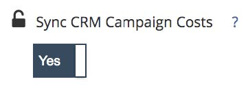

# Spend Management Methods {#spend-management-methods}

Spend data is key to the success of ROI reporting with [!DNL Marketo Measure]. In order to have accurate and comprehensive ROI reporting across all of your channels and subchannels, you need to make sure you have the appropriate spend data being pulled into [!DNL Marketo Measure].

There are three ways to get spend data into [!DNL Marketo Measure]. Each method is designed to pull spend data from particular data inputs.

**1) API Connected Accounts**

Any Ad Account you have connected to [!DNL Marketo Measure] through an API will have it's spend automatically pulled into [!DNL Marketo Measure] for ROI reporting. To check which accounts you have connected and therefore pulling in spend, go to your [!DNL Marketo Measure] App and select the [!UICONTROL Connections] tab under the [!UICONTROL Integrations] section. For more details on how to setup your API connections review our [Integrated Ad Platforms](/help/api-connections/utilizing-marketo-measures-api-connections/integrated-ad-platforms.md#how-to-connect-ad-platforms) article.

**2) CRM Campaign Cost Sync**

Every [!DNL Marketo Measure] account has access to a feature called [Sync CRM Campaign Costs](/help/marketing-spend/spend-management/crm-campaign-costs.md#availability). By default, this feature bit is set to "No" but can be turned on at any time.

Once enabled this feature will automatically pull spend in from any CRM campaign/program that meets the following criteria

i. [!DNL Marketo Measure] first looks to see if the Campaign/Program is creating touchpoints, either from a matching [Campaign Sync rule](/help/channel-tracking-and-setup/offline-channels/custom-campaign-sync.md) that was created, or a matching [Program Sync rule](/help/marketo-measure-and-marketo/marketo-measure-integrations-with-marketo/marketo-engage-programs-integration.md) that was created, or the [Enable Buyer Touchpoints value](/help/channel-tracking-and-setup/offline-channels/syncing-offline-campaigns.md#how-to-create-a-campaign-and-sync-buyer-touchpoints) is "Include All Campaign Members" or "Include 'Responded' Campaign Members."

ii. A Start Date must be populated on the campaign/program

iii. An End Date must also be populated on the campaign/program

iv. Lastly an Actual Cost (for Campaigns in SFDC) or Period Cost (for Programs in Marketo) must be specified.

**3) Manual Cost Upload**

This method allows you to [manually upload spend data](/help/marketing-spend/spend-management/marketing-channel-costs.md#uploading-marketing-costs) for those channels and subchannel which are not covered by API Connected Accounts or the CRM Campaign Cost Sync. By navigating to the Marketing Spend section in your [!DNL Marketo Measure] settings, you can upload spend data via a CSV file for any of your Channels.

Customers can use a combination of all three of these methods to manage their spend and will depend on the specific setup of the [!DNL Marketo Measure]. Because there are three methods of importing spend into [!DNL Marketo Measure], we strongly recommend you utilize your Marketing Spend board located in Discover to get a comprehensive view of all spend data. This board is the only place where you will be able to see all your channels and their associated spend. The Marketing Spend board can help you to quickly identify where there might be gaps in your spend data and how you can improve your ROI reporting.
