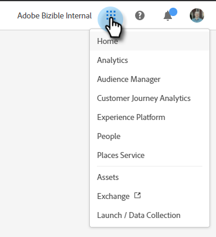

# Adobe Experience Cloud Interface Overview {#experience-cloud-interface-overview}

Adobe Experience Cloud Interface aligns the look and feel of Adobe Experience Cloud applications and services. But, it's more than just a new design. It's a single-page application that delivers user experience in a single instance.

## User Flow {#user-flow}

If you're already logged in to an Adobe Experience Cloud product, click the menu icon and select **[!DNL Marketo Measure]**.

   

>[!NOTE]
>
>Your drop-down menu may look different depending on which Adobe Experience Cloud products you're subscribed to.

If you're _not_ already logged in to an Adobe Experience Cloud product, log in directly to [!DNL Marketo Measure] here: [https://experience.adobe.com/marketo-measure](https://experience.adobe.com/marketo-measure).

## New Features {#new-features}

In addition to the updated look and feel, notice the following features:

**Domain Management**

[Manage your [!DNL Marketo Measure] domains](/help/marketo-measure-and-adobe/domain-management.md) without assistance from [!DNL Marketo Measure].

   

**Integrated Help Center**

Search for support articles, submit tickets, provide feedback, all from within the [!DNL Marketo Measure] application.

   

**Application Switcher**

Those with access to multiple Adobe products are able to easily toggle between them.

   

**Notifications and Announcements**

View and interact with product-specific notifications and general Adobe product announcements directly in the application.

   

   

**Adobe Settings**

To change your language or other Adobe-wide preferences, click your profile icon. You can also make [!DNL Marketo Measure]-specific changes by clicking **My Settings**.

   

## FAQ {#faq}

**What happens to my bookmarks?**

Bookmarks are redirected. For example, if you were to navigate to https://apps.marketo-measure.com/Discover/391, you would be redirected to https://experience.adobe.com/marketo-measure/Discover/391 after completing authentication.

**I can't log in to [!DNL Marketo Measure] through the Experience Cloud Interface. What might the issue be?**

If you can log in to Adobe Experience Cloud, but see a page like the following, the issue could be on the [!DNL Marketo Measure] side:

   

If you receive the above error, [contact Support](https://nation.marketo.com/t5/support/ct-p/Support) for assistance.
