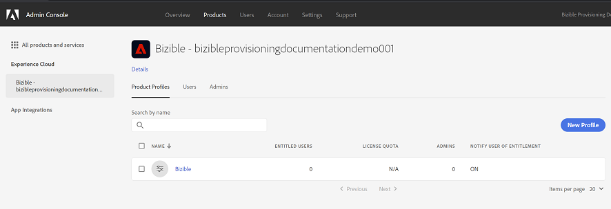
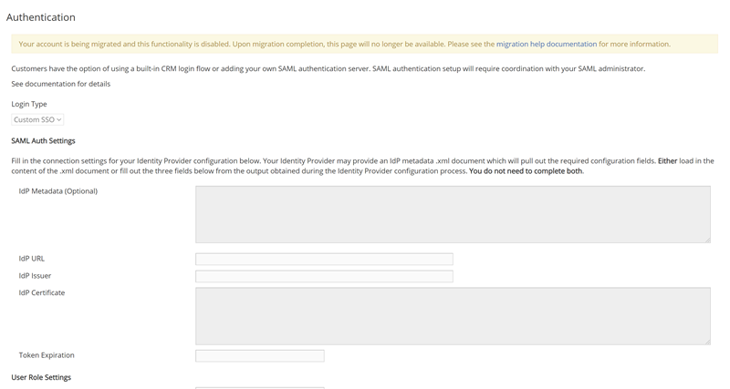
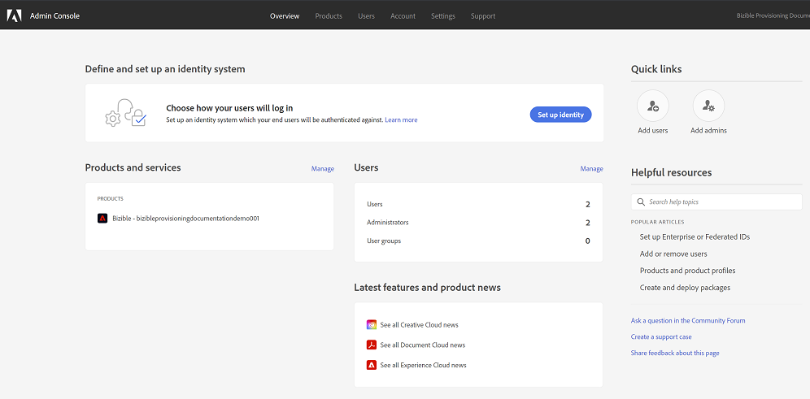
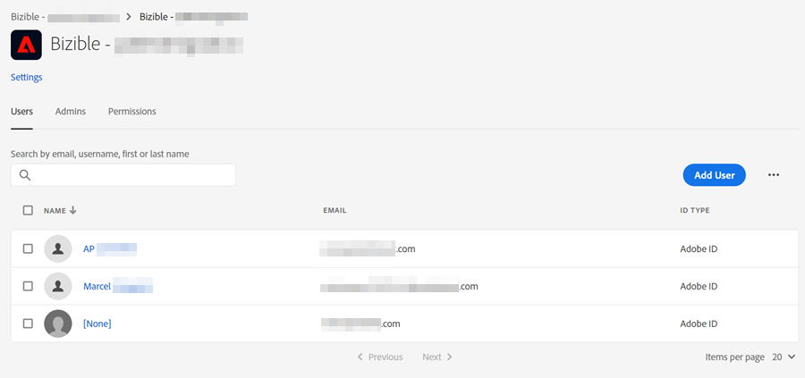
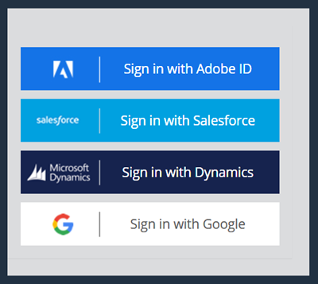

# Migration to Adobe Admin Console {#migration-to-adobe-admin-console}

## Overview {#overview}

**Marketo Measure Migration to Adobe Unified Provisioning Platform**

Starting in February 2021, all Marketo Measure customers provisioned prior to 2021 will be migrated onto the Adobe Admin Console and Identity Management Service (IMS) platform via the Adobe Unified Provisioning Platform. All Marketo Measure accounts and settings will remain the same outside of User Management, which will all occur via Adobe Admin Console and Adobe IMS after the migration.

**What is Adobe Admin Console & Identity Management Service (IMS)?**

Adobe Admin Console provides a central location for managing your Adobe entitlements across your entire organization. With this migration, Marketo Measure becomes another entitlement that is managed centrally through Adobe Admin Console in your organization. Adobe Admin Console provides full product management, user management, role based access controls, and Identity Provider (IdP) integration.

Adobe Identity Management Service (IMS) is the service that provides all authentication between your users and your Adobe products (Marketo Measure being one of those products after migration).

We encourage you to explore all of the details here:

* Adobe Admin Console Overview: [https://helpx.adobe.com/enterprise/using/admin-console.html](https://helpx.adobe.com/enterprise/using/admin-console.html)
* Adobe Admin Console Admin Guide: [https://helpx.adobe.com/enterprise/admin-guide.html](https://helpx.adobe.com/enterprise/admin-guide.html)
* Adobe Identity Management Services Overview: [https://www.adobe.com/content/dam/cc/en/security/pdfs/AdobeIdentityServices.pdf](https://www.adobe.com/content/dam/cc/en/security/pdfs/AdobeIdentityServices.pdf)

**Why is my Marketo Measure account being Migrated to Adobe Admin Console?**

Adobe Admin Console and IMS provide a full suite of functionality for User management, Single Sign On (SSO), and entitlement management. Migrating Marketo Measure accounts into the Adobe platform offers several benefits:

* **Centralized Entitlement & User Management**: With Adobe Admin Console, all Adobe products, entitlements, and users are managed in a centralized location. With this migration, Marketo Measure is now included in the list of your Adobe entitlements and all managed in one location.

* **Extended Functionality & Integrations for User Management**: Adobe Admin Console offers a number of direct integrations with various Identity Providers (IdP), such as Google G-Suite, Azure Active Directory, and Okta.

* **Future Marketo Measure Product Enhancements**: Marketo Measure has a number of product upgrades and new features on the product roadmap. Migrating onto Adobe Admin Console and IMS unlocks future Marketo Measure integrations with various Adobe services and platforms.

**What do I need to do as a part of this Marketo Measure Adobe Admin Console Migration Effort?**

Marketo Measure will send an email to all Marketo Measure administrators on your account when the migration begins. At this point, these administrators will receive an additional email from Adobe letting them know they are now system administrators in Adobe Admin Console, and that the Marketo Measure entitlement has been added.

At this point, you will have a **Migration window of 30 days** to migrate user management from Marketo Measure onto Adobe Admin Console.

>[!NOTE]
>
>During the migration window, all existing Marketo Measure access stays the same. After your migration window is complete, users will be required to log in to Marketo Measure using Adobe Id.

A full checklist and guide for this is [linked below](#adobe-ims-migration-checklist-and-action-items).

During the migration window, previous IdP user login and management functionality will remain active.

After your migration window is complete, all user management and login will occur via Adobe Admin Console and the **Login with Adobe Id** function in Marketo Measure.

>[!NOTE]
>
>For any customers provisioned in September 2020 and beyond, you will already have Adobe Admin Console set up with your initial provisioning of Marketo Measure. In this case, you already have user management set up through Adobe Admin Console.

This migration effort brings full parity for Marketo Measure as an entitlement within your Adobe Admin Console. You will now see your Marketo Measure instance(s) within the Product Context and have Product Profile functionality for managing users and admins in Marketo Measure. At any time you may use the Product Card for User Management (rather than the specific 'MarketoMeasureAdmins' and 'MarketoMeasureUsers' groups you may have set up). These user groups will remain backward compatible.

**When will my Marketo Measure account be migrated to Adobe IMS?**

Marketo Measure migrations are scheduled to begin in February 2021 and will take place on a rolling basis throughout the year.

Prior to starting migration for your Marketo Measure accounts, your Marketo Measure administrators will receive an email with additional information.

## Adobe IMS Migration Checklist and Action Items {#adobe-ims-migration-checklist-and-action-items}

Listed below is an overview of the changes that will occur as a result of migrating to Adobe Admin Console and the actions to take during the migration window:

**Before Migration**

<table> 
 <colgroup> 
  <col> 
  <col>
  <col> 
 </colgroup> 
 <tbody> 
  <tr> 
   <td><b>Action</b></td> 
   <td><b>Description</b></td>
   <td><b>Additional Details</b></td>  
  </tr> 
  <tr> 
   <td>Review User Management and any SSO Settings in Marketo Measure</td> 
   <td>Marketo Measure user management can be seen within [experience.adobe.com/marketo-measure](https://experience.adobe.com/marketo-measure){target="_blank"} on the 'Users.View/Add Account Users' tab.  Any Marketo Measure SSO setup can be seen within [experience.adobe.com/marketo-measure](https://experience.adobe.com/marketo-measure){target="_blank"} on the 'Security.Authentication' tab.  When the migration starts, you will likely want to setup all Marketo Measure users and settings present on these tabs within Adobe Admin Console to keep a consistent experience.</td>
   <td></td>  
  </tr>
  <tr> 
   <td>Review Your Organizations Identity Provider (IdP)</td> 
   <td>When transitioning User Management from Marketo Measure (and your CRM) to Adobe Admin Console, many organizations take advantage of Federated Identities. This allows your organization to manage all user credentials. More details can be seen <a href="https://helpx.adobe.com/enterprise/admin-guide.html/enterprise/using/identity.ug.html">here</a>.  We recommend reviewing your Identity Provider and desired User Management strategies to help facilitate and accelerate your Marketo Measure Adobe Admin Console migration.</td>
   <td><a href="https://helpx.adobe.com/enterprise/admin-guide.html/enterprise/using/identity.ug.html">https://helpx.adobe.com/enterprise/admin-guide.html/enterprise/using/identity.ug.html</a></td>  
  </tr> 
 </tbody> 
</table>

**During Migration**

<table> 
 <colgroup> 
  <col> 
  <col>
  <col> 
 </colgroup> 
 <tbody> 
  <tr> 
   <td><b>Action</b></td> 
   <td><b>Description</b></td>
   <td><b>Additional Details</b></td>  
  </tr> 
  <tr> 
   <td>Log in to Your Adobe Admin Console</td> 
   <td>Once your account has started the migration process, all Marketo Measure admins for your account will be added as System Administrators to your new Adobe Admin Console.  These person(s) will receive an automated email from Marketo Measure.  These person(s) will be able to log in to Adobe Admin Console and begin all setup like outlined <a href="https://experienceleague.adobe.com/docs/marketo-measure/using/configuration-and-setup/marketo-measure-and-salesforce/marketo-measure-installation-guide.html?lang=en#set-up-your-adobe-admin-console-and-identity-provider">here</a>.  Note that if your organization already has an Adobe IMS Organization, no new admins will be added by Adobe during the migration.  Any system administrators will also receive an email alerting them to their new Marketo Measure account setup.</td>
   <td>   <a href="https://experienceleague.adobe.com/docs/marketo-measure/using/configuration-and-setup/marketo-measure-and-salesforce/marketo-measure-installation-guide.html?lang=en#set-up-your-adobe-admin-console-and-identity-provider">https://experienceleague.adobe.com/docs/marketo-measure/using/configuration-and-setup/marketo-measure-and-salesforce/marketo-measure-installation-guide.html?lang=en#set-up-your-adobe-admin-console-and-identity-provider</a></td>  
  </tr>
  <tr> 
   <td>Review Adobe Admin Console and User Management Roles</td> 
   <td>Review the Adobe Admin Console Overview and User Management options available:

* [Adobe Admin Console Overview](https://helpx.adobe.com/enterprise/using/admin-console.html)

* [Adobe Admin Console Admin Guide](https://helpx.adobe.com/enterprise/admin-guide.html)</td>
   <td><a href="https://helpx.adobe.com/enterprise/using/admin-console.html">https://helpx.adobe.com/enterprise/using/admin-console.html</a>  <a href="https://helpx.adobe.com/enterprise/using/manage-products-and-profiles.html">https://helpx.adobe.com/enterprise/using/manage-products-and-profiles.html</a></td>  
  </tr> 
  <tr> 
   <td>Setup Identity Provider and SSO in Adobe Admin Console (optional)</td> 
   <td>When transitioning User Management from Marketo Measure (and your CRM) to Adobe Admin Console, many organizations take advantage of Federated Identities.  This allows your organization to manage all user credentials. More details can be seen <a href="https://helpx.adobe.com/enterprise/admin-guide.html/enterprise/using/identity.ug.html">here</a>.</td>
   <td><a href="https://helpx.adobe.com/enterprise/admin-guide.html/enterprise/using/identity.ug.html">https://helpx.adobe.com/enterprise/admin-guide.html/enterprise/using/identity.ug.html</a></td>  
  </tr> 
  <tr> 
   <td>Set up Marketo Measure Users and Admins in Adobe Admin Console</td> 
   <td>Whatever Identity types you wish to use, you will need to add the list of Marketo Measure Users and Admins to the Marketo Measure product card within Adobe Admin Console.  This will allow these users to login to [experience.adobe.com/marketo-measure](https://experience.adobe.com/marketo-measure){target="_blank"} using the 'Login with Adobe Id' option.  More information can be seen <a href="https://experienceleague.adobe.com/docs/marketo-measure/using/configuration-and-setup/marketo-measure-and-salesforce/marketo-measure-installation-guide.html?lang=en#set-up-your-adobe-admin-console-and-identity-provider">here</a>.</td>
   <td></td>  
  </tr> 
  <tr> 
   <td>Log in to Marketo Measure using Adobe Id</td> 
   <td>During migration, all existing users can continue to login to Marketo Measure using the CRM login during the 30 day migration.  After migration users will only be able to login to Marketo Measure if they are setup in Adobe Admin Console and login with the Adobe ID option.</td>
   <td></td>  
  </tr> 
 </tbody> 
</table>

## FAQ {#faq}

**Will any aspects of my Marketo Measure set up change as a part of my migration to Adobe Admin Console?**

Only User Management and any SSO configurations will change as a part of this migration. All other Marketo Measure functionality remains the same.

**My organization already has Adobe Admin Console & IMS for other Adobe products. How will my migration be affected?**

If you already have Adobe Admin Console and IMS, your Marketo Measure instance(s) will appear as additional products within your Adobe Admin Console after migration. Marketo Measure will be managed the same as any other Adobe products.

**What type of security does Adobe Admin Console & Identity Management Service Offer?**

Please see full [details here](https://www.adobe.com/content/dam/cc/en/security/pdfs/AdobeIdentityServices.pdf).

**How do I set up my company Identity Provider (IdP) within Adobe Admin Console?**

Azure: [https://helpx.adobe.com/enterprise/using/sso-setup-azure.ug.html](https://helpx.adobe.com/enterprise/using/sso-setup-azure.ug.html)
Google: [https://helpx.adobe.com/enterprise/using/setup-sso-google.ug.html](https://helpx.adobe.com/enterprise/using/setup-sso-google.ug.html)
Okta: [https://helpx.adobe.com/enterprise/kb/configure-okta-with-adobe-sso.html](https://helpx.adobe.com/enterprise/kb/configure-okta-with-adobe-sso.html)

**How do I set up Users and Admins within Adobe Admin Console for Marketo Measure?**

In order to login to Marketo Measure using Adobe ID, a must be added to the 'Users' tab in a Marketo Measure product profile. If a user is also listed as an Admin on the Marketo Measure product profile, they will receive admin access in Marketo Measure.
More information can be [seen here](https://helpx.adobe.com/enterprise/using/manage-products-and-profiles.html).

**How can I direct my questions or concerns?**

Please reach out to your Account Executive or Success Manager for all other inquires and we will be happy to talk through any questions, concerns, or best practices.
