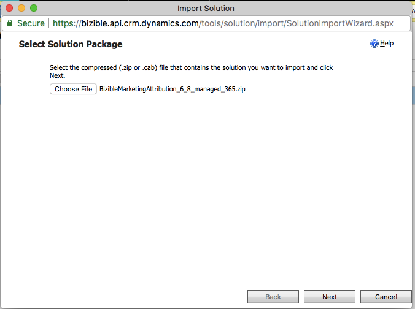
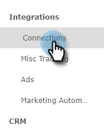
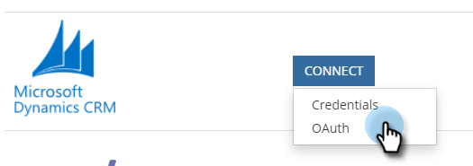

# [!DNL Microsoft Dynamics] CRM Installation Guide {#microsoft-dynamics-crm-installation-guide}

>[!NOTE]
>
>You may see instructions specifying "[!DNL Marketo Measure]" in the documentation, but still see "Bizible" in your CRM. We are working to have that updated and the rebranding will be reflected in your CRM soon.

## Supported Versions {#supported-versions}

[!DNL Marketo Measure] supports the following [!DNL Microsoft Dynamics CRM] versions:

* [!DNL Microsoft Dynamics 2016] (Online and On-Premise)
* [!DNL Microsoft Dynamics 365] (Online and On-Premise)

For connection and authentication, [!DNL Marketo Measure] supports the following Active Directory Federated Services (ADFS) versions:

* ADFS 4.0 - [!DNL Windows Server 2016]
* ADFS 5.0 - [!DNL Windows Server 2019]

## Install the Managed Solution {#install-the-managed-solution}

[Download and install](assets/marketo-measure-dynamics-extension.zip) the zip file within the Dynamics CRM.

**[!UICONTROL Settings]** > **[!UICONTROL Customizations]** > **[!UICONTROL Solutions]** > **[!UICONTROL Import]** (button) > **[!UICONTROL Choose File]**.

>[!NOTE]
>
>The following two screenshots may vary slightly from yours, as they were taken during a solution upgrade.

## Creating a [!DNL Marketo Measure] User {#creating-a-marketo-measure-user}

We recommend creating a dedicated Marketo Measure User as an "Application User" within Dynamics for us to export and import data through to avoid any issues with other users in your CRM. Take note of the username and password, as well as the endpoint URL, as they will be used when creating the [!DNL Marketo Measure] account.

## Security Roles {#security-roles}

If your organization uses Dynamics Security Roles, make sure the connected user, or the dedicated [!DNL Marketo Measure] User has sufficient read/write permissions to the required entities.

Security Roles are located here: **[!UICONTROL Settings]** > **[!UICONTROL Security]** > **[!UICONTROL Security Roles]**.

For [!DNL Marketo Measure] custom entities, we will need full permissions across all of our entities.

>[!NOTE]
>
>Users who will be closing opportunities also will need the full permissions.

For Dynamics standard entities, refer to the [!DNL Marketo Measure] Dynamics schema document. At a high level, [!DNL Marketo Measure] just needs to read in certain entities in order to gather the appropriate data and write to custom fields that will get installed with the managed solution. We will not create new standard records, nor will we update any standard fields.

## Include Touchpoints on Page Layouts: {#include-touchpoints-on-page-layouts}

1. For each Entity, navigate to the Form Editor. You can either find this under **[!UICONTROL Settings]** > **[!UICONTROL Customizations]** > **[!UICONTROL Customize the System]** > `[Entity]` > **[!UICONTROL Forms]**. Or you can find it on the settings while you're viewing a record.

   * The entities to configure: Account, Opportunity, Contact, Lead, and Campaign.

   * To configure Campaigns, you need to turn on the "Campaign Sync" option in **[!UICONTROL CRM]** > **[!UICONTROL Campaigns]**.

   

1. Page Layouts: first add a "[!UICONTROL One Column]" tile in the section you want the Touchpoints to live. Within that new column, we will need a sub grid added to each form within your Account, Opportunity, Contact, and Lead entities.

   

   

1. Select the object (Buyer Attribution Touchpoints or Buyer Touchpoints) that should render in the subgrid, which depends on the object relationship. Optionally, change the columns that will display by clicking the Edit button. A default layout has been set by the managed solution.

   Buyer Attribution Touchpoint Subgrid - Accounts, Opportunities, and Contact  
   Buyer Touchpoint Subgrid - Leads and Contacts

   

1. Once you're done updating the form, publish and save your changes.

## Schema-related Considerations {#schema-related-considerations}

**Revenue**

[!DNL Marketo Measure] points to the standard Actual Revenue field by default. If you are not using this, explain how you report on revenue to your Solutions Engineer or Success Manager as a custom workflow will be needed.

**Close Date**

[!DNL Marketo Measure] points to the Actual Close Date field out of the box. If you are not using this or also use the Estimated Close Date field, explain your process to your Solutions Engineer or Success Manager. A custom workflow may be need to account for both fields.

## Configuring your Connections and Data Providers {#configuring-your-connections-and-data-providers}

After you've logged in to the [!DNL Marketo Measure] application and have been set up as a user in the Adobe Admin Console, the next step is to set up your various data connections.

**CRM as a Data Provider**

1. In your [!DNL Marketo Measure] account, click the **[!UICONTROL My Account]** drop-down and select **[!UICONTROL Settings]**.

   

1. Under [!UICONTROL Integrations] in the left nav, click **[!UICONTROL Connections]**.

   

1. Click the **[!UICONTROL Set Up New CRM Connection]** button.

   

1. Next to [!UICONTROL Microsoft Dynamics CRM], click the **[!UICONTROL Connect]** button.

   

1. Select [!UICONTROL Credentials] or [!UICONTROL OAuth].

   

   >[!NOTE]
   >
   >For more information on OAuth, visit [this article](/help/marketo-measure-and-dynamics/getting-started-with-marketo-measure-and-dynamics/oauth-with-azure-active-directory-for-dynamics-crm.md). If you have any questions about the process, contact your [!DNL Marketo Measure] Account representative.

1. In this example, we've chosen Credentials. Enter your credentials and click **[!UICONTROL Next]**.

After connecting, you will see the details of your Dynamics connection in the CRM/MAP Connections list.

**Ad Account Connections**

To connect your Ad Accounts with [!DNL Marketo Measure], start by visiting the [!UICONTROL Connections] tab within the [!DNL Marketo Measure] application.

1. Follow Steps 1 & 2 from the above _CRM as a Data Provider_ section.

1. Click the **[!UICONTROL Set up New CRM Connection]** button.

   

1. Select your desired platform.

   

**[!DNL Marketo Measure] Javascript**

In order for [!DNL Marketo Measure] to track your web activities, there are multiple steps for setup.

1. Click the **[!UICONTROL My Account]** drop-down and select **[!UICONTROL Account Configuration]**.

   

1. Enter your phone number. For Website, enter your primary root domain that will be used for [!DNL Marketo Measure] tracking on your website. Click **[!UICONTROL Save]** when done.

   

   >[!NOTE]
   >
   >To add multiple root domains, contact your [!DNL Marketo Measure] Account Representative.

1. The [[!DNL Marketo Measure] JavaScript](/help/marketo-measure-tracking/setting-up-tracking/adding-marketo-measure-script.md) then needs to be placed across the entire site and landing pages. We recommend hardcoding the script within the head of your landing pages or adding through a Tag Management System such as [Google Tag Manager](/help/marketo-measure-tracking/setting-up-tracking/adding-marketo-measure-script-via-google-tag-manager.md).

   >[!NOTE]
   >
   >By default, [!DNL Marketo Measure] exports 200 records per API credit each time a job sends data to your CRM. For most customers, this provides the optimal balance between API credits consumed by [!DNL Marketo Measure] and CPU resource requirements on the CRM. However, for customers with complex CRM configurations, such as workflows and triggers, a smaller batch size might be helpful to improve CRM performance. To this end, [!DNL Marketo Measure] allows customers to configure the CRM export batch size. This setting is available on the Settings > CRM > General page in the [!DNL Marketo Measure] web application and customers can choose between batch sizes of 200 (default), 100, 50, or 25.
   >
   >When modifying this setting, keep in mind that smaller batch sizes will consume more API credits from your CRM. It's advisable to reduce the batch size only if you're experiencing CPU timeout or high CPU load in your CRM.

   >[!NOTE]
   >
   >When you disable Marketo Measure exporting data to Dynamics, it won't remove any existing data. For help with removing existing data, contact Dynamics Support.

   >[!MORELIKETHIS]
   >
   >[Error Notifications](/help/configuration-and-setup/getting-started-with-marketo-measure/error-notifications.md){target="_blank"}
