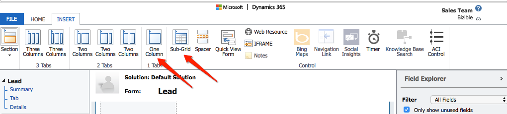
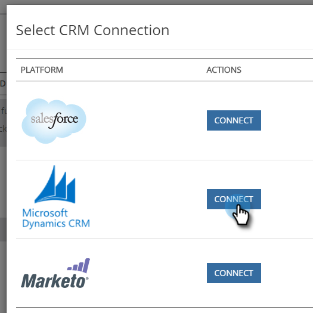

# Microsoft Dynamics CRM Installation Guide {#microsoft-dynamics-crm-installation-guide}

## Supported Versions {#supported-versions}

Marketo Measure supports the following Microsoft Dynamics CRM versions:

* Microsoft Dynamics 2016 (Online and On-Premise)
* Microsoft Dynamics 365 (Online and On-Premise)

For connection and authentication, Marketo Measure supports the following Active Directory Federated Services (ADFS) versions:

* ADFS 4.0 - Windows Server 2016
* ADFS 5.0 - Windows Server 2019

## Install the Managed Solution {#install-the-managed-solution}

[Download and install](assets/marketo-measure-dynamics-extension.zip) the zip file within Dynamics CRM.

Settings > Customizations > Solutions > Import (button) > Choose File

>[!NOTE]
>
>The following two screenshots may vary slightly from yours, as they were taken during a solution upgrade.

## Marketo Measure User Permissions {#marketo-measure-user-permissions}

We recommend creating a dedicated Marketo Measure User within Dynamics for us to export and import data through to avoid any issues with other users in your CRM. Take note of the username and password as well as the endpoint URL as this will be used when creating the Marketo Measure account.

## Security Roles {#security-roles}

If your organization uses Dynamics Security Roles, please make sure the connected user, or the dedicated Marketo Measure User has sufficient read/write permissions to the required entities.

Security Roles are located here: Settings > Security > Security Roles

For Marketo Measure custom entities, we will need full permissions across all of our entities.

>[!NOTE]
>
>Users who will be closing opportunities also will need the full permissions.

For Dynamics standard entities, please refer to Marketo Measure’s Dynamics schema document. At a high level, Marketo Measure just needs to read in certain entities in order to gather the appropriate data and write to custom fields that will get installed with the managed solution. We will not create new standard records, nor will we update any standard fields.

## Include Touchpoints on Page Layouts: {#include-touchpoints-on-page-layouts}

1. For each Entity, navigate to the Form Editor. You can either find this under Settings > Customizations > Customize the System > `[Entity]` > Forms. Or you can find it on the settings while you’re viewing a record.

   * The entities to configure: Account, Opportunity, Contact, Lead, and Campaign.

   

1. Page Layouts: first add a “One Column” tile in the section you want the Touchpoints to live. Within that new column, we will need a sub grid added to each form within your Account, Opportunity, Contact, and Lead entities.

   

   

1. Select the object (Buyer Attribution Touchpoints or Buyer Touchpoints) that should render in the subgrid, which depends on the object relationship. Optionally, change the columns that will display by clicking the Edit button. A default layout has been set by the managed solution.

   Buyer Attribution Touchpoint Subgrid - Accounts, Opportunities, and Contact  
   Buyer Touchpoint Subgrid - Leads and Contacts

   

1. Once you’re done updating the form, publish and save your changes.

## Schema-related Considerations {#schema-related-considerations}

**Revenue**

Marketo Measure points to the standard Actual Revenue field by default. If you are not using this, please explain how you report on revenue to your Solutions Engineer or Success Manager as a custom workflow will be needed.

**Close Date**

Marketo Measure points to the Actual Close Date field out of the box. If you are not using this or also use the Estimated Close Date field, please explain your process to your Solutions Engineer or Success Manager. A custom workflow may be need to account for both fields.
 &nbsp;

## Set up Your Adobe Admin Console and Identity Provider {#set-up-your-adobe-admin-console-and-identity-provider}

The first step to using Marketo Measure is to create and sign-in to your provisioned Adobe Admin Console. If you haven't already received the email with log in instructions, please contact your Marketo Measure Account Representative.

As a product within the Adobe Suite, Marketo Measure leverages the full functionality of Adobe Admin Console for Identity Management. More resources can be found here: https://helpx.adobe.com/enterprise/using/admin-console.html.

We recommend reviewing all of the resources, best practices, and options available to you for Identity Management: https://helpx.adobe.com/enterprise/using/set-up-identity.html.

For guidance and review of setting up your Identity Management within the Adobe Admin Console, please reach out to your Marketo Measure Account Representative.

In order to facilitate user authentication and authorization with your Marketo Measure instance(s), the following steps are required within the Adobe Admin Console:

**Setting Up the Marketo Measure Product Card**

Upon accessing the Adobe Admin Console, you will see your Marketo Measure Product instance(s) present in the Overview section.

   

Clicking the Marketo Measure Product Card will show you all of your Marketo Measure instance(s). By default, each Marketo Measure Instance has its own profile prefixed with 'Marketo Measure'. Any Admins or Users added to this or any other profile within this instance will be able to log in to Marketo Measure.

   

No action is required to create a new profile within the Marketo Measure Product instance(s).

To begin adding users who can access Marketo Measure, please refer to the [Adding Marketo Measure Admins and Marketo Measure Users](#adding-marketo-measure-admins-and-marketo-measure-users) section below.

## Adding Marketo Measure Admins and Marketo Measure Users {#adding-marketo-measure-admins-and-marketo-measure-users}

The next step is to grant access to the Marketo Measure application by adding users. This can be done in the admins and users directory of the Marketo Measure product card.

| User Type | Description |
|---|---|
|Admins|these are administrators and power users of the Marketo Measure Application with full ability to update and manage Marketo Measure-specific configuration options|
|Users|these are standard users of the Marketo Measure Application with read only permissions within the Marketo Measure application|

When adding a user to their respective group, you'll see their [Identity Type listed](https://helpx.adobe.com/enterprise/admin-guide.html/enterprise/using/set-up-identity.ug.html).

>[!NOTE]
>
>In order to be a Marketo Measure administrator (in [experience.adobe.com/marketo-measure](https://experience.adobe.com/marketo-measure){target="_blank"}), a user must be added as a User _and_ an Admin to any Marketo Measure product profile within the Marketo Measure product card.

**Signing in to Marketo Measure**

After a user has been added to a Product Profile, they're able to access their Marketo Measure instance(s) by choosing the **Sign in with Adobe ID** option at [experience.adobe.com/marketo-measure](https://experience.adobe.com/marketo-measure){target="_blank"}.

   

## Configuring your Connections and Data Providers {#configuring-your-connections-and-data-providers}

After you've logged in to the Marketo Measure application and have been set up as a user in the Adobe Admin Console, the next step is to set up your various data connections.

**CRM as a Data Provider**

1. In your Marketo Measure account, click the **My Account** drop-down and select **Settings**.

   

1. Under Integrations in the left nav, click **Connections**.

   

1. Click the **Set Up New CRM Connection** button.

   

1. Next to Microsoft Dynamics CRM, click the **Connect** button.

   

1. Select Credentials or OAuth.

   

   >[!NOTE]
   >
   >For more information on OAuth, please visit [this article](/help/marketo-measure-and-dynamics/getting-started-with-marketo-measure-and-dynamics/oauth-with-azure-active-directory-for-dynamics-crm.md). If you have any questions about the process, please contact your Marketo Measure Account representative.

1. In this example, we've chosen Credentials. Enter your credentials and click **Next**.

After connecting, you'll see the details of your Dynamics connection in the CRM/MAP Connections list.

**Ad Account Connections**

To connect your Ad Accounts with Marketo Measure, start by visiting the Connections tab within the Marketo Measure application.

1. Follow Steps 1 & 2 from the above _CRM as a Data Provider_ section.

1. Click the **Set up New CRM Connection** button.

   

1. Select your desired platform.

   

**Marketo Measure Javascript**

In order for Marketo Measure to track your web activities, there are multiple steps for setup.

1. Click the **My Account** drop-down and select **Account Configuration**.

   

1. Enter your phone number. For Website, enter your primary root domain that will be used for Marketo Measure tracking on your website. Click **Save** when done.

   

   >[!NOTE]
   >
   >To add multiple root domains, please contact your Marketo Measure Account Representative.

1. The [Marketo Measure JavaScript](/help/marketo-measure-tracking/setting-up-tracking/adding-marketo-measure-script.md) then needs to be placed across the entire site and landing pages. We recommend hardcoding the script within the head of your landing pages or adding through a Tag Management System such as [Google Tag Manager](/help/marketo-measure-tracking/setting-up-tracking/adding-marketo-measure-script-via-google-tag-manager.md).

   >[!NOTE]
   >
   >By default, Marketo Measure exports 200 records per API credit each time a job sends data to your CRM. For most customers, this provides the optimal balance between API credits consumed by Marketo Measure and CPU resource requirements on the CRM. However, for customers with complex CRM configurations, such as workflows and triggers, a smaller batch size might be helpful to improve CRM performance. To this end, Marketo Measure allows customers to configure the CRM export batch size. This setting is available on the Settings > CRM > General page in the Marketo Measure web application and customers can choose between batch sizes of 200 (default), 100, 50, or 25.
   >
   >When modifying this setting, please keep in mind that smaller batch sizes will consume more API credits from your CRM. It's advisable to reduce the batch size only if you're experiencing CPU timeout or high CPU load in your CRM.
