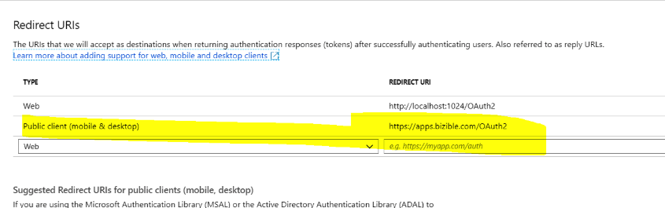
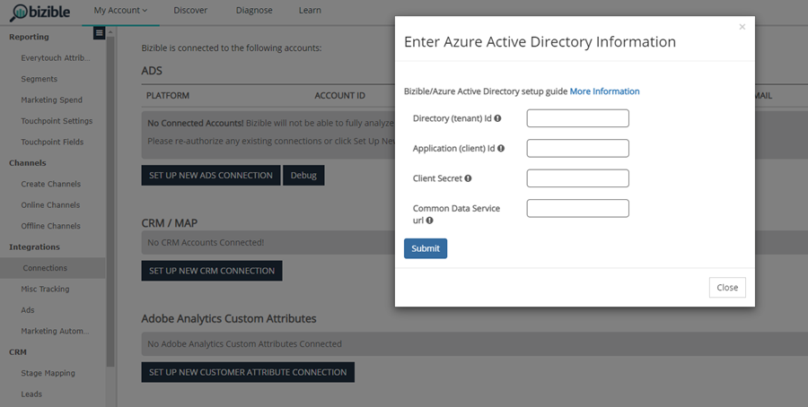

# OAuth with [!DNL Azure Active Directory] for Dynamics CRM {#oauth-with-azure-active-directory-for-dynamics-crm}

## Who's Affected {#who-s-affected}

This setup is for new [!DNL Marketo Measure] customers using Dynamics CRM with an [!DNL Azure Active Directory] (AAD) account, or for customers that want to migrate from their legacy username and password to [!DNL Azure Active Directory] with OAuth.

>[!NOTE]
>
>For both of these scenarios, AAD is set up here to facilitate connecting your Dynamics instance in [!DNL Marketo Measure] as a Data Provider.

## Set Up New Application {#set-up-new-application}

1. Sign in to your [Azure Portal](https://portal.azure.com/#home).

1. Choose the Azure AD tenant by clicking your account in the top-right corner of the page, followed by clicking the Switch Directory navigation and then selecting the appropriate tenant. Skip this step if you only have one Azure AD tenant under your account or if you've already selected the appropriate Azure AD tenant.

   

1. Search for "[!DNL Azure Active Directory]" in the search bar and click the name to open.

   

1. Click **[!UICONTROL App Registrations]** in the left-hand menu.

   

1. Click **[!UICONTROL New Registration]** at the top.

   

1. Follow the prompts and create an application. It doesn't matter if it's a web application or a public client (mobile & desktop) application, but if you'd like specific examples for web applications or public client applications, check out the [quickstarts](https://learn.microsoft.com/en-us/azure/active-directory/develop/v2-overview).  
   a. Name is the application name and describes your application to end users.  
   b. Under Supported account types, select Accounts in any organizational directory and personal Microsoft accounts.  
   c. Provide the Redirect URI. For Web Applications, this is the base URL of your app where users can sign in. For example, `http://localhost:12345`. For public clients (mobile & desktop), Azure AD uses it to return token responses. Enter a value specific to your application. For example, `http://MyFirstAADApp`.

1. Once you've completed registration, Azure AD assigns your application a unique client identifier (the Application ID). You need this value in the next section, so copy it from the application page.

1. To find your application in the Azure portal, click **[!UICONTROL App Registrations]**, then click **[!UICONTROL All Applications]**. Open your newly created application

1. Click **[!UICONTROL Authentication]** in the left-hand menu.

   

1. Add the [!DNL Marketo Measure] redirect URLs: `https://apps.bizible.com/OAuth2` and `https://apps.bizible.com/OAuth2?identityOnly=true` to the list of Redirect URLs.

   

1. Navigate to the API Permissions tab and make sure that the correct permissions are assigned to the application.

   

1. From here, enter "[!UICONTROL enterprise]" in the search box and click **[!UICONTROL Enterprise Applications]**.

   

1. Again, find and open your new application from the list of applications.

1. From the Permissions tab, click **[!UICONTROL Grant Admin Consent for (instance name)]**.

   

1. Click **[!UICONTROL Accept]**.

   

1. From the "[!UICONTROL Users and Groups]" tab, make sure that the valid "Users and Groups" are assigned to the Application.
  
   

## Creating an Application User {#creating-an-application-user}

Once the application registration is done, then an application user can be created.

1. Navigate to your Common Data Service environment (`https://[org].crm.dynamics.com`).

1. Navigate to **[!UICONTROL Settings]** > **[!UICONTROL Security]** > **[!UICONTROL Users]**.

1. Choose **[!UICONTROL Application Users]** in the view filter.

1. Select **[!UICONTROL + New]**.

1. In the Application User form, enter the required information.

   >[!NOTE]
   >
   >* The user name information must not match a user that exists in the [!DNL Azure Active Directory].
   >
   >* In the Application ID field, enter the application ID of the app you registered earlier in the Azure AD.

1. If the setup is correct, then after selecting **[!UICONTROL Save]**, the **[!UICONTROL Application ID URI]** and **[!UICONTROL Azure AD Object Id]** fields will auto-populate with correct values.

1. Before exiting the user form, choose **[!UICONTROL Manage Roles]** and assign a security role to this application user so that the application user can access the desired organization data.

## Connecting your Dynamics Instance via OAuth {#connecting-your-dynamics-instance-via-oAuth}

1. When setting up your Dynamics connection for the first time, follow steps 1-5 of the "CRM as a Data Provider" section in [this article](/help/marketo-measure-and-dynamics/getting-started-with-marketo-measure-and-dynamics/microsoft-dynamics-crm-installation-guide.md).

1. When prompted for OAuth credentials, fill in the Client Id, Client Secret, and Application Id URI that were set up in the section above.

  a. Client Id is the Id from Step #7 in the section above. If you didn't write it down, the Application Id is displayed in the Settings of the App registration.

  b. Client Secret is the application secret created in the Azure Portal for your application under Certificates & Secrets.

   
  
  c. Application ID URI is the URL of the target web API (secured resource). To find the App ID URL, in the Azure Portal, click [!DNL Azure Active Directory], click Application registrations, open the application's Settings page, then click Properties. It may also be an external resource like `https://graph.microsoft.com`. This is normally the URL of the Dynamics instance.

1. After you click **[!UICONTROL Submit]**, you will be prompted to sign in with [!DNL Azure Active Directory]. When the authentication is successful, your Dynamics account is connected as a data provider within [!DNL Marketo Measure].

## Reauthenticating your Dynamics Account {#re-authenticating-your-dynamics-account}

1. When you are in the [!DNL Marketo Measure] application, go to **[!UICONTROL My Settings]** > **[!UICONTROL Settings]** > **[!UICONTROL Connections]**.

1. Click the key icon in the CRM section next to the Dynamics connection.

1. Once the key is clicked, a pop-up appears and you are prompted to enter the Client Id, Client Secret, and Application Id URI, similar to the signup flow.

   

1. After you click **[!UICONTROL Submit]**, you will be prompted to sign in with [!DNL Azure Active Directory]. When the authentication is successful, your Dynamics account is reauthorized within [!DNL Marketo Measure].
