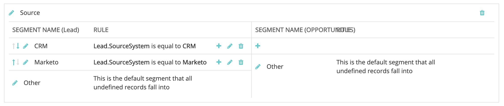

# [!DNL Marketo Engage] People Integration {#marketo-engage-people-integration}

The Marketo people integration allows [!DNL Marketo Measure] to start downloading people from Marketo and begin to tie their tracked sessions to the individual and map touchpoints to their engagements. Historically, [!DNL Marketo Measure] was only able to map touchpoints to a person from the CRM, so this helps marketers measure their marketing efforts sooner rather than waiting for a stage or trigger to sync it to the CRM.

## Requirements {#requirements}

* Production Marketo instance
* Production [!DNL Salesforce] or [!DNL Microsoft Dynamics] instance
* Any paid [!DNL Marketo Measure] subscription
* SOLR enabled (reach out to [Marketo Support](https://nation.marketo.com/t5/Support/ct-p/Support){target="_blank"} to have this enabled)

## How It Works {#how-it-works}

As a current customer, [!DNL Marketo Measure] is already downloading people from your CRM. The standard process is that [!DNL Marketo Measure] downloads the people and maps the email address to a web session that we've tracked via bizible.js.

With the introduction of downloading Marketo people, [!DNL Marketo Measure] is now able to map web sessions to a larger pool of individuals, those that have not been synced with the CRM. We commonly see this due to internal processes that wait until people reach a certain status before they are pushed to the CRM.

When [!DNL Marketo Measure] successfully maps the Marketo person to a web session, our processing will generate any relevant touchpoints for it, which are ultimately reportable in [!DNL Marketo Measure Discover]. If that Marketo person gets pushed to the CRM, [!DNL Marketo Measure] will handle the duplicate scenario and we will recreate the touchpoint for the CRM person, and mark the initial set as "duplicate."

In order for us to detect these duplicates, make sure your [!DNL Marketo-Salesforce] or [!DNL Marketo-Dynamics] sync is populating the Lead and Contact Ids on the Marketo Person. If the Id is syncing properly, you should be able to see the CRM Id on the Person record, like this:

Customers have the option of reporting the full set of Marketo people and CRM people inside of [!DNL Marketo Measure] Discover. If you are interested in reporting on CRM people only, we recommend creating a Segment to filter them.

## [!DNL Marketo Measure Discover] {#marketo-measure-discover}

When reporting on leads (people) in [!DNL Marketo Measure Discover], you will see the total of your Marketo and CRM leads. In order to report on only Marketo people or only CRM leads, you will want to create a Segment Category for your source, then create Segment rules for Marketo and CRM using the "Source System" field to define the rule. Once your segments are created, you will see the Source category available to filter across your [!DNL Marketo Measure Discover] dashboards.

## Field Mappings {#field-mappings}

<table> 
 <colgroup> 
  <col> 
  <col> 
 </colgroup> 
 <tbody> 
  <tr> 
   <th>
<strong>biz_leads</strong>
</th> 
   <th>
<strong>Marketo</strong>
</th> 
  </tr> 
  <tr> 
   <td>
ID
</td> 
   <td>
id
</td> 
  </tr> 
  <tr> 
   <td>
MODIFIED_DATE
</td> 
   <td>
updatedAt<strong>*</strong>
</td> 
  </tr> 
  <tr> 
   <td>
CREATED_DATE
</td> 
   <td>
createdAt
</td> 
  </tr> 
  <tr> 
   <td>
EMAIL
</td> 
   <td>
email
</td> 
  </tr> 
  <tr> 
   <td>
WEB_SITE
</td> 
   <td>
website
</td> 
  </tr> 
  <tr> 
   <td>
COMPANY
</td> 
   <td>
company
</td> 
  </tr> 
  <tr> 
   <td>
IS_CONVERTED
</td> 
   <td>
n/a
</td> 
  </tr> 
  <tr> 
   <td>
ACCOUNT_ID
</td> 
   <td>
Account Id (L2A)
</td> 
  </tr> 
  <tr> 
   <td>
BIZIBLE_STAGE
</td> 
   <td>
Status
</td> 
  </tr> 
  <tr> 
   <td>
IS_DELETED
</td> 
   <td>
true/false
</td> 
  </tr> 
 </tbody> 
</table>

*There is a known behavioral issue where fields from the Marketo Company entity do not impact the Person's updatedAt value, so if relevant fields such as Website or Company are updated, [!DNL Marketo Measure] will not know that those values are modified because the updatedAt date/time value is not updated. This impacts the ABM feature, where we wouldn't have fresh data to resolve the Account for the lead. There is no workaround at the moment, but there are plans to address this in the future.

## FAQ {#faq}

**Why do my lead counts differ between my CRM and [!DNL Marketo Measure Discover]?**

Because this integration allows us to create touchpoints for leads that we've imported directly from Marketo, there may be leads that didn't get synced to the CRM so therefore the count within Discover could be higher than the CRM since touchpoints are only pushed for the CRM Leads.

**How does this replace my data?**

This integration actually merges the data sets within your current [!DNL Marketo Measure] instance so nothing is getting replaced. What we would expect from your current CRM Leads is that when we download the 2 years worth of Marketo Leads, we would simply update that Lead record to show that there was also a match to a Marketo Lead. That all happens in the backend and the touchpoints are expected to remain the same. We would also expect that we'd see more touchpoints because of the eligible Marketo Leads. If we're able to find web sessions matched to those Marketo people, we'll start seeing the touchpoints counted in [!DNL Marketo Measure].

**Can I only have my people downloaded from Marketo and cut off the CRM connection?**

At this time, no. We'll have this option in the future, but we need to build out other phases of this Marketo integration so that we can connect the programs, opportunities and deals from Marketo to [!DNL Marketo Measure].

**Do you import ALL of my Marketo people?**

At the moment, the earliest we will import people is from 1/1/2018 so that we have a minimum of 2 years of data, which is the same behavior we enforce from CRM downloads. We will implement improved behavior to download a rolling 2-year window once the Marketo connection has been established.

We also don't filter for any people types, so all people within the two-year window will get imported and are eligible for touchpoints.

**What is SOLR and why do I need to have it enabled to use this feature?**

Enabling SOLR for your Marketo instance is a trivial step that opens up hardware space in Marketo so that your subscription can utilize the [!DNL Marketo Measure] integration. Without SOLR enabled, we don't have access to certain calls that would otherwise allow us to download the appropriate people from your Marketo instance.
