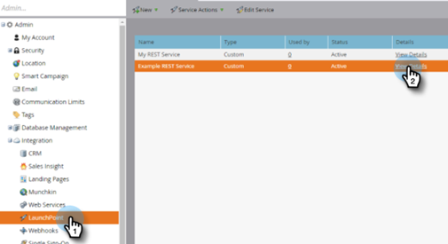
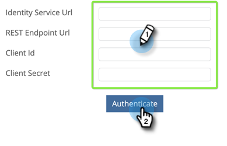

# Set Up Marketo Connection {#set-up-marketo-connection}

Here's how to set up your connection to Marketo.

>[!PREREQUISITES]
>
>[Create an API Only User role](https://experienceleague.adobe.com/docs/marketo/using/product-docs/administration/users-and-roles/create-an-api-only-user.html) for the [!DNL Marketo Measure]/Marketo Engage connection.

1. In [!DNL Marketo Measure], click the **[!UICONTROL My Account]** drop-down and select **[!UICONTROL Settings]**.

   

1. Under [!UICONTROL Integrations], click **[!UICONTROL Connections]**.

   

1. Click **[!UICONTROL Set Up New CRM Connection]**.

   

1. Click the **[!UICONTROL Connect]** button next to Marketo.

   

1. In a new tab, log in to your Marketo Engage account. Go to **Admin** > **Web Services**. Scroll down to REST API. Highlight and save the Endpoint and Identity Service URL. You need them in the following steps.

   

1. Still in Marketo Engage, select **LaunchPoint** in the tree on the left. Find the custom service that you want to connect to Marketo Measure and click **View Details**.

   

1. Highlight and save the Client ID and Client Secret. Click **Close**.

   

1. Back in [!DNL Marketo Measure], populate the fields with the data you collected.

   

1. After you enter the values, click **[!UICONTROL Authenticate]**. Your Marketo Engage account is connected to [!DNL Marketo Measure].

   

   >[!NOTE]
   >
   >[!DNL Marketo Measure] makes calls to the Marketo API on your behalf without consuming any of your Marketo API limits, so there's no need to worry about caps and credit allocation with other integrations.
