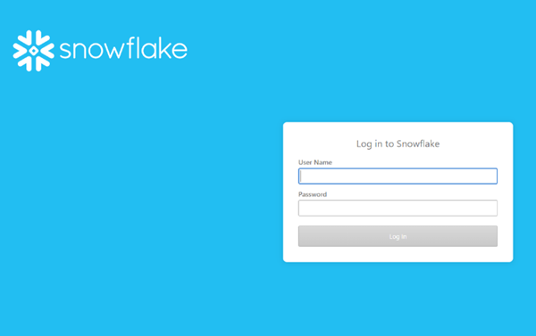

# Data Warehouse Access - Reader Account {#data-warehouse-access-reader-account}

## Snowflake Access Link {#snowflake-access-link}

To access your Snowflake data warehouse, you must navigate to the specific URL for your Snowflake account. You can find this access link by logging into [!DNL Marketo Measure] and following the steps below to navigate to the Data Warehouse information page.

1. In [!DNL Marketo Measure], at the top of the page, Click **[!UICONTROL My Account]** > **[!UICONTROL Settings]**.

   

1. On the left side menu, under Security, Click **[!UICONTROL Data Warehouse]**.

   

1. This page has the link to your Snowflake data warehouse and your username.

   

   >[!NOTE]
   >
   >This is a read-only account that's available for your organization, not just an individual user. Any user within your organization that has access to [!DNL Marketo Measure] can use this account to log into the Snowflake Data Warehouse reader account.

1. Click the link provided in the Snowflake URL, this takes you to the Snowflake login page where you enter your username and password. _If you don't have your password, see the steps below to reset it_.

   

1. Once logged in, Click **[!UICONTROL Worksheets]** at the top of the page.

   

1. The BIZIBLE_ROI_V3 database objects are on the left side of the screen. Enter the Warehouse, Database, and Schema from the dropdown options at the top of the query window. There should only be one option for each. Now you are ready to execute queries inside the Snowflake query editor.

   

## Reset Your Password {#reset-your-password}

[!DNL Marketo Measure] does not have access to your Snowflake login password. If you must reset your password, Click the [!UICONTROL Reset Password] button on the Data Warehouse information page, and follow the instructions. A temporary password is immediately displayed in the UI. You will be prompted to create your own password on your next data warehouse login.

>[!NOTE]
>
>* Resetting the password resets it for all [!DNL Marketo Measure] users in your organization, not just the user currently logged in.
>* We only show the temporary password in the UI. An email will not be sent.

   

   

## Connecting to Snowflake via Third-Party Tools {#connecting-to-snowflake-via-third-party-tools}

You need to enter a few pieces of information to connect your Snowflake data warehouse to a third-party tool.

>[!NOTE]
>
>Each tool has different connection requirements; it's recommended you consult the documentation for the specific tool you're trying to connect.

* **URI** (always required)
  * This is the domain name of the Snowflake account. It is contained within a portion of the Snowflake login link.  
* **Username** (always required)
  * The username is listed on the Data Warehouse information page in [!DNL Marketo Measure].
* **Password** (always required)
  * This is the password that you set the first time you logged into your Snowflake account. To reset your password, see the steps outlined above.
* **Database Name** (not always required)
  * The database is what stores the data in Snowflake. It is the storage resource. The database name is listed on the Data Warehouse information page in [!DNL Marketo Measure].
* **Warehouse Name** (not always required)
  * The warehouse is what executes queries in Snowflake. It is the computed resource. The warehouse name is listed on the Data Warehouse information page in [!DNL Marketo Measure].

   
