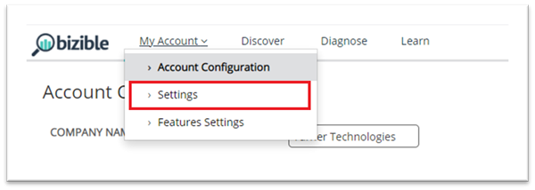
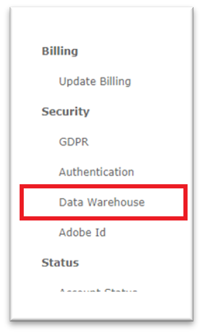
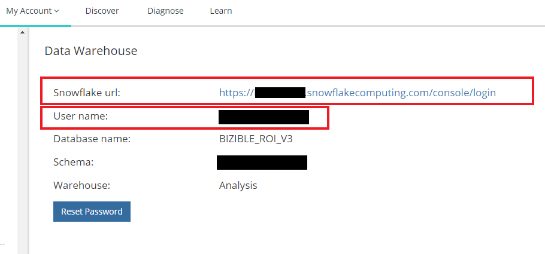
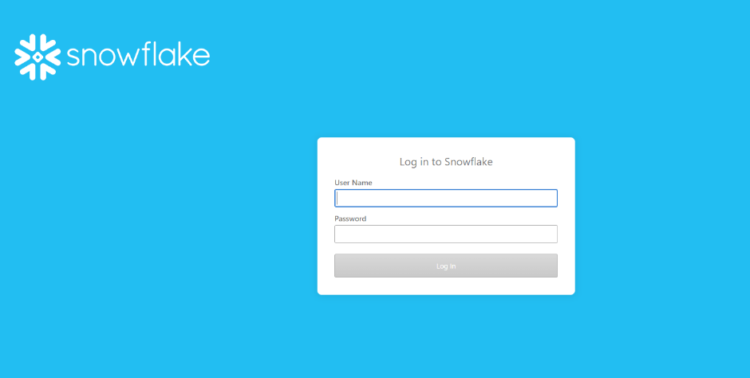
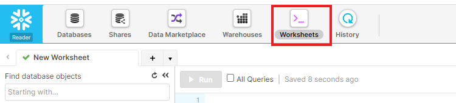
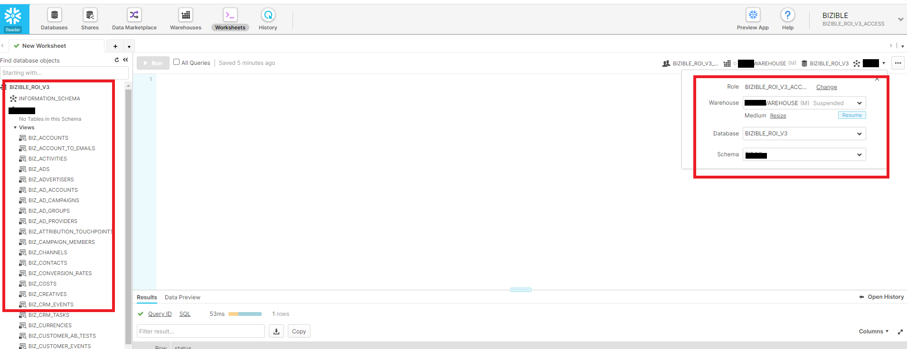
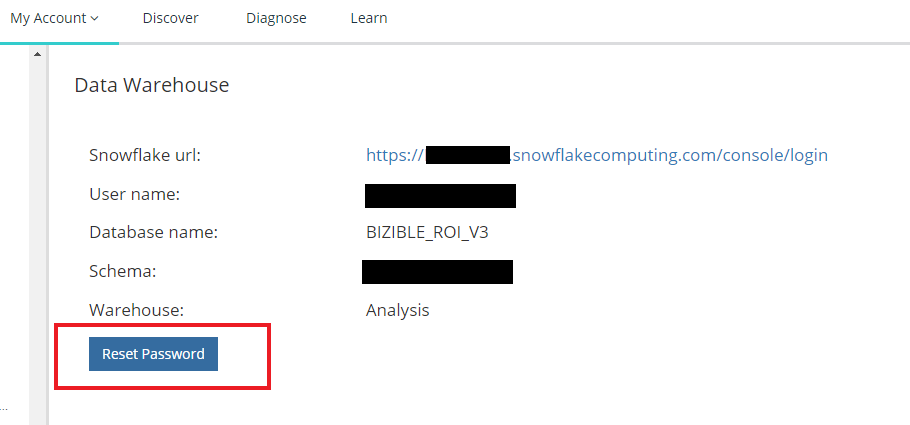
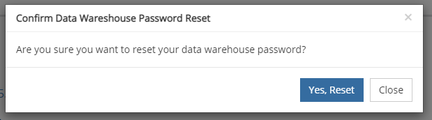
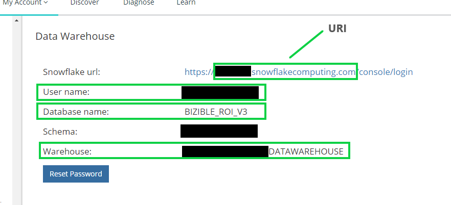

# Connecting to the Snowflake Data Warehouse {#connecting-to-the-snowflake-data-warehouse}

## Snowflake Access Link {#snowflake-access-link}

To access your Snowflake data warehouse, you'll need to navigate to the specific URL for your Snowflake account.  You can find this access link by logging into Marketo Measure and following the steps below to navigate to the Data Warehouse information page.

1. In Marketo Measure, at the top of the page, Click **My Account** > **Settings**.

   

1. On the left side menu, under Security, Click **Data Warehouse**.

   

1. On this page, you'll find the link to your Snowflake data warehouse and your username.

   

   >[!NOTE]
   >
   >This is a read-only account that's available for your organization, not just an individual user. Any user within your organization that has access to Marketo Measure can use this account to log into the Snowflake Data Warehouse reader account.

1. Click the link provided in the Snowflake URL, this will take you to the Snowflake login page where you'll enter your username and password. _If you don't have your password, see the steps below to reset it_.

   

1. Once logged in, Click **Worksheets** at the top of the page.

   

1. The BIZIBLE_ROI_V3 database objects are on the left side of the screen.  Enter the Warehouse, Database, and Schema from the dropdown options at the top of the query window.  There should only be one option for each.  Now you are ready to execute queries inside the Snowflake query editor.

   

## Reset Your Password {#reset-your-password}

Marketo Measure does not have access to your Snowflake login password.  If you need to reset your password, Click the Reset Password button on the Data Warehouse information page, and follow the instructions. A temporary password will be immediately displayed in the UI. You will be prompted to create your own password on your next data warehouse log in.

>[!NOTE]
>
>* Resetting the password resets it for all Marketo Measure users in your organization, not just the user currently logged in.
>* We only show the temporary password in the UI. An email will not be sent.

   

   

## Connecting to Snowflake via Third-Party Tools {#connecting-to-snowflake-via-third-party-tools}

You'll need to enter a few pieces of information to connect your Snowflake data warehouse to a third-party tool.

>[!NOTE]
>
>Each tool has different connection requirements; it's recommended you consult the documentation for the specific tool you're trying to connect.

* **URI** (always required)
  * This is the domain name of the Snowflake account.  It is contained within a portion of the Snowflake login link.  
* **Username** (always required)
  * The username is listed on the Data Warehouse information page in Marketo Measure.
* **Password** (always required)
  * This is the password you set the first time you logged into your Snowflake account.  To reset your password, please see the steps outlined above.
* **Database Name** (not always required)
  * The database is what stores the data in Snowflake. It is the storage resource. The database name is listed on the Data Warehouse information page in Marketo Measure.
* **Warehouse Name** (not always required)
  * The warehouse is what executes queries in Snowflake. It is the compute resource.  The warehouse name is listed on the Data Warehouse information page in Marketo Measure.

   

## Snowflake Data Warehouse Direct Share {#snowflake-data-warehouse-direct-share}

**Requirements**

In order for Marketo Measure to set up a direct share to the data warehouse you must meet the following requirements.

* You have your own Snowflake instance.
* Your Snowflake instance is located in the Azure East US 2 Snowflake region.
* You provide Marketo Measure with your Snowflake account id.

**Limitations**

In order for Marketo Measure to set up a direct share, the account requesting access must be located in Azure East US 2. We are aware Snowflake offers a data replication solution between regions, however we do not support this from our end as we only host data in the Azure East US 2 region. You may leverage this feature by setting up your own instance in Azure East US 2 and [replicating the data across regions](https://docs.snowflake.com/en/user-guide/secure-data-sharing-across-regions-plaforms.html){target="_blank"} to your existing instance. However, Snowflake's data replication feature is only available on tables, so in order to use this feature you will need to copy the data from our views to your own tables first.

**Accessing the Share**

Once the share has been created for the account id provided, you must complete the [setup steps](https://docs.snowflake.com/en/user-guide/data-share-consumers.html){target="_blank"} within your Snowflake instance in order to access the data.

Please note, you can choose any database name you want. You can assign the privileges to any rule you choose, so long as it exists in your Snowflake instance.

* Use the Account Admin role

```
USE ROLE ACCOUNTADMIN
```

* View available shares (this will show the name of the share granted)

```
SHOW SHARES
```

* Create a database for the share

```
CREATE DATABASE <database_name> FROM SHARE <provider_account>.<share_name>
```

* Grant privileges on the shared database

```
GRANT IMPORTED PRIVILEGES ON DATABASE <database_name> TO ROLE <role_name>
GRANT IMPORTED PRIVILEGES ON ALL SCHEMAS IN DATABASE <database_name> TO ROLE <role_name>
```

For more detailed instructions and steps to accomplish these steps from the Snowflake UI, please reference [Snowflake's documentation directly](https://docs.snowflake.com/en/user-guide/data-share-consumers.html){target="_blank"}.
