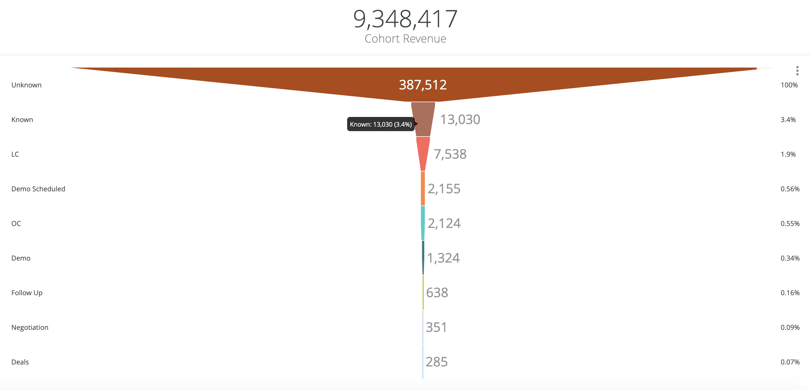

# Cohort Journey Dashboard Documentation {#cohort-journey-dashboard-documentation}

Cohort Journey dashboard enables Marketers to view the progression from a starting cohort stage for a selected time frame, and measure the conversion rate.

This dashboard has two tiles:

* Cohort Revenue: The total opportunity amount from all opportunities in the Deals stage of the Cohort Journey tile.
* Cohort Journey: The progression to each journey stage from the starting cohort stage for a selected time frame.

>[!NOTE]
>
>Across all Discover dashboards, only one person object, either Lead or Contact, can be reported. This is set in [!UICONTROL Settings] > [!UICONTROL Reporting] > [!UICONTROL Attribution Settings] > [!UICONTROL Default Dashboard Object].

This dashboard supports the following filters:

* Cohort Stage: select the starting cohort stage. Records in all following stages are evolved from the records in the cohort stage.
* Cohort Date Range: select the time frame for the selected cohort stage. Together with Cohort Stage, it defines the starting data set.
* Cutoff Date: select the date by which the record progression in all following stages must occur. Defaults to today. Note this applies to all stages other than the cohort stage.
* Channel: filter the records by channels. A record is associated to a channel if any of its touchpoints are associated to the channel.
* Subchannel: filter the records by subchannels. A record is associated to a subchannel if any of its touchpoints are associated to the subchannel.
* Campaign: filter the records by campaigns. A record is associated to a campaign if any of its touchpoints are associated to the campaign.
* Campaign Source: filter the records by campaign sources. Example campaign sources are [!DNL Adwords], [!DNL BingAds], [!DNL Facebook], [!DNL LinkedIn], etc. A record is associated to a campaign source if any of its touchpoints are associated to the campaign source.
* Segment filters: filter the records by custom segments. A record is associated to a segment if any of its touchpoints are associated to the segment.

Across all filters, "AND" logic is used.

>[!NOTE]
>
>Segment filters only apply to LC stage and after. If Cohort Stage is Unknown or Known and one of the segment filters has a value, the dashboard will not return any results.

Stages include Unknown, Known, LC, selected Funnel stages in Open Lead/Contact Stages (Settings > CRM > Stage Mapping), OC, selected Funnel stages in Open Opportunity Stages (Settings > CRM > Stage Mapping), and Deals (Closed Won Opportunities).

>[!NOTE]
>
>The count of the records for a journey stage, defined as any stage other than the cohort stage, includes all new records, related to the cohort records, that are created after the start date of the selected time frame and before the cutoff date. This is inferred causality.

You can drill down from each bar to view the records for each stage.

* For Unknown, it shows anonymous visitor details.
* For Known, it shows known visitor details.
* For LC and Open Lead/Contact stages, it shows Lead/Contact details.
* For OC, Open Opportunity stages, and Deals, it shows Opportunity details.
