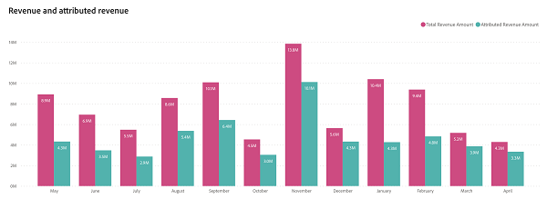
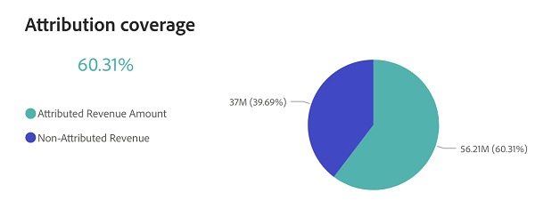

# Revenue Overview Dashboard {#revenue-overview-dashboard}

The Revenue Overview dashboard provides insights into the total revenue derived from your CRM, shedding light on your marketing strategies' role. It offers an overview of how marketing influences your overall revenue and contributes to the successful closure of deals.

**Questions the board answers:**

* What % of our revenue is attributable to our marketing efforts?
* What % of our "Closed Won" deals have been influenced by our marketing efforts?

## Dashboard Components {#dashboard-components}

### KPI Tiles {#kpi-tiles}

* **Total Revenue**: The total revenue from "Closed Won" Opportunities, including Opportunities without touchpoints.
* **Total Deals**: The number of "Closed Won" Opportunities, including Opportunities without touchpoints.
* **Attributed Revenue**: The total revenue from "Closed Won" Opportunities with touchpoints.
* **Attributed Deals**: The number of "Closed Won" Opportunities that have touchpoints.

### Revenue and Attributed Revenue Chart {#revenue-and-attributed-revenue-chart}

This side-by-side time series bar chart contrasts Total Revenue with Attributed Revenue, clearly visualizing your marketing impact on overall revenue.

* use the drill-down and up functionalities to categorize the data by Quarter and Year.
* Hover over a section of the bar chart to reveal its detailed information.

**Questions the chart answers:**

* What % of our August 2022 revenue can be attributed to our marketing initiatives?
* How does the attributed revenue in Q3 of last year stack up against Q4?

### Attribution Coverage Chart {#attribution-coverage-chart}

This pie chart distinctly visualizes your attribution coverage by segmenting total revenue into Attributed and Non-Attributed revenue, spotlighting the precise percentage of revenue influenced by your marketing efforts.

**Questions the chart answers:**

* What was the % of revenue coverage attributed to our marketing efforts last year?

## Filter Pane {#filter-pane}

This dashboard is equipped with the following settings and filters:

* Date (based on Closed Date)

>[!MORELIKETHIS]
>
>* [Discover Dashboard Basics](/help/marketo-measure-discover-ui/dashboards/discover-dashboard-basics.md){target="_blank"}
>* [Dashboard Data Visibility Policy](/help/marketo-measure-discover-ui/dashboards/dashboard-data-visibility-policy.md){target="_blank"}
