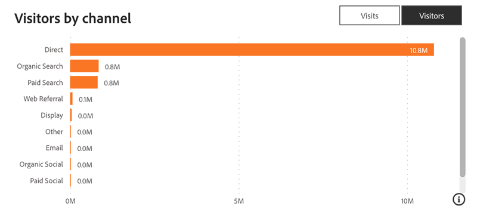

# Web Traffic Dashboard {#web-traffic-dashboard}

The Web Traffic Dashboard provides a comprehensive view of your site's visitor interactions. Delve into metrics such as unique visitor counts per URL, overall visits, page views, and form submissions from specific form URLs or landing pages. Monitor monthly traffic trends and identify high-performing paid media, empowering you to refine your strategies for optimal revenue generation.

Questions this dashboard answers:

* How many visits/unique visitors do we have from each URL?
* How many page views and form submissions do we have from each URL?
* How has web traffic trended over the past year?

## Dashboard Components {#dashboard-components}

**KPI Tiles**

<table>
<thead>
  <tr>
    <td>Visits</td>
    <td>The total site visits (sessions) initiated from external pages encompassing known and anonymous users.</td>
  </tr>
</thead>
<tbody>
  <tr>
    <td>Visitors</td>
    <td>The total number of unique visitors.</td>
  </tr>
  <tr>
    <td>Page Views</td>
    <td>The total number of views across website pages.</td>
  </tr>
  <tr>
    <td>Forms</td>
    <td>The total number of form submissions, including LinkedIn Lead Gen Forms.</td>
  </tr>
  <tr>
    <td>Unique Emails from Forms</td>
    <td>Total number of unique emails from form submissions.</td>
  </tr>
  <tr>
    <td>Leads Created from Forms</td>
    <td>Total number of new leads created from form submissions.</td>
  </tr>
</tbody>
</table>

## Web Traffic Over Time {#web-traffic-over-time}

Time series line chart displaying the trends of Page views, Visits, Visitors, Forms, Unique emails from forms, and Lead creation from forms. Use this chart to visualize and compare the performance and engagement of your website over time.

* Hover over a section on the graph to view the Total Visits, Unique Visitors, or Form Submits.
* Zoom into specific value ranges using the left-side slider.

Questions the chart answers:

* How do trends in Total Visits compare with Unique Visitors and Form Submissions over the displayed timeframe?
* In which period did the website see the highest number of Unique Visitors compared to Total Visits and Form Submissions?

## Web Traffic Summary Table {#web-traffic-summary-table}

Table displaying Page views, Visits, Visitors, Forms, Unique emails from forms, and Lead creation from forms by URLs.

**Columns**

* Page Title
* Page URL
* Page Views
* Visits
* Unique Visitors
* Form Submits
* Unique emails from forms
* Lead creation from forms

## Referrer Table {#referrer-table}

Table displaying Total Visits and Unique Visitors by Referrers. 

**Columns**

* Referrer Name
* Visits
* Unique Visitors

## Visits/Visitors by Channel {#visits-visitors-by-channel}

Bar chart displaying Visits or Unique Visitors segmented by Channel/Subchannel/Campaign.

* Leverage the drill-down and up functionalities to categorize the data by Subchannel and Campaign.
* Hover over each bar to view the Visits or Unique Visitors.

Questions the chart answers:

* Which Channel/Subchannel/Campaign attracts the highest number of visits or unique visitors?
* How does the number of unique visitors compare to total visits within a specific Channel/Subchannel/Campaign?

## Filter Pane {#filter-pane}

This dashboard is equipped with the following settings and filters:

* Date (based on Event Date)
* Channel, Subchannel
* Campaign
* URL
