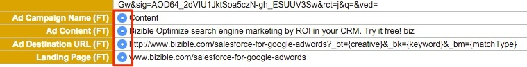

# Best Practices for Merging Leads {#best-practices-for-merging-leads}

When merging Leads in [!DNL Salesforce], it's always best to be cautious to ensure that no data is lost.
  
For your reference, here's breakdown of [how to Merge Leads](https://help.salesforce.com/s/articleView?id=leads_merge.htm&language=en_US&type=5) from [!DNL Salesforce] Support.  
  
Where [!DNL Marketo Measure] comes in is when it's time to select fields that populate on the merged record. Upon selecting the Master Record, validate that the [!DNL Marketo Measure] fields are selected to carry over to the new record.  
  
If there are multiple records with [!DNL Marketo Measure] data, ensure that the Master Record has the selected fields for the Lead that was created first. Additional [!DNL Marketo Measure] data will be present within the Insights section. Also, ensure that the email address of the tracked Lead is the email address that is retained, as it allows us to continue to update that Lead with any new attribution data.  
  
From there, you should be free to merge the Leads and [!DNL Marketo Measure] data will be carried across to the new record.  
  
Should you have any questions, don't hesitate to reach out to the Adobe Account Team (your Account Manager) or [Marketo Support](https://nation.marketo.com/t5/support/ct-p/Support){target="_blank"}.

