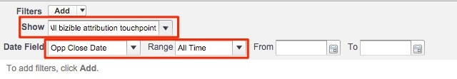
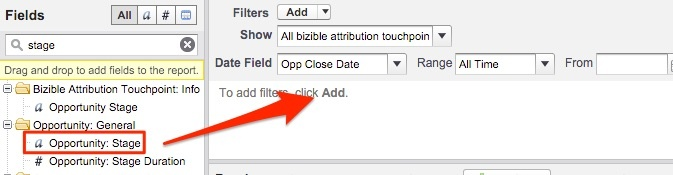
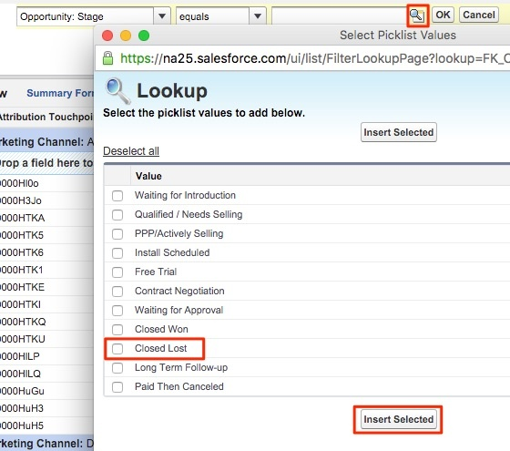

# Closed Lost Opportunities by Marketing Channel {#closed-lost-opportunities-by-marketing-channel}

Although this report might depend on your Opportunity Stages, this report will unveil which Marketing Channels contributed to opportunities that are not closed won.

1. Click your **[!UICONTROL Reports]** tab in Salesforce and select **[!UICONTROL New Report]**.

   

1. In the quick find type in "Bizible Attribution" and select the **[!UICONTROL Bizible Attribution Touchpoint with Opportunity]** report type, then select **[!UICONTROL Create]**.

   

1. Starting from the top of the report, show "[!UICONTROL All Bizible Attribution Touchpoints]" and adjust the date field according to the timeframe you are looking to report on. In our example, we're looking at All Time. Additionally, change the report format from Tabular to Summary.

   

   

1. Now, we will be adding fields to the report. In the quick find on the left, type in "Marketing Channel" and add it to the summary grouping in the report.

   

1. Next, we will add in a filter to only look at Closed Lost Opps. In the quick find on the left, search for the field "Stage" and drag it into the filter area.

   

1. From there you will select the magnifying glass to pick whatever stage(s) you utilize for "Closed Lost" Opportunities. In our case, we'll use the standard "Closed Lost" naming.

   

1. Now, go ahead and run the report!

   This is an Opportunities report summarized by Marketing Channel measuring Closed Lost Opportunities across your channels. This report allows you to understand what Channels may be underperforming. Feel free to add in any filters or fields that you'd like to report on.

>[!MORELIKETHIS]
>[[!DNL Marketo Measure] Tutorials: Additional SFDC Reports](https://experienceleague.adobe.com/en/docs/marketo-measure-learn/tutorials/onboarding/marketo-measure-102/addtional-salesforce-reports)
