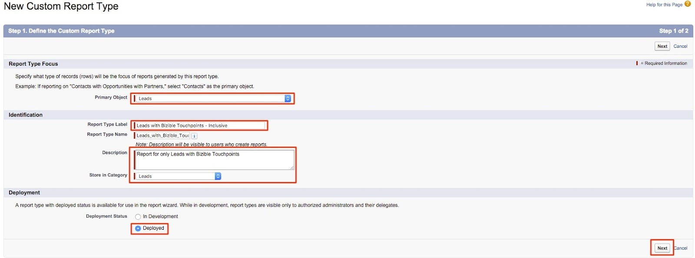

# Leads with Buyer Touchpoints Report {#leads-with-buyer-touchpoints-report}

>[!NOTE]
>
>You may see instructions specifying "[!DNL Marketo Measure]" in our documentation, but still see "[!DNL Bizible]" in your CRM. We are working to have that updated and the rebranding will be reflected in your CRM soon.

Out of the box you have many reporting capabilities at your fingertips when it comes to [!DNL Marketo Measure], but there are some additional report types we recommend building. Learn about creating an inclusive Leads with Buyer Touchpoints report type below.

1. Navigate to your Setup option within [!DNL Salesforce]. From there, expand the "Create" grouping and select **[!UICONTROL Report Types]**.

   

1. Select **[!UICONTROL New Custom Report Type]**.

   

1. Set the primary object as "Leads" and within the "Report Type Label" input "Leads with Buyer Touchpoints - Inclusive." Store the report within the "Leads" category and change the deployment status to **[!UICONTROL Deployed]**. Then select **[!UICONTROL Next]**.

   

1. For the object relationships, select the **[!DNL Marketo Measure] Persons** object as the secondary object. Select the A to B relationship as, "Each 'A' record must have at least one related 'B' record." From there, you will relate the "Buyer Touchpoint" object and select the same relationship between the B and C objects.

   

1. Save and start building some reports!
