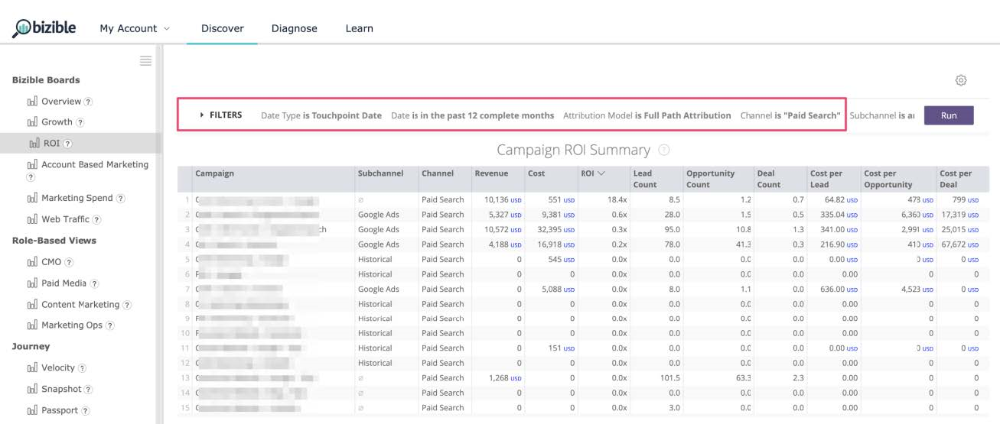
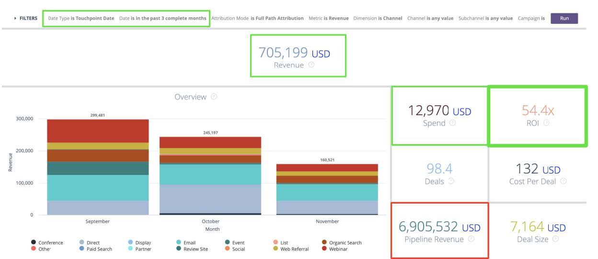

# Reporting on Opportunities with or Without Buyer Attribution Touchpoints {#reporting-on-opportunities-with-or-without-buyer-attribution-touchpoints}

>[!NOTE]
>
>You may see instructions specifying "[!DNL Marketo Measure]" in the documentation, but still see "Bizible" in your CRM. We are working to have that updated and the rebranding will be reflected in your CRM soon.

Create a new Report Type to include all Opportunities with or without Buyer Attribution Touchpoints.

1. Go to **[!UICONTROL Setup]** > **[!UICONTROL Create]** > **[!UICONTROL Report Types]**.

   

1. Select **[!UICONTROL New Custom Report Type]**.

   

1. Set the Primary Object as "[!UICONTROL Opportunities]."

    * Name the Report Type Label as: "Opportunities with or without Buyer Attribution."
    * Use the same naming for the Report Type Name. Within the description input, "Opportunities with or without Buyer Attribution Touchpoints."
    * Save the Report within the "[!UICONTROL Other]" and set the report to "[!UICONTROL Deployed]."

   

1. From there, you will link the Opportunities Object to the Buyer Attribution Touchpoints Object. Ensure that you choose the button "'A' records may or may not have related 'B' records." Click **[!UICONTROL Save]** when done.

   

>[!MORELIKETHIS]
>
>[[!DNL Marketo Measure] Tutorials: Additional SFDC Reports](https://experienceleague.adobe.com/en/docs/marketo-measure-learn/tutorials/onboarding/marketo-measure-102/addtional-salesforce-reports)
