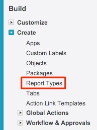
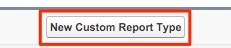
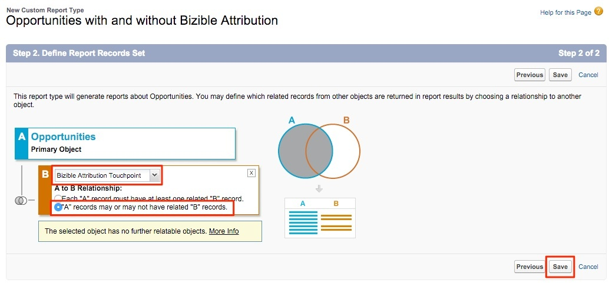

# Report Type for Contacts Without Opportunities {#report-type-for-contacts-without-opportunities}

>[!NOTE]
>You may see instructions specifying "[!DNL Marketo Measure]" in the documentation, but still see "[!DNL Bizible]" in your CRM. We are working to have that updated and the rebranding will be reflected in your CRM soon.

In order to report on Contacts with Buyer Touchpoints that are not associated to an Opportunity, you need to create a custom report type.

1. Go to **[!UICONTROL Setup]** > **[!UICONTROL Create]** > **[!UICONTROL Report Types]**.

   

1. Select **[!UICONTROL New Custom Report Type]**.

   

1. Set the [!UICONTROL Primary Object] as "[!UICONTROL Contacts]." Name the Report Type Label as "Contacts with Buyer Touchpoints." Use the same naming for the Report Type Name. Within the description input, "Contacts with Buyer Touchpoints." Save the Report within the "[!UICONTROL Other]" and set the report to "[!UICONTROL Deployed]."

   

1. From there, you will link the Contacts Object to the Buyer Touchpoints Object. Ensure that you choose the button "Each "A" record must have at least one related "B" record."

   

1. Click **[!UICONTROL Save]** and you are done!
