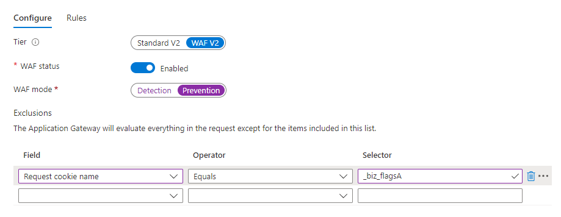

# Marketo Measure Cookies {#marketo-measure-cookies}

Learn about the various [!DNL Marketo Measure] Cookies that are loaded onto your site when you apply the [!DNL Marketo Measure] JavaScript to your landing pages. This information may serve as useful for the web development team during implementation.

>[!IMPORTANT]
>
>Due to privacy concerns, third-party cookies are on the way out. Google Chrome's announced Q3 2024 deprecation of third-party cookies effectively marks the end of this form of tracking. As a result, Adobe is deprecating Marketo Measure functions which rely on third-party cookies; specifically, Cross-Domain Tracking and View-through Attribution, which use the Google/DoubleClick impression cookie. No other functions of Marketo Measure will be impacted. First-party cookie usage is also not impacted. In light of Google's schedule, the expected deprecation date for the two functions above is 6/1/2024. Related data collected before this date remains available to Adobe customers.

| Cookie Name | Cookie Type | Purpose | Expiry | Has Secure Flag Set? | Has HTTP Only Flag Set? | Cookie Setter |
| --- | --- | --- | --- | --- | --- | --- |
| `_biz_uid` | First party | Uniquely identify a user on the current domain. | 1 year | No | No | `bizible.js` |
| `_biz_nA` | First party | A sequence number that Marketo Measure includes for all requests for internal diagnostics purposes. | 1 year | No | No | `bizible.js` |
| `_biz_flagsA` | First party | A cookie that stores various user information, such as form submission, cross-domain migration, view-through pixel, tracking opt-out status, etc. | 1 year | No | No | `bizible.js` |
| `_biz_pendingA` | First party | Temporarily stores analytics data until successfully sent to Marketo Measure server. | 1 year | No | No | `bizible.js` |
| `_biz_ABTestA` | First party | List of checksums from Optimizely and Visual Web Optimizer ABTests data that have already been reported, preventing `bizible.js` from resending collected data. | 1 year | No | No | `bizible.js` |
| `_biz_EventA` | First party | List of checksums reported by Bizible Events to prevent `bizible.js` from resending collected data. | 1 year | No | No | `bizible.js` |
| `_biz_su` | First party | Universal user ID to identify a user across multiple domains, only applicable to tenants with integration bypassing ITP limitations. | 1 year | Yes | No | Edgecast |
| `_BUID` | Third party, domain=.bizible.com | Universal user ID to identify a user across multiple domains. | 1 year | Yes | No | Edgecast |
| `_BUID` | Third party, domain=.bizibly.com | Mapping between Marketo Measure cookie ID on the tenant's domain and its Doubleclick impression cookie ID. | 1 year | Yes | No | Edgecast |

If a Web Application Firewall (WAF) warning is triggered during the JavaScript setup, users can either disable that WAF rule or allowlist the cookies, as the below example:

