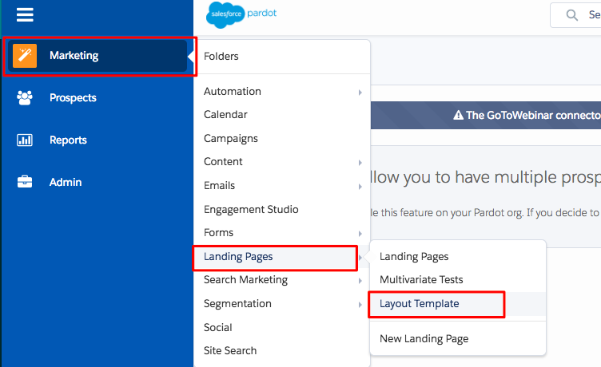

# Adding [!DNL Marketo Measure] JavaScript to [!DNL Pardot] {#adding-marketo-measure-javascript-to-pardot}

[!DNL Pardot] forms require additional handling within the form template beyond putting script on the site in order for [!DNL Marketo Measure] to recognize form submissions. The process is simple; it only requires placing the [!DNL Marketo Measure] tracking script into the [!DNL Pardot] form template.

## Step by Step Instructions {#step-by-step-instructions}

Once you've logged into your [!DNL Pardot] account, follow the steps below.

1. Navigate to **[!UICONTROL Marketing]**.

1. Click on **[!UICONTROL Landing Pages]**.

1. Select **[!UICONTROL Layout Template]**.

   

1. Determine the appropriate Layout Template and click **[!UICONTROL Edit]** to the right.

   

1. Copy and paste the [!DNL Marketo Measure] JavaScript code right before the close header tag on your HTML page.

   `<script type="text/javascript" src="https://cdn.bizible.com/scripts/bizible.js" async=""></script>`

1. Follow these steps for all applicable Landing Page Layout Templates.

1. Make sure the [!DNL Marketo Measure] JavaScript is on the general site page as well.

   Within the [!DNL Pardot] Layout Template, the code will look something like this:

```text
<script type="text/javascript" src="https://cdn.bizible.com/scripts/bizible.js" async=""></script>
   </head>
   <body>
```

## Additional Notes {#additional-notes}

If the [!DNL Pardot] IFrame has the following HTML tag:

`<base href="http://go.pardot.com">`

_And_ the IFrame itself is actually on a secure page (HTTPS) instead of a nonsecure page (HTTP), when we try to load our script on the [!DNL Pardot] IFrame, the browser will try to load an HTTP version of our script on an HTTPS page which will fail and prevent us from tracking. The solution is to update the script on the [!DNL Pardot] IFrame to load the secure version of our script:

`<script type="text/javascript" src="https://cdn.bizible.com/scripts/bizible.js" async=""></script>`

As well, there may already be other tracking code snippets in this area, such as a [!DNL Google Analytics] code. Be sure to separate them by a semicolon `;` and a single space, like shown in this example:

`<script type="text/javascript" src="https://cdn.bizible.com/scripts/bizible.js" async=""></script>; <script async="true" type="othercode_example" src="otherfile_example.js" ></script>`
