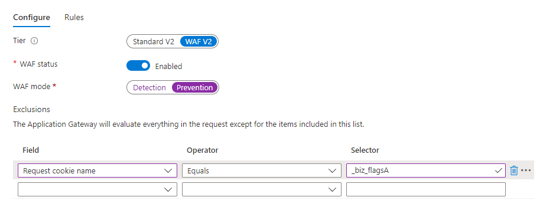

# Adding [!DNL Marketo Measure] Script {#adding-marketo-measure-script}

Marketo Measure JavaScript that you'd like tracked by Marketo Measure should be added to all web properties as soon as possible. Once the JavaScript is deployed, Marketo Measure will start collecting your digital data. This article outlines the methods for deploying Marketo Measure JavaScript and additional considerations to take into account.

>[!NOTE]
>
>Make sure you've [claimed all appropriate domains in the Adobe Admin Console](/help/marketo-measure-and-adobe/domain-management.md) in addition to deploying the [!DNL Marketo Measure] JavaScript.

When getting started with [!DNL Marketo Measure], there are two ways you can add the [!DNL Marketo Measure] JavaScript to your website:

* Hard-Coding
* Tag Management Systems

## Hard-Coding {#hard-coding}

As a best practice, we strongly recommend hardcoding [!DNL Marketo Measure] JavaScript to your web properties. To hardcode the script, you'll need to place the script before the closing `</head>` on every page of your site.

``

Hardcoding the JavaScript into the `<head>` of your pages ensures the [!DNL Marketo] Measure script will load first and referral information isn't missed. The [!DNL Marketo] Measure JavaScript loads asynchronously. If hardcoding, the JavaScript must be manually added to Marketing Automation.

>[!TIP]
>
>Learn how to make sure your script is [GDPR compliant](/help/security-and-compliance/compliance-related-resources/ensuring-consent-for-gdpr-in-marketo-measure-js.md).

## Tag Management Systems {#tag-management-systems}

If adding Marketo Measure JavaScript via hardcoding isn't possible, another option is to add the Marketo Measure script using a Tag Management System such as [!DNL Google Tag Manager] (GTM) or Tealium.

Please note that using tag management systems to deploy [!DNL Marketo] Measure JS can result in a potential 5-10% data loss due to script load time latency. Essentially, if the tag management tool does not load quickly enough, [!DNL Marketo] Measure JS also cannot load quickly enough and could lose first referrer information.

A common practice is to deploy [!DNL Marketo Measure] JS via a tag management tool until timing/resourcing is better to move to hardcoding.

To add [!DNL Marketo Measure] script through a tag management solution, you'll need to create a new tag and add our JavaScript within it. Apply this tag to all the pages on your website that you want tracked.

[!DNL Marketo Measure] recommends that any page view should cause the tag to fire. Additionally, it's best to give [!DNL Marketo Measure] the highest priority in the firing order and make sure there are no synchronous scripts in front of the Marketo Measure tag in order to ensure the highest data quality.

More information can be [found here](/help/marketo-measure-tracking/setting-up-tracking/adding-marketo-measure-script-via-google-tag-manager.md).

## Additional Considerations {#additional-considerations}

Marketo Measure JavaScript is domain-based so it is automatically able to handle any subdomains as long as the JavaScript is on the pages and the root domain is the same as the domain used to create the Marketo Measure account.

However, if you are using any separate or international domains, be sure to let your [!DNL Marketo] Measure Consultant know. The domain(s) need to be manually added to your account on the [!DNL Marketo] Measure end so that Marketo Measure knows to tie the additional domains' data to your account. So, please send any separate/international domains to your Marketo Measure Consultant.

If you use any third party pages, have a conversation about your use case with your Marketo Measure Consultant. In general, you'll want to know if you can add a custom version of Marketo Measure's JavaScript to track those pages if appropriate. If this isn't possible, tracking via CRM Campaign touchpoints will be explored with your Marketo Measure Consultant.

Do you have any forms that should NOT be tracked by Marketo Measure since they don't necessarily make sense for attribution (e.g., unsubscribe forms, customer logins, etc.,)? If so, you'll want to add the exclude code [in this article](/help/marketo-measure-tracking/setting-up-tracking/excluding-marketo-measure-from-specific-forms.md) to each form

Do you have any non-secure pages? If so, you'll want to secure them as navigating between a secure/non-secure page will break the tracking session.

Be sure to have a conversation with your web team so they know [!DNL Marketo Measure] JavaScript should always be on the appropriate web properties. If new pages/forms/sites are introduced, make sure deploying [!DNL Marketo Measure] JavaScript is part of the protocol.

If a Web Application Firewall (WAF) warning is triggered during the JavaScript setup, users can either disable that WAF rule or allow-list the cookies, as the below example:

## Forms to Pay Extra Attention To {#forms-to-pay-extra-attention-to}

**Multi-form submission**

* Issue: If you have multiple linked forms as part of a single form submission, it's possible that the first form will generate a touchpoint even if the complete form is not submitted.
* Solution: You'll need to force one of the forms to report the user to Marketo Measure based on cached data and discuss abandonment practices. Generally, [report user code](/help/marketo-measure-tracking/setting-up-tracking/adding-marketo-measure-script-to-different-form-providers/ajax-form-handling.md) can solve for this.

**Account login (not creation)**

* Issue: Marketo Measure recommends not creating touchpoints for subsequent account logins, as these tend to dilute the attribution story.
* Solution: Add Exclude Code to the account/customer/partner login form.

>[!NOTE]
>
>We do recommend creating a touchpoint for the creation of an account or trial.

**Download of asset**

* Issue: If your assets are gated, Marketo Measure will track downloads as form fills. If your assets are not gated, there are limitations to what we can report on without customization.
* Solution: Gate the asset if you'd like it to be tracked by Marketo Measure JavaScript. If this is not an option and you'd still like a touchpoint for it, consider syncing a CRM Campaign instead.

**iFrames**

* Issue: iFrames essentially function as pages within pages.
* Solution: The [!DNL Marketo] Measure JS must be deployed directly within the iFrame header in order for us to attach to the form correctly.

**Lightboxes**

* Lightboxes are typically pop-ups that contain iFrames
* Solution: the [!DNL Marketo] Measure JS must be deployed within the header of that hosted iFrame.

**Multiple forms on a page**

* Issue: If there are multiple forms hosted on a page, you might not be able to tell which specific form was filled out with Marketo Measure's Form URL field.
* Solution: If you need to know which form was filled out, explore setting up dynamic URL hashing with your web team.

**Forms organized in `
` format**

* Issue: [!DNL Marketo Measure JS] has a hard time recognizing forms organized in `
` format so custom code can be needed.
* Solution: These [report user templates](/help/marketo-measure-tracking/setting-up-tracking/adding-marketo-measure-script-to-different-form-providers/ajax-form-handling.md) can be used by your web dev team to add the needed code.

**Chat**

* Issue: If you use a chat provider, special handling may be required.
* Solution: [!DNL Marketo Measure] integrates with Drift, Olark, Livechat, LivePerson, and SnapEngage. All other platforms need to be tracked through CRM campaign membership.

**Second Domain**

* Issue: [!DNL Marketo Measure] JavaScript is domain specific so extra steps need to be taken for any separate or international domains. Note that Marketo Measure JS can handle subdomains on the same root domain.
* Solution: If you own multiple root domains, that you'd like to be tracked by [!DNL Marketo Measure] be sure to add JS to the domains AND let your [!DNL Marketo] Measure Consultant know which domains should be manually associated to your [!DNL Marketo Measure] account.

## Testing [!DNL Marketo] Measure JavaScript {#testing-marketo-measure-javascript}

Your Marketo Measure Consultant will help you to spot test the website to ensure that Marketo Measure JavaScript is present across all pages. Part of this testing will be submitting a few form fills with clearly indicated test details to ensure that tracking returns properly.

However, your Marketo Measure Consultant is likely not as familiar with your website as your web team is. For this reason, it's very important that your web team or other appropriate team, thoroughly checks the website especially if there are complex forms in use like the ones mentioned above. Your team will ultimately be responsible for ensuring that all needed web properties are properly tracking but if you are aware of any complex forms or situations, you are welcome to ask your Marketo Measure Consultant for assistance in testing.

To test a form yourself, please follow these steps:

1. Always use an incognito browser or clear your cache between each form submission test AND use a different email address each time.

   a. A best practice is to use a fake email that contains something indicating it is a test and the time of day. For example: testing830am@test.com.

1. Record the URL of the page you are submitting the form and the email used.

1. Locate the record created in your CRM (Lead or Contact) for that form submission and verify that a touchpoint was appropriately created.

   a. You can use a [!DNL Marketo Measure] stock report such as Leads with Buyer Touchpoints or look at the Lead/Contact page layout if you chose to update your page layouts with [!DNL Marketo] Measure details.

   b. Note that this could take some time for the data to process.
