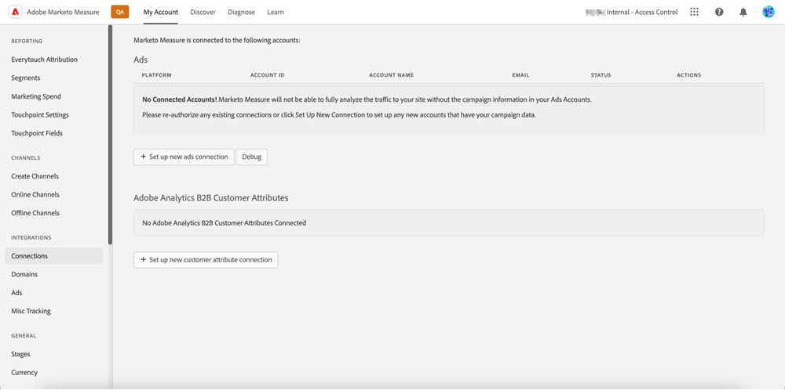

# [!DNL Marketo Measure] Ultimate Overview {#marketo-measure-ultimate-overview}

[!DNL Marketo Measure] (formerly Bizible) gives marketers insight into which marketing efforts are the most effective in driving revenue and maximizing return on investment for their company. [!DNL Marketo Measure] is a marketing attribution solution that automatically tracks and reports on channel performance, providing visibility into which channels drive the most customer engagement and allowing you to optimize your marketing spend accordingly.

[!DNL Marketo Measure Ultimate] contains the additional capabilities:

* Ingest from nearly any data source as well as multiple data sources of the same type to bring in all your data for attribution.
  * Use with nearly any CRM, not just Salesforce and Dynamics.
  * Connect multiple CRM instances and/or MAP instances to one [!DNL Marketo Measure] instance.
  * Bring in 3rd-party webinar registration and participation data.

* Transform your data with great flexibility through the field-mapping and transformation capabilities to ensure the right data shape.

* Make attribution insights available to external applications through the included data warehouse to integrate the insights into your workflow. More granular results data and BI-based reporting, including Snowflake Data Warehouse, which provides access to granular results data and the ability to use any BI tool for analysis and reporting.

* Integration with RTCDP (B2B or B2P Edition), providing an integrated B2B attribution solution for RTCDP customers as RTCDP and [!DNL Marketo Measure] both work from centralized Adobe Experience Platform (AEP) data.

**[!DNL Marketo Measure] Tiers 1-3**

   

**[!DNL Marketo Measure Ultimate]**

   

## What's New in [!DNL Marketo Measure Ultimate] {#whats-new-in-marketo-measure-ultimate}

**Import B2B Data Through AEP**

Marketers are expected to bring their B2B data (e.g. Account, Opportunity, Contact, Lead, Campaign, Campaign Member, Activity) through AEP. The direct CRM and Marketo Engage connections are no longer available for Ultimate. Marketers will continue bringing Ad Platform data through direct connections and tracking web activities through [!DNL Marketo Measure] javascript.

   

**Default Currency Setting**

[!DNL Marketo Measure Ultimate] will set the default currency to USD until the user changes it. Setting a new default currency will update the data without reprocessing. As long as the selected currency is present as a target ISO code, there is no need to submit conversion rates.

   

**[!DNL Marketo Measure Ultimate] Sandbox**

[!DNL Marketo Measure Ultimate] instance must be mapped to an AEP sandbox before creating the [!DNL Marketo Measure] destination data flows in AEP. 

>[!NOTE]
>
>A [!DNL Marketo Measure Ultimate] production instance needs to be mapped to an AEP production sandbox, a [!DNL Marketo Measure Ultimate] developers instance needs to be mapped to an AEP developers sandbox.

Once the sandbox mapping selection is saved, you cannot change it in the application at this time. To change it, reach out to [Marketo Support](https://nation.marketo.com/t5/support/ct-p/Support){target="_blank"}.

Data for a given entity (e.g., Account) from a given data source can only go into one dataset. Each dataset can only be included in one data flow. Violations will stop the data flow at run time.

   

**Stage Mapping**

All [!DNL Marketo Measure Ultimate] rules are dataset-specific. Stage Mapping rules must be created for all datasets and all selected stages.

There are six built-in stages:

* Lead Lost
* Lead Open
* Lead Converted
* Opportunity Lost
* Opportunity Open
* Opportunity Won

The Lost, Won, and Converted sections do not allow custom stages. Source data can, however, be mapped to the built-in Lost/Won/Converted stages by updating the mapping rule.

Custom stages can only be defined for Open sections.
We no longer automatically include CRM stages on stage mapping.

Four built-in stages must be mapped with rules (mapping rules for the other two, Lead Lost and Lead Converted, are optional):

* Lead Open
* Opportunity Lost
* Opportunity Open
* Opportunity Won

Rule conditions are dataset-specific. Stage Mapping rules must be created for all datasets and all stages except for Lead Lost and Lead Converted.

No selection for funnel vs boomerang vs custom model. All stages are selected for funnel, boomerang, and custom model. There's a limit of how many stages we support: 15 custom plus 6 built-in stages.

   

Campaign Member touchpoint rules and Activity touchpoint rules are dataset-specific.

   

   

Attribution Touchpoints are not written to CRM because Ultimate does not have a direct CRM connection.

[!DNL Marketo Measure] ABM ML services (Lead-to-Account Matching and Predictive Engagement Score) are not available for [!DNL Marketo Measure Ultimate]. You can find such services included free in the RT-CDP B2B edition.

## Limitations {#limitations}

* Limited fields are available for data transformation rules at this time.
* There is no migration path for existing Tier 1/2/3 users. Requires new implementation but we will help migrate the tracked web activity data from the existing instance.

>[!MORELIKETHIS]
>
>[Marketo Measure Ultimate Destination](https://experienceleague.adobe.com/docs/experience-platform/destinations/catalog/adobe/marketo-measure-ultimate.html?lang=en){target="_blank"}
