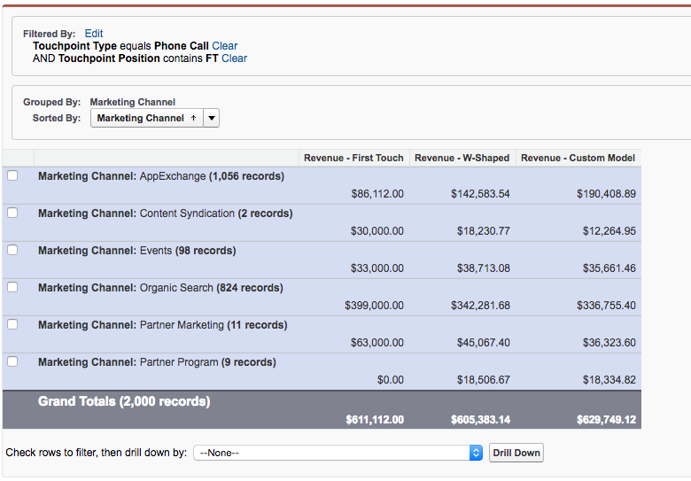

# Call Tracking Integration {#call-tracking-integration}

Our integration with [!DNL CallTrackingMetrics] is intended to merge a web session with a phone call. A phone call gets treated as a form submission to [!DNL Marketo Measure]. It gives credit to a web session that would have otherwise only been considered a web visit because there was no actual form submission.

## Call Tracking Explained {#call-tracking-explained}

"Call Tracking" in the general sense is a product from companies such as [!DNL CallTrackingMetrics], [!DNL DiaglogTech], [!DNL Invoca], or [!DNL CallRail], to name a few. Unique phone numbers are shown to users based on the different marketing channels or campaigns they're coming from. This allows marketers to see how those channels or campaigns are performing.

## Before and After {#before-and-after}

Take a look at the flowchart below to see how [!DNL Marketo Measure] used to handle phone calls without an integration with CallTrackingMetrics. The phone call that took place went untracked, so it was seen as a web session and no touchpoint was created for it. It wasn't until the next visit where the user completed a form that a touchpoint was finally populated.

With the integration, you can see that the web session was actually tied to a phone call. The next form fill ends up being a PostLC touch and is still tracked as part of the journey.

## How It Works {#how-it-works}

CallTrackingMetrics has to do a little bit of development work on their end in order for this to work. With the javascript that they place on your site, CallTrackingMetrics can grab the _biz_uid from the [!DNL Marketo Measure] cookie. This "[!DNL BizibleId]" is then stored by CallTrackingMetrics.

When a visitor comes to your site and makes a phone call, it is the job of CallTrackingMetrics to push that data into [!DNL Salesforce]  Typically, a [!DNL Salesforce Task] is created that populates data such as phone number, subject, type, and now, the [!DNL BizibleId] 

The [!DNL BizibleId] is a field that is installed with version 6.7+ of the [!DNL Marketo Measure] Marketing Attribution package.

Below is an example of a Task record with the [!DNL BizibleId] populated.

When [!DNL Marketo Measure] finds a Task record with a known [!DNL BizibleId] value filled in, [!DNL Marketo Measure] can map that user to a web session with the same [!DNL BizibleId] and attribute that session to a phone call instead of a web visit.

## The Touchpoint {#the-touchpoint}

When [!DNL Marketo Measure] can import/download the task, we process that detail along with the web session. In most cases, it can be merged with a referrer or ad. In the example below, a visitor found the business through an Paid Google ad and made a phone call.

The [!UICONTROL Touchpoint] Type "Call" is pulled from the Task, from the screenshot above, which is also populated by CallTrackingMetrics when the Task is created.

## Reporting {#reporting}

Touchpoint Type values that [!DNL Marketo Measure] typically pushes are Web Visit, Web Form, or Web Chat, but in the case of CallTrackingMetrics touchpoints, the touchpoint type will be Phone Call. This helps marketers see which channels draw in the most phone calls and generate revenue for their organization.

## FAQ {#faq}

**Why is my touchpoint type web visit?**

The Touchpoint Type is populated from the Task.Type field. If the Task.Type field is blank then [!DNL Marketo Measure] will automatically set the Touchpoint Type as Web Visit. Once the Task.Type field is populated [!DNL Marketo Measure] will read that value and populate the Touchpoint Type accordingly.

**What other fields does the Touchpoint populate from the phone call?**

Both the Touchpoint Type and Medium will contain the data that is pulled from the Task.Type. All other data points are pulled from the web tracking and javascript data.

**Why is this phone call not tied to a web session?**

First, check the Task to make sure there is a [!DNL BizibleId] populated. If there is no value, then we will not and cannot create a touchpoint for it. This will need to be escalated with CallTrackingMetrics.

If there is a value, note that we only consider all web sessions to be 30 minutes. If a Google Ad was clicked on at 12:17pm (start of the session on the website), but the phone call did not occur until 1:05pm, we will not merge the web session and phone call. Rather, [!DNL Marketo Measure] will create a separate [!DNL Salesforce Task] touchpoint to track the phone call, but will not have any web session data.

## Partnerships {#partnerships}

[!DNL Marketo Measure] currently has one official Call Tracking partner that has gone through the "official" integration process with us, which included co-marketing and product training. This one partner is CallTrackingMetrics.
