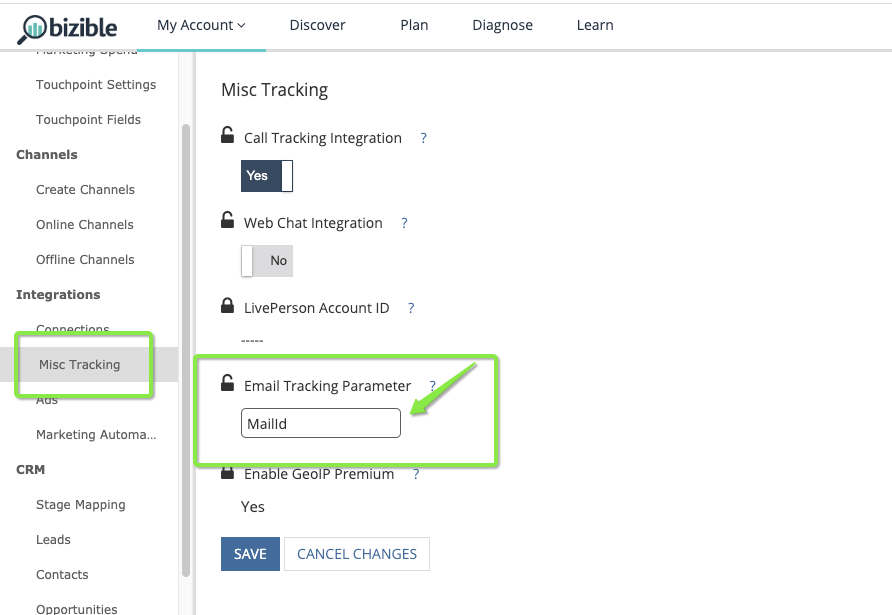

# Email Tracking Parameter {#email-tracking-parameter}

Marketo Measure's Email Tracking Parameter allows marketers to treat email clicks as form submissions so that touchpoints get generated for those actions. Without using an email tracking parameter, click-throughs from an email are only treated as "web visits" until the user actually engages with the site through a form submission or a web chat.

## Use Cases  {#use-cases}

**Webinar Registration**: The Marketing team sends out an email invite with a single button to register for a webinar. Because the email already has the person's information, the single click will auto-register them. The landing page contains the email tracking parameter so when they click through and land on the confirmation page, [!DNL Marketo] Measure can capture the email address and treat the click-through as a form fill, which will generate a touchpoint.

**Content Download**: The Content Marketing team wants to promote a recent eBook that they've published with a direct download link from an email. When the email template is built, the download confirmation page will contain the email tracking parameter so that when they click through, [!DNL Marketo] Measure can capture the email address. Without having to fill out a form on the site, [!DNL Marketo Measure] can generate a touchpoint for the content download that occured via the email because it landed them on the confirmation page with the email tracking parameter.

## How It Works {#how-it-works}

When a visitor arrives on your site, [!DNL Marketo] Measure expects to find a landing page with either an email address or [!DNL Salesforce] Id so we can associate that visit with a "form submission" and generate a touchpoint for that activity.

As the customer, you will build out an email template as you normally would. Once it's time to add in the landing page for the action that you want to track, you'll need to determine either the token, or variable tag, or macro that your Marketing Automation platform accepts to dynamically display the value for each individual.

Marketo Measure accepts the following values: Email Address, Salesforce Lead Id, or Salesforce Contact Id.

## Tag Examples {#tag-examples}

<table> 
 <colgroup> 
  <col> 
  <col> 
  <col> 
  <col> 
 </colgroup> 
 <tbody> 
  <tr> 
   <th>
Marketing Automation
</th> 
   <th>
Token / Tag / Macro 
</th> 
   <th>
Example
</th> 
   <th>
Supporting Material
</th> 
  </tr> 
  <tr> 
   <td>
Marketo
</td> 
   <td>
{{lead.Email Address}} 
</td> 
   <td>
https://engage.marketo.com/rs/460-TDH-945/images/BZ-B2B-Marketing-Attribution-101-ebook.pdf?mailId={{lead.EmailAddress}}
</td> 
   <td>
https://docs.marketo.com/display/public/DOCS/Tokens+Overview#TokensOverview-PersonTokens
</td> 
  </tr> 
  <tr> 
   <td>
Pardot
</td> 
   <td>
%%email%% 

or

%%user_crm_id%%
</td> 
   <td>
https://engage.marketo.com/rs/460-TDH-945/images/BZ-B2B-Marketing-Attribution-101-ebook.pdf?mailId=%%email%%
</td> 
   <td>
https://help.salesforce.com/articleView?id=pardot_variable_tags_reference.htm&amp;type=5
</td> 
  </tr> 
  <tr> 
   <td>
Hubspot
</td> 
   <td>
(inserted via Editor)
</td> 
   <td>
n/a
</td> 
   <td>
https://knowledge.hubspot.com/cos-general/how-to-use-personalization-with-your-content
</td> 
  </tr> 
  <tr> 
   <td>
Act-On
</td> 
   <td>
(inserted via Message Composer)
</td> 
   <td>
n/a
</td> 
   <td>
https://connect.act-on.com/hc/en-us/articles/360033436074-How-to-Personalize-Email-Content-with-CRM-Data
</td> 
  </tr> 
 </tbody> 
</table>

And finally, within Marketo Measure, you will need to specify the tracking parameter so that Marketo Measure can locate the email or Id value. The default is "mailId" as shown in the examples above and the screenshot below. Enter the value into your Settings in Marketo Measure, then click **Save**.

