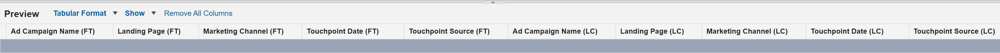

# Release Notes: 2023 {#release-notes-2023}

Below you will find all the new and updated features for our 2023 releases.

## Q4 Release {#q4-release}

**Web Traffic Dashboard**

The newly redesigned [Web Traffic dashboard](/help/marketo-measure-discover-ui/dashboards/web-traffic-dashboard.md){target="_blank"} is now accessible to all customers. This dashboard offers a complete overview of your website's visitor interactions. You can analyze metrics such as unique visitor counts per URL, overall visits, page views, and form submissions from specific form URLs or landing pages. You can also keep track of monthly traffic trends and identify high-performing paid media, which will help you refine your strategies for optimal revenue generation.

The new set of pre-built dashboards is scheduled to be introduced in waves, concluding before the end of the year. 

>[!NOTE]
>
>While the current dashboards will be deprecated by March 2024, you can utilize both versions until then, ensuring a smooth transition.

**IP Address Data Removal**

We are removing IP address data from our long-term storage to ensure data privacy compliance. Currently, the following Snowflake tables and views contain IP addresses, and we plan to remove this data and add new geolocation information:

<table style="width:400px">
<thead>
  <tr>
    <th style="width:50%">Tables</th>
    <th>Views</th>
  </tr>
</thead>
<tbody>
  <tr>
    <td>CUSTOMER_AB_TESTS</td>
    <td>BIZ_CUSTOMER_AB_TESTS</td>
  </tr>
  <tr>
    <td>CUSTOMER_EVENTS</td>
    <td>BIZ_CUSTOMER_EVENTS</td>
  </tr>
  <tr>
    <td>FORM_SUBMITS</td>
    <td>BIZ_FORM_SUBMITS</td>
  </tr>
  <tr>
    <td>IMPRESSIONS</td>
    <td>BIZ_IMPRESSIONS</td>
  </tr>
  <tr>
    <td>PAGE_VIEWS</td>
    <td>BIZ_PAGE_VIEWS</td>
  </tr>
  <tr>
    <td>SESSIONS</td>
    <td>BIZ_SESSIONS</td>
  </tr>
  <tr>
    <td>WEB_HOST_MAPPINGS</td>
    <td>BIZ_WEB_HOST_MAPPINGS</td>
  </tr>
</tbody>
</table>

* From now on, we will download Country Code, City Name, and Region Code instead of Country Name, City Name, and Region Name.
* During the processing of all historical web activities, inconsistencies in location information across records may arise. These inconsistencies may include the presence of IP addresses without geolocation details, updated geolocation information without IP addresses, or a mix of country or region names and codes.
* _**This mixed data period is expected to occur from 01/04/2023 through 02/29/2023.**_

**Page Title Data in URL Table**

The URL table in the [data warehouse](/help/marketo-measure-data-warehouse/data-warehouse-schema.md){target="_blank"} will now include a page title field, in addition to web data tables.

Note that the page title in the URL table may not always match the page title in other web tables. The URL table will have the most recent page title. If the title has been changed for the URL after the web activity took place, it will not match what's in the URL table.

**Discover Dashboard Redesign**

All Marketo Measure users will experience our redesigned in-app dashboards that combine enhanced usability with added value. We're also introducing new metrics, such as "Realized ROI," which takes into account the typical delay between marketing investments and purchases in B2B go-to-markets.

The new set of pre-built dashboards is scheduled to be introduced in waves, beginning the first week of October and concluding before the end of the year. These new dashboards will automatically appear in your instances, along with in-product information and links to documentation.

* [New Discover Dashboard Guide](/help/marketo-measure-discover-ui/dashboards/new-discover-dashboard-guide.md){target="_blank"}
* [Discover Dashboard Basics](/help/marketo-measure-discover-ui/dashboards/discover-dashboard-basics.md){target="_blank"}
* [Revenue Overview Dashboard](/help/marketo-measure-discover-ui/dashboards/revenue-overview-dashboard.md){target="_blank"}
* [Attributed Revenue Dashboard](/help/marketo-measure-discover-ui/dashboards/attributed-revenue-dashboard.md){target="_blank"}
* [ROI Dashboard](/help/marketo-measure-discover-ui/dashboards/roi-dashboard.md){target="_blank"}
* [Passport Dashboard](/help/marketo-measure-discover-ui/dashboards/passport-dashboard.md){target="_blank"}

>[!NOTE]
>
>While the current dashboards will be deprecated by March 2024, you can utilize both versions until then, ensuring a smooth transition.

### Deprecations {#deprecations}

#### Salesforce Field Deprecations

We will be phasing out our export jobs to Lead/Contact objects to simplify our integration and eliminate the need to export to Salesforce standard objects. The denormalized fields listed below will also be deprecated, as customers can obtain the same data from their Touchpoint objects. _**The timeline of deprecation is June 2024.**_ 

<table style="width:350px">
<tbody>
  <tr>
    <td>bizible2__Ad_Campaign_Name_FT__c</td>
  </tr>
  <tr>
    <td>bizible2__Ad_Campaign_Name_LC__c</td>
  </tr>
  <tr>
    <td>bizible2__Landing_Page_FT__c</td>
  </tr>
  <tr>
    <td>bizible2__Landing_Page_LC__c</td>
  </tr>
  <tr>
    <td>bizible2__Touchpoint_Date_FT__c</td>
  </tr>
  <tr>
    <td>bizible2__Touchpoint_Date_LC__c</td>
  </tr>
  <tr>
    <td>bizible2__Touchpoint_Source_FT__c</td>
  </tr>
  <tr>
    <td>bizible2__Touchpoint_Source_LC__c</td>
  </tr>
  <tr>
    <td>bizible2__Marketing_Channel_FT__c</td>
  </tr>
  <tr>
    <td>bizible2__Marketing_Channel_LC__c</td>
  </tr>
</tbody>
</table>

The fields which contain the same information on the Touchpoint and Attribution Touchpoint objects are:

* bizible2__Ad_Campaign_Name__c
* bizible2__Landing_Page__c
* bizible2__Marketing_Channel__c
* bizible2__Touchpoint_Date__c
* bizible2__Touchpoint_Source__c

**Required Actions**

* Create new Report Types for Leads and Contacts with or without Touchpoints.

* Create reports which capture the functionality of any existing report which utilizes the removed fields. As part of this process you will want to change the fields in the report as specified below:

  * Remove Lead/Contact FT/LC fields:

  * Add Touchpoint fields:

  * The Touchpoint Position filter and any filters that use the FT/LC fields, including the Date Field, should be updated as follows:

* Delete any pre-existing reports that utilized the removed fields from the Lead/Contact object to no longer reference those fields.

#### Dynamics Package related

   * To stay connected to Dynamics, install our latest package version, v6.12. Old versions `(<v6.12)` will no longer be supported. This update optimizes historical record creation to reduce storage usage.

   * The outdated method of OAuth with a RefreshToken will be deprecated. Refer to [this guide](/help/marketo-measure-and-dynamics/getting-started-with-marketo-measure-and-dynamics/oauth-with-azure-active-directory-for-dynamics-crm.md){target="_blank"} for updating your credentials to adhere to Microsoft's best practices of using ClientSecret.

#### "custom_properties" Field

In our data warehouse, the "custom_properties" field has been serving as a storage for additional data points not covered by our fixed schema. Stored in JSON format, this field's usage is limited and its integration with SQL queries can be complicated, affecting performance. Given these factors, we've decided to deprecate this field. This change will mainly affect the data processing layer within our Azure table storage and the data exported to our data warehouse.

### What's coming? {#q4-whats-coming}

**In-app Custom Reporting**

Marketo Measure customers, for the first time, will be able to create and save their own reports right in the app. This will follow the release of the pre-built dashboards in early 2024.

 

## Q2 Release {#q2-release}

* **Salesforce Package Consolidation**

We're merging all Salesforce packages into a single, comprehensive package for an improved user experience and simplified usage. The V1, V2_EXT, and Reporting packages will be retired next quarter. The new package combines all previous features, allowing for more efficient tracking and deeper customer insights.

Customers who already have the V2 package installed must update it to the new consolidated version.

We've added two new fields to enhance your reporting capabilities:

* form_name: Now available in BT/BAT objects, this field enables users to create reports based on form names.
* user_touchpoint_id: This field enables users to create reports with unique user touchpoint counts. 

[This article](/help/configuration-and-setup/marketo-measure-and-salesforce/salesforce-package-consolidation.md){target="_blank"} includes guides on recreating reports and dashboards from the legacy Reporting packages.

* **Salesforce API Version Updates**

All Salesforce API versions of Apex classes, including the UserActivityContext class, are updated to supported versions. (31.0 through 57.0)

* **New Package Installation**

The new consolidated package installation link [can be found here](https://login.salesforce.com/packaging/installPackage.apexp?p0=04t1P000000VY6Z){target="_blank"}

### What's coming? {#q2-whats-coming}

**Changes in IP Address Storage**

We will no longer store IP addresses in our system per privacy considerations. We will continue identifying and storing the geo-location of the IP address, but the format will change (e.g., "United States" to "US").
